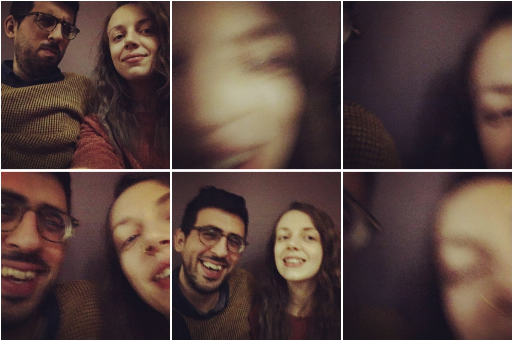

Personally, I've always enjoyed reflecting on the year as it draws to a close. I'm always susprised, when I take stock of the last 12 months, how much has actually happened - for good or for bad. Although I often get to the end of the week feeling like I haven't done anything very interesting or important, it turns out that I _have_ been doing things after all, when I stop and take a minute to look back.

Here are a few lists that sum up 2018 for me. They are mostly positive - 2018 has been on the whole a really positive year for me - but also I just don't feel like dwelling on the negatives here.

### 5 Professional Highs

1. In March, I **got a new job as a full stack software engineer**. This was an exciting move for me as it was my first job since executing a career change from librarianship to programming which was officially "software engineer". Previously I'd had a hodge-podge of titles from Tutor to Head of Community, with Developer thrown in on the side. It was also a move to a job which would allow me to grow, increase my skills and get a better work-life balance. All round, a move I'm pleased I made and which has put me in a good place at the end of this year.

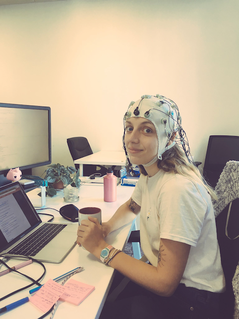

2. **Coding professionally in a second language**. My first language was JavaScript, and this year I picked up my second: Ruby. Although JavaScript is still most comfortable and I probably prefer it, Ruby's been great and it's been very beneficial to learn its paradigms. Learning Rails has also been very insightful. There's a whole world of ways to build software out there, folks!

3. **Teaching on the CodeFirst:Girls Ruby course**. I enjoyed leading a couple of classes during this course, although in all honesty the curriculum didn't really "click" with me and I would have preferred more freedom to make changes to it. However, it was still a good experience and gave me a lot to think about with regards to the curriculum. I'd like the chance to teach the course again now I've experienced the whole curriculum first-hand. It also made me realise that I missed teaching, and inspired me to look for more opportunities to teach in the new year.

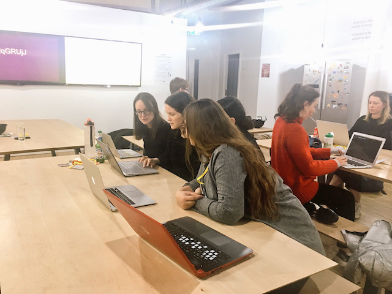

4. **Keeping my energy/passion alive**. I took about a 6 month-long break from going to events, meetups or anything to do with work, outside of work, and instead focussed a lot of energy and time on training for a marathon, yoga, seeing friends and generally doing whatever I felt like. When I started thinking about doing community stuff again, it was when I really felt like it, and I've been more inspired than ever the last few months.

5. **Making time to learn**. I'm proud of what I've learnt this year, and looking back at the beginning of the year I can see how far I've come. I followed a few courses outside of work, am currently studying for my AWS Certified Developer exam, and think I've got into a good routine of prioritizing a bit of time each week for learning/studying. I have kept a couple of side projects going throughout the year, and have done a good job of pursuing ideas that would enable me to learn as much as possible. I'm also pleased with how I've used the mentoring opportunities I've been afforded through work.

### 9 Personal Achievements

1. **Getting engaged** Is this an achievement? It's more of an event... but still, I haven't decided if I'm making a more appropriate list where I could put this one, so I'll put it here for now. Mauro asked me to marry him, I said yes... thus we are engaged.

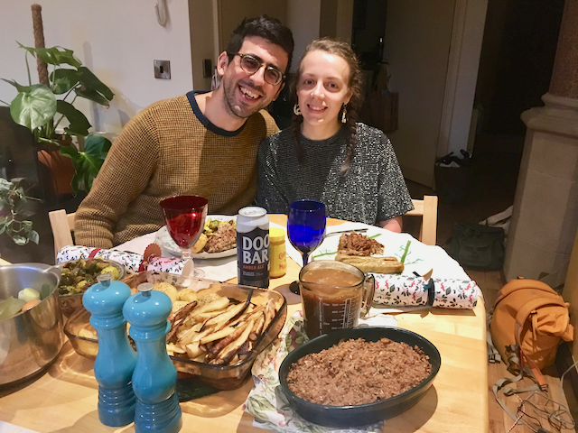

2. **Running a marathon!** Errrrr, I still can't believe I ran a marathon. Actually, what I really can't believe is that it wasn't _that_ bad. Turns out that if you train enough for something, your body can actually do it. The worst part was when I ate a bit too much at one of the snack stations and felt a bit sick and sluggish for the next 3 miles, but apart from that it was more or less okay. I even found a bit of extra energy somewhere to sprint the last mile! It certianly left me wanting to repeat the experience - in fact, I've already booked my second marathon for next year, and would like to do a third later on in the year too.

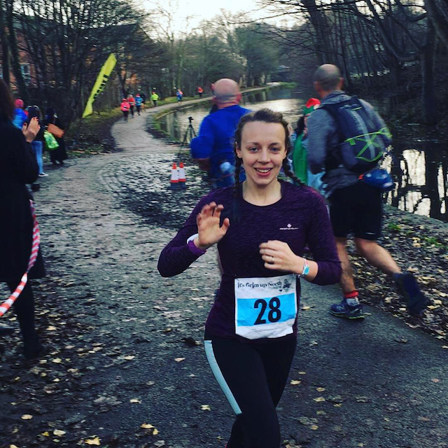

3. **Walking 300 km of the Camino de Santiago** Actually, this was maybe even more of a feat than the marathon. At least during the marathon I didn't actually consider giving up, wheras I distinctly remember one afternoon on the Camino, still about 5 miles from our destination, hobbling along a scorching endless tarmac road with an ankle injury and thinking "Would Uber work out here? Is it physically possible to call a taxi?" In the end I didn't call a taxi, I somehow persevered, but honestly there were evenings when we got to a hostel at 6pm after a day's walking and physically could not move from the bed again until the morning, when we had to get up for the next leg of the journey. When we arrived at Santiago de Compostela, I was so proud of us I almost did a little cry.

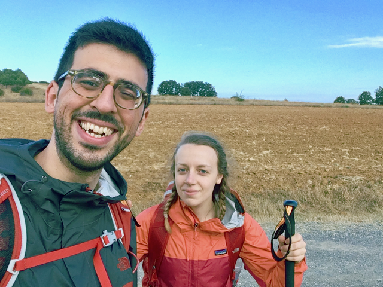

4. **Buying a house** Mauro and I managed to scrape enough money together to buy a house, which was exciting! We were hapless buyers, barely looking round anywhere and settling on one of the first places we saw (as Mauro noted, we spent longer deciding what backpack to take to Spain than we did on what house to buy...) but amazingly it turned out rather well, with no complications (unless you count the mice in the kitchen - but it's an old church, after all, and they've responded well to Mouse-Be-Gone humane mouse repellents...). We also managed to overpay on our mortgage this year, which we hope to be able to do next year too!

5) **Painting a wall** I was extememly chuffed about the big yellow wall we painted in our house.

6) **Getting rid of 465 things** over the course of 30 days. Shortly before we moved, Mauro and I did a "30 Day Challenge" which consisted of getting rid of 1 thing on the 1st day, 2 things on the 2nd day and so on, until you get rid of 30 things on the 30th day. Overall that makes - you guessed it - 465 things. Amazingly, the house looked absolutely no different for it. Where had all these things come from? Where are they now? Nobody knows, but we don't miss them, and we probably made about £400 from selling random things.

7) **Ditching the car** was also a big highlight for me. I've never enjoyed driving but had had a car for a few years in order to get to my Mum's house which is in the countryside about 60 miles away, and is inconvenient to reach by other means. However, in March we decided we'd had enough of running a car just to make this single trip on a monthly basis, and have since been braving public transport to get there. It's not so bad - we don't need a car in Manchester, and the very large inconvenience of the Northern rail services are probably still more convenient than running a car you don't really need.

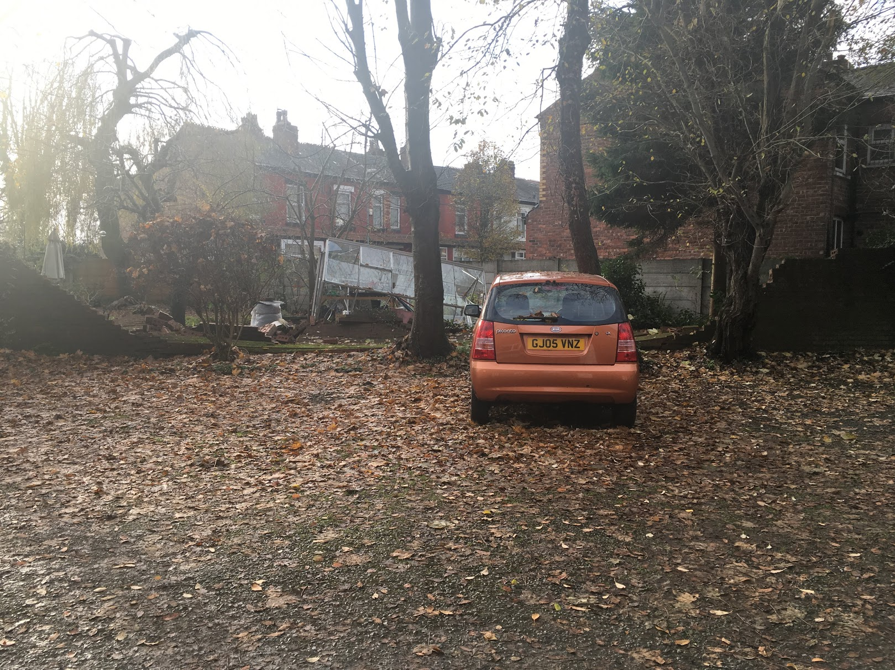

8. **Barely touching my hair for a whole year** Besides a little trim in March, and getting some blue put on the ends in December (which promptly washed out again 😢) I've managed to leave my hair more or less alone, resulting in the longest, most natural hair I've had in a long time!

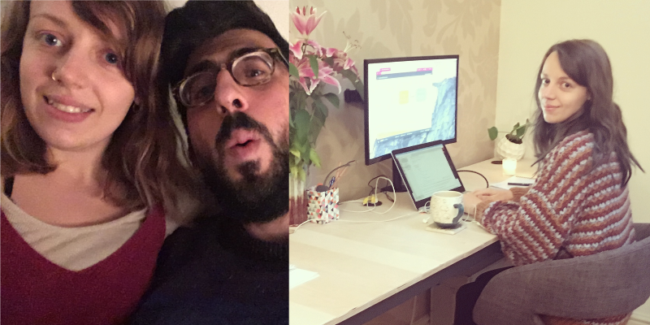

9. **Giving up caffeine** This has improved my life _a lot_ and I'm ridiculously glad that I did it.

### 4 Places Visited

1. Valencia in January, for a lovely new year celebration and temperatures of 20 degrees! Why did we ever come back, actually?
   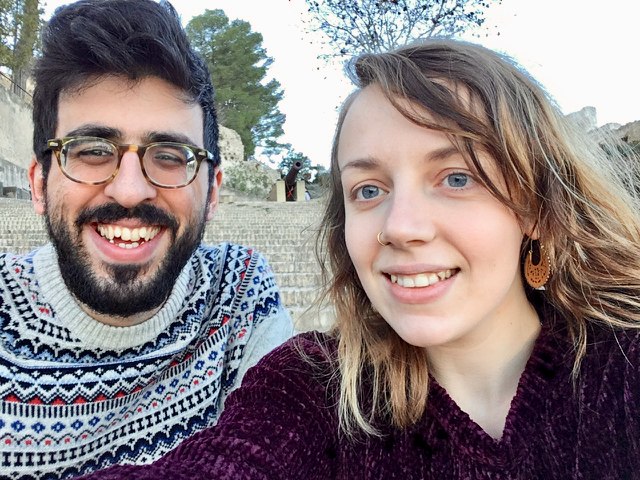

2. Amsterdam and Delft in February
   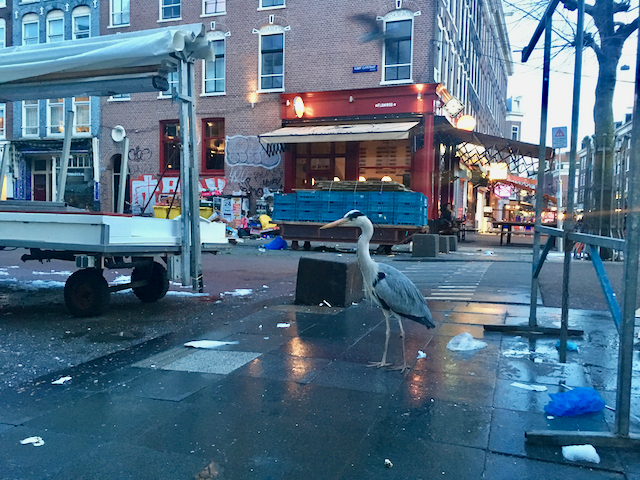

3) Madrid and Valencia in March
   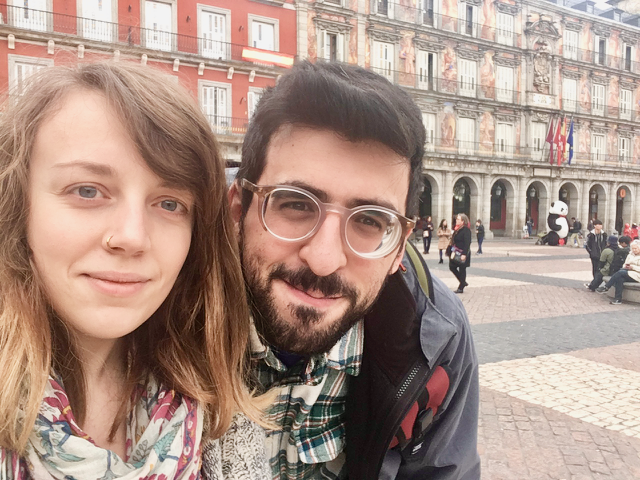

4) Madrid, Northern Spain and Santiago de Compostela for the Camino de Santiago in September
   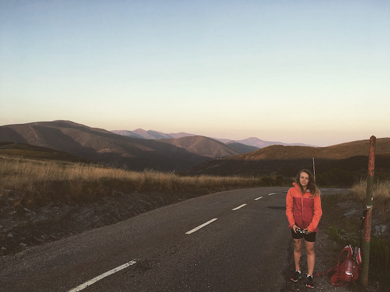

### 5 of my favourite books from this year

I've just had a look at GoodReads and apparently I've read 50 books this year! If I'd had a goal of reading 50 books, I'd have smashed it. But I didn't, so it's just a nice round number with no other significance.

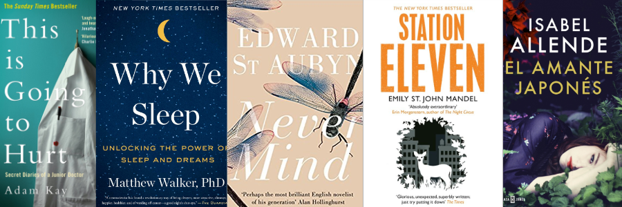

Here are a few of my favourite books:

**This Is Going to Hurt: Secret Diaries of a Junior Doctor by Adam Kay**
This book was hilarious and also a bit tragic in places. It really opened my eyes to what it's like to work in the NHS these days, and to the wide variety of objects which doctors have to extract from anuses.

**Why We Sleep: Unlocking the Power of Sleep and Dreams by Matthew Walker**
Although it was initially hard to trust a book written by someone with the same name as a guy who once awkwardly propositioned me with a large bunch of roses in the middle of the 6th form common room, in front of about 60 people, this book turned out to be one of the most interesting and practically useful that I've read in a long time. For anyone who struggles with sleep, I cannot recommend it enough - and even if you don't (I don't), it's simply fascinating and taught me so much that I wished I'd known sooner.

**Never Mind (and others in the series) by Edward St. Aubyn**
A dismally hilarious and sarcastic book about growing up in an upper class English family. That sounds pretty boring, but it's actually extremely witty and cutting, full of dislikable and complex characters which I love.

**El Amante Japonés by Isabel Allende**
This was probably the first book I've read in Spanish that I enjoyed so much I couldn't put it down. Partly it was because my reading has improved enough to allow me to read more fluently but also it was just a really good book, at the right level for me. I'm not sure it would have made it onto this list if I'd read it in English, as the story's pretty straightforward, but the experience of reading it in Spanish was so good that it's made it on here.

**Station Eleven by Emily St. John Mandel**
Another book I couldn't put down. An easy read, but also just really gripping. I love a good post-apocalyptic story and it had been a while since I'd read a good one, and this definitely ticked the box.

Looking back over my reading list for 2018, I want to read more fiction next year!

### 4 Things I've learnt

**1. To ride the tide of energy and enthusiasm.**

Energy and enthusiasm comes and goes. You can't force it to return when you're not feeling it - do something else, whatever you feel like - and your passion will return when it's ready. I've stopped beating myself up if I don't feel passionate about what I'm working on, or enthusiastic about a side project. And without fail, my energy has rekindled itself in time and I've been able to make the most of it when it returns.

**2. Don't invest money that you're going to need in the short term**

I did this, like a chump. I invested money that I was going to need in a few months time and left myself in the unpleasant position of having to take money out of investments when they were at their lowest, instead of being able to wait until they regained their value after a bad month. Investments are for the long term, folks. As I'm sure everyone else is fully aware.

**3. Work is a business relationship**

A few things this year reminded me of this. It's a business relationship for them and for you - unless you literally do work with your best mates in which case I imagine it's a bit more complicated. But in general it's a business relationship which means neither you nor they owe each other any loyalty or special treatment beyond that. If either of the parties don't think they're getting a good deal, it's not a good business relationship.

**4. Bash!**

I put a lot of energy into studying the Bash scripting language, so I now officially _know Bash_.

The end.

Thanks for reading, next up I'll be posting my plans and goals for next year.

Don't forget to follow me on <a href="https://twitter.com/harri_etty" target="_blank" rel="noopener noreferrer">Twitter</a> if you haven't already (can you tell that one of my goals for next year is going to be to reach 1000 followers?)

🙈
