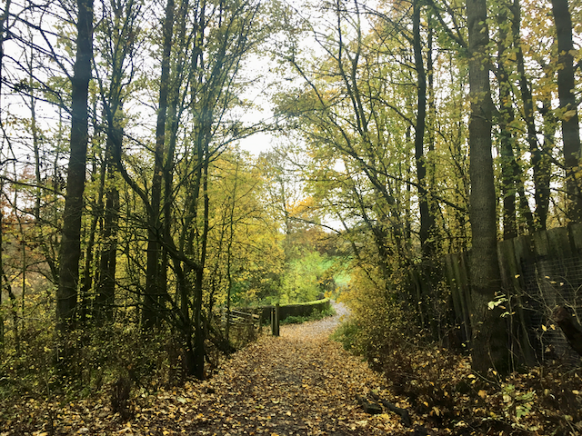
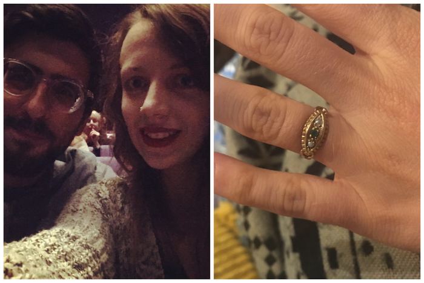
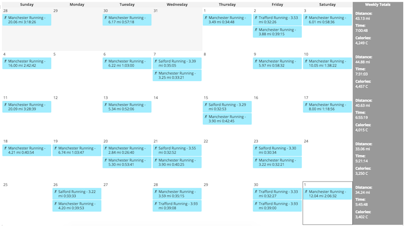
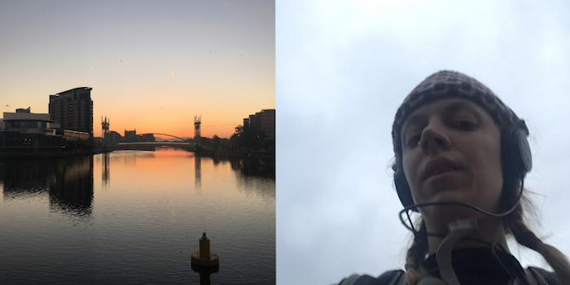
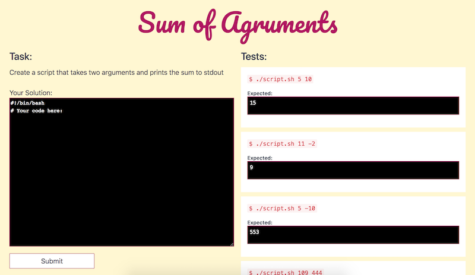
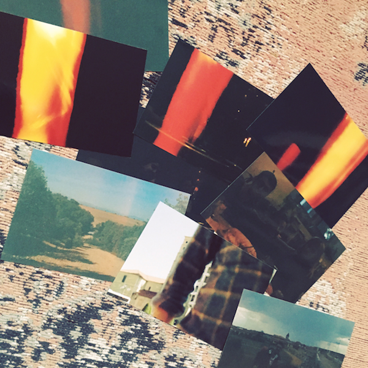

Wooo, it's the 1st December! This is super exciting because <a href="https://adventofcode.com/" target="_blank" rel="noopener noreferrer">Advent of Code</a> for 2018 has just gone live, and this means 25 days of coding challenges to complete in the run-up to Christmas. I'm not joking, AoC really is a December highlight for me. I love how tough the problems get, and the limited timeframe for the advent calendar. It's easy to commit to because it's only 25 days (and I know I'm not gonna make it all the way anyway) and it's a great chance to practice raw problem solving skills.

In other years, I've competed as part of a Northcoders team where we gave prizes for first, second and third place but this year I guess I'll just be competing against the global leaderboard (and Mauro), which means no prizes haha and not even any recognition because everyone else is really good. Some people literally complete the challenges before I've even had time to read them 🤷

I am also looking forward to this month because

🔶 Mauro's Mum is coming to stay with us after Christmas

🔶 Christmas!

🔶 Engagement party (Me and Mauro got engaged!)

🔶 Running a marathon (not sure if I'm actually looking forward to this)

🔶 Having more free time once I stop having to train for the marathon

🔶 Final CodeFirst:Girls session

🔶 Cooking lots of yummy food

🔶 Work Christmas do, which is going to be a walk and pub lunch

Anyway, enough about next month. What's been going on in November?

##### We're getting married!

Well, firstly and most importantly Mauro and I got engaged! He asked me a couple of weeks ago and of course I said yes. We went to see Swan Lake the next day, which was not intended as a celebration but turned out to be. At the weekend we went to town and bought a ring, and began to think about what we wanted to do for a wedding. At the moment we haven't made any firm plans but it will be next year some time. We will probably go for something small and local, and will maybe have 2 celebrations - one here in Manchester and another in Valencia. I'm super excited, and I can't wait to have all our friends round to celebrate at our engagement party in December.

A lot of people asked me whether it was expected. In some ways yes it was because we'd talked about our future plans, but because he asked me on a random day of the week when we weren't doing anything special, the timing was not expected! Not that I'm complaining - I wouldn't have wanted a public performance or anything. To me there could have been no more perfect a moment than when we were cosy and happy at home.

##### My goals from last month

I always end my monthly blog posts with a list of things I want to achieve/work on in the coming month - from now on I want to spend a bit longer reflecting on how I did. I'm usually a bit too ambitious, overestimating the amount of time in 30 days - but that's okay! The point is, the goals are at the back of my mind and encourage me to reach towards them, even if I don't hit every one.

💎 **Run 40+ miles per week in the runup to the marathon** 💎

This would have been achievable, if I hadn't felt a bit of pain coming on in the same place where I had an injury in September. Not wanting to provoke further injury, I slowed down a bit.

My month in running looked like this:

If you can see from the image, I did between 33 and 44 miles per week. Many days I did 2 runs, as I've begun to get into the habit of running to and from work. I like this routine, as it means I can do 7 miles in a day without actually spending any extra time on excercise, since it's time I'd normally be cycling to work anyway. However, I know that long runs are important for the marathon training too (although my plan focuses more on total distance than long runs) so I've still been trying to fit 10+ miles in at the weekend.

I found that after a particularly bad run, I think I've been subconsciously avoiding long runs since mid November. I have definitely felt realy demotivated and not excited about long runs over the last few weeks. I don't know why this particular run was so bad - I was just really not into it. I ran 10 miles in one direction, and at the 10 mile mark when it was time to turn back I began to feel really tired and a bit sick. It also started raining quite heavily. The entire 10 miles back were unpleasant. That was the first time I've had a bad run, so I'm hoping it won't happen again but definitely put me off for a bit.

I'm looking forward to having a break from long runs and focussing on other aspects of my health once the marathon's done. I've really missed yoga lately, and want to get back into it seriously in the new year.

When it's cold and miserable outside, it's also super difficult to drag myself outside. Next time, an early autumn marathon would be much better than a December one, as it would give me the summer to train when it's actually really enjoyable, and then take a break over the winter.

💎 **Finish my Bash course on Pluralsight** 💎

Yes!! I did this! Wooooo! I was almost done anyway but I'm still proud I made it to the end. Learning bash properly has made a _big_ difference to me. It has enabled me to write short scripts to solve problems, understand deploy scripts better, and use more of the builtin commands in the terminal to perform quick, but helpful operations. So an overall productivity increase, and also in general it's just been great to learn a language that works really differently to other programming languages I've used. And I think every developer should have a working knowledge of bash so I'm pleased to be plugging that hole.

💎 **Make public the Bash exercises I've been creating** 💎

As I was learning Bash, I made up exercises for myself to practice with (finding a lack of suitable material online). I published them in a Gist <a href="https://gist.github.com/harrietty/a21ca7a0a223107f921947f66f0b3e46" target="_blank" rel="noopener noreferrer">here</a> but I have even more grandiose plans.

I am currently working on a platform which will work like <a href="https://www.codewars.com/" target="_blank" rel="noopener noreferrer">Codewars</a> but specifically for Bash challenges. This is my current personal side project, who knows if it will ever make it to production haha, but I'll see where it takes me. If it pans out, it will provide a number of challenges to which people will submit answers written in Bash, which will be executed against a test suite on a remote machine.

It's currently looking like this...

Not too bad, eh? And it actually works, too!

Although there's a _lot_ more to be done - it's just a proof of concept with a fancy font at the moment.

💎 **Write a notebook entry in Spanish per day (my equivalent of NaNoWriMo)** 💎

Err so this didn't happen. Do you know how long it takes me to write a journal entry in Spanish? About an hour. With so many other things to focus on this month, I only managed to do about 10 entries, but it's better than nothing.

💎 **Publish a technical blog post** 💎

Yassss, something else I managed! Check out my blog post on <a href="/2018/blog/running-code-docker-sandbox/">Running User-submitted code in a Docker container</a>, inspired by my first fumbles with my new side project (see above).

💎 **Take more pictures!** 💎

I didn't notice myself taking many more pictures, and I'm sad that I didn't take any pics when my Mum came to visit the other week or when I had friends round for a dinner party, but I have managed to find enough photos for this month's blog post so I guess I've done a better job.

I also got some photos developed finally from when we went to Spain and <a href="/blog/2018/camino-de-santiago/">walked the Camino de Santiago</a>. However, as you can see, we seem to have had some difficulty using a camera.

💎 **Read a book in Spanish** 💎

I actually read two books in Spanish this month, which was partly why I had no time to write anything in Spanish. Darn goals getting in the way of one another.

I read <a href="https://www.amazon.co.uk/Juzga-Esto-Books-Chip-Kidd/dp/8492921560" target="_blank" rel="noopener noreferrer">"Juzga Esto" by Chip Kidd</a>, a thin book about design which was a bit of a cop out to be honest, because I thought I wouldn't have time for anything longer and wanted to cross this goal off my list! However, I then started reading El Amante Japonés (The Japanese Lover) by Isabel Allende and it was so good, I couldn't put it down. So I finished that, too.

💎 **Look into <a href="https://solid.mit.edu/" target="_blank" rel="noopener noreferrer">Solid</a>** 💎

Nope. nope nope nope. No time for this. Haven't I already done enough this month? ^^

##### Goals for next month

✨ Fill all my plant pots with plants, and get plant pots for all my potless plants

✨ Throw a lovely engagement party

✨ Organise end of year Women in Tech dinner & drinks

✨ Work through at least half of my AWS certification course

✨ Keep working on my side project

✨ Get back into yoga after the marathon

✨ Read another book in Spanish, for a total of 14 this year

✨ Do a talk at Northcoders Lightning Talks
