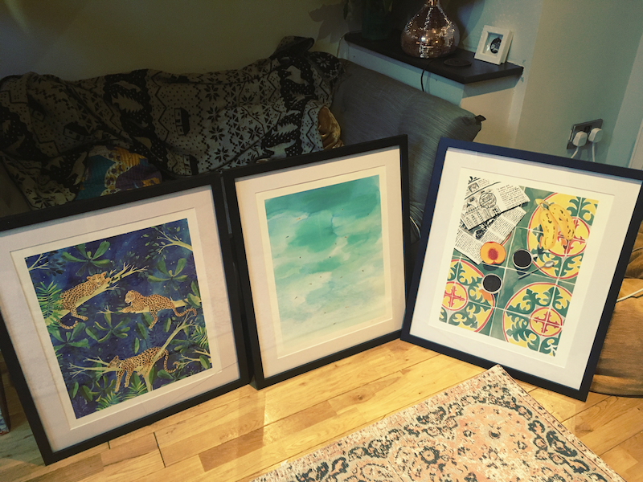
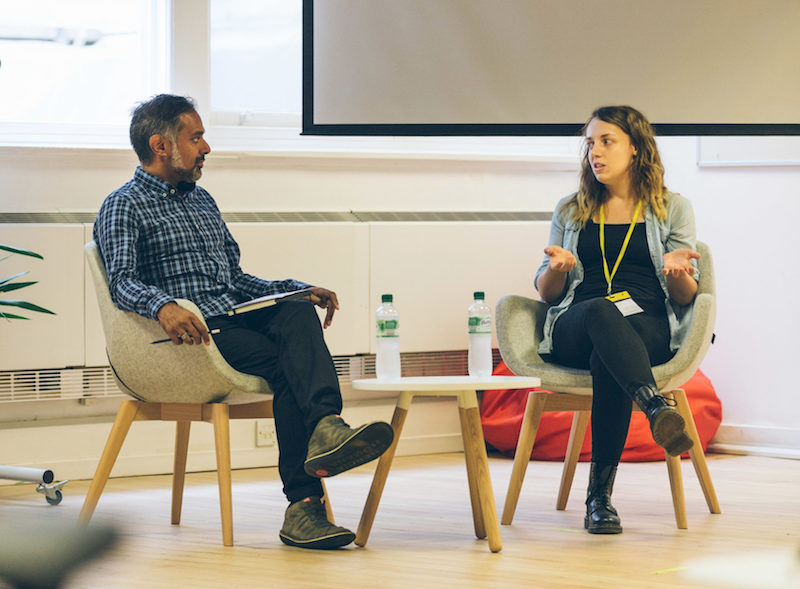
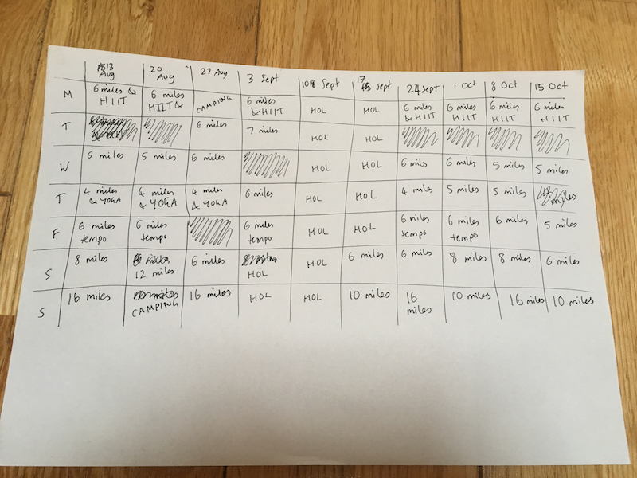

Wow, where did September go? Well, most of it disappeared in Spain, where I spent 2 weeks [walking 300km of the Camino de Santiago](/blog/2018/camino-de-santiago/). But what about the other two weeks at the beginning and the end? I really struggle to remember much of anything, but according to my diary things did happen!

##### First month in our new house

On the 8th of September we celebrated a month in our new little home. Well, we didn't celebrate because we didn't do anything special, but that landmark passed. We've had lots of friends over in batches of around 4 (being limited by the number of chairs we currently have) which has been lovely, and I framed some art that I bought from <a href="http://www.ohkiistudio.com/" target="_blank" rel="noopener noreferrer">Ohkii Studio</a>. These prints were my indulgent housewarming present to myself, and I don't even feel the tiniest bit guilty about them!

We also ordered an organic vegetable box which arrives every Wednesday and is honestly the highlight of my week. It is so exciting to come home and discover what variety of potatoes have been bequeathed to you this week. My favourite item so far has been a glorious Romanesco cauliflower which we made into a delicious gnocci, which was so good I definitely didn't get any pictures of it.

##### Revisiting Northcoders

At the beginning of September I popped back to Northcoders for a couple of hours to chat to Amul, a good friend, ex-classmate and ex-colleague of mine. We were on the first cohort together at <a href="https://northcoders.com/" target="_blank" rel="noopener noreferrer">Northcoders</a> in April 2016 and we then both began working together afterwards. He invited me back for a 'fireside chat' (there was no fire involved) where we talked about the development of the course, software development as a career, expectations, tips and advice, with an audience of about 60 current or very recent students.

It was a pleasure to chat to everyone and I was pleasantly surprised that people actually seemed interested in what I had to say and had plenty of questions! I gathered that most people had the transition from bootcamp to job on their minds, as most questions focussed around this topic, with questions ranging from "Do employers value you as much as a computer science graduate?" (I've never worked with a computer science graduate so I don't know, but I think employers should and would hope most do) to "What do you wish you'd known before going into a job?" (SSH, tunnelling, better CLI skills).

One of my favourite questions was "What advice would you give to people on the course right now?", which is quite a vague question but I liked it because I had the perfect answer stashed up my sleeve which I always try and give to anyone who's learning to code - don't worry too much! It's going to be your career to keep on learning and practicing this stuff, so don't get hung up on having to know EVERYTHING right now. You have a long, long time ahead of you where you're going to get PAID to keep honing your skills so you really don't need to stress right now.

##### Running & Health

As you might have read in [last month's update](/blog/2018/august-review/), I had an injury which had delayed my marathon training by a couple of weeks, and then I went walking for 2 weeks so all in all I had about a month off from running. Spain was tough and I definitely worked hard there, walking for up to 8 hours a day in all sorts of terrain, but I'm not sure it was any use as part of marathon training because you're using different muscle groups and it's a very different sort of exercise.

However, the change in exercise helped my previous injury and by the time I got back it felt completely healed. I have been running without any pain for the last 2 weeks, gradually building up my distances again. I have also decided to run 4 days instead of 6 every week, do yoga 1 day, HIIT 1 other day and then finally leave a day for resting. So far I feel really good with this routine, and I am enjoying the variation. It is also making me _really_ look forward to running, which will always be my fave, so all round a good decision so far.

I am so far away from Hanson's Marathon Method now, though, that it's a bit ridiculous. I am basically making up my own training schedule, so we'll see how that goes.

NB this is a page from my old plan, which was pretty intense. 😅

##### Goals from last month

✅ Get back into meetups and mentoring - Although I was away for the September Codebar I did attend a couple of meetups and I've signed up to help teach on a Ruby course in October.

✨ Self-treat my calf injury - I wanted to be running 16 miles by the end of September but this was a bit too ambitious given my 2 week break for our walking holiday. I am currently at 12 miles, so looking good for my 20 mile race at the end of October.

✅ Re-start my side project with React Native but without the starter kit Expo. I guess you could technically say I achieved this, as I created a new project and got a splash page working!

✅ Finish painting the living room and bathroom

✅ Bake and cook more and make the most of our lovely new kitchen! Well, last week we ate 4 apple crumbles so I reckon this one gets a big, hearty tick.

✨ Plan/run a workshop somewhere ⁉️🤷🤔💻 Still thinking about this one...

##### Goals for next month

✨ Complete my 20 mile race in Leeds

✨ Bake bread (my Mum bought us a mixer as a housewarming present which is brilliant because I can't stand kneading dough!)

✨ Learn Shell Scripting - I've never taken the time to learn this properly and it's annoying me

✨ Write a new technical blog post

✨ Run a film night for our Women in Tech Meetup

✨ Work through as much of the free Linux Academy courses as I can
