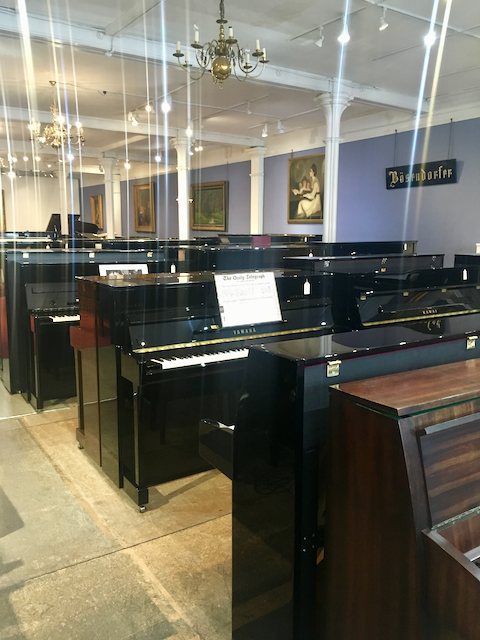
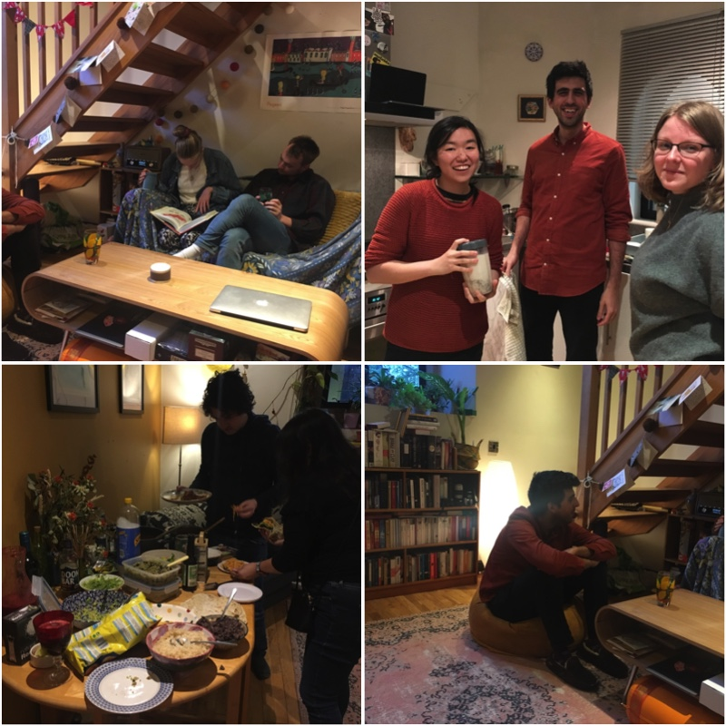
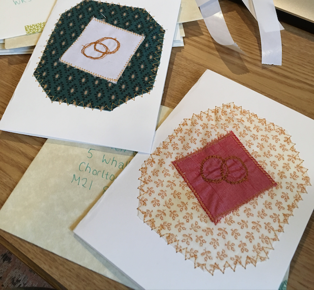
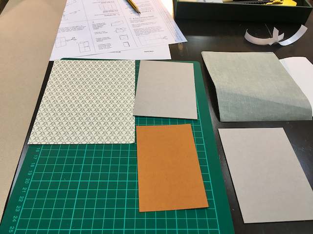

This post's going to be a short one, mostly by virtue of having done very little of interest during April.

I spent about two weeks with a flu/cold - in fact I think I had a flu, followed by a cold, which was completely my fault (the second one, anyway) as I refused to give into the fact that I was ill and continued to work, go to exercise classes and basically live my normal life which my body was not happy with, and thus decided to fall victim to a second illness as revenge.

##### Not getting a pomeranian

However, I did finally recover (yay) and was able to enjoy a nice Easter weekend with my Mum, who came to visit and stay with us in Manchester.

We ate at the wonderful <a href="http://www.pastafactory.co.uk/" target="_blank">Pasta Factory</a> and my Mum bought a clarinet. We also visited a dog sanctuary and almost came away with a blind, elderly pomeranian. In the end we dithered too much and decided to wait and see if another family adopted him (they did) so no pomeranian for us, although he was a cutie and I think I definitely have space in my life for a small disabled dog - send them my way!

Neither Mauro or I really celebrate Easter properly though, and as vegans we don't usually bother with eggs as I've never found a great vegan easter egg (I'm sure they're out there but I'm not fussed enough to actually go looking for one), so it was really just a nice long weekend for us.

##### Revival of the dinner parties!

For the first time in ages I decided to host a themed dinner party, this time with the theme of Mexican food. Up until about a year ago I was going to themed dinner parties regularly at a friend's place, as she had a large kitchen, and we used to cook and eat together roughly once or twice a month, but we let the tradition slip until now.

I invited a cautious 8 people, not being sure how many bodies my kitchen could physically accomodate (turns out the limit is more like 3), and it went well - lots of yummy food, good friends, and I'm looking forward to choosing our next cuisine!

##### Wedding plans

Don't talk to me about wedding plans!

Things are afoot, but after a not-quite-yet-in-retrospect-hilarious debacle with the invitations, in which half of my carefully handmade cards were destroyed through human error, I am a bit touchy about our wedding plans!

We hope we have now managed to invite everyone we want to invite, some of them twice, as we don't know how many of the original invitations "went astray" let's just say.

Here's to hoping the actual wedding will have fewer disasters, although we can't promise anything!

##### Bookbinding

This was the beeeeeest thing about April for me! Although it occurred on the same day as the aforementioned invitations debacle, going to a full-day course on bookbinding with Mauro cheered me right up and I had an _amazing_ time. Turns out bookinging is really fun and quite accessible for a beginner - we basically spent the day learning to fold and glue and position things, which was extremely satisfying.

I can highly recommend the event, run by the Portico Library in Manchester. You can see any upcoming events <a href="https://www.eventbrite.co.uk/o/the-portico-library-1321223273" target="_blank">here</a>. I'm checking the list every day to see if they release another course, and I want to make a visit to <a href="https://ratchford.co.uk/" target="_blank">Ratchfords Bookbinding Supplier</a> in Stockport so I can continue at home.

I've been looking for a new hobby for ages, something which seems to attract me and is easy to get started with, and I think this might just be the perfect thing.

##### Reading & Listening

I got back into Audible this month, so my first 2 books were audio books and the rest physical. I've realised I prefer the audio format for fiction rather than non-fiction, so looking forward to listening to more books in the future and enjoying it more than I have in the past.

1. **Educated by Sara Westover** - an amazing autobiography of a women who grew up uneducated in a very rural, survivalist mormon family and finally got an education at the age of 17, making it to Cambridge and Harvard after a difficult struggle.
2. **Endurance by Alfred Lansing** - details the story of Shackleton and his crew's failed expedition of 1914 to the South Pole. Literally made me never want to leave the house again just in case I accidentially might end up anywhere near the South Pole, it sounded so incredibly horrible and I never want to go anywhere near there thanks.
3. **Prisoners of Geography: Ten Maps That Explain Everything About the World by Tim Marshall** - Really enjoyed this look at the geopolitical histories and contemporary realities of a handful of the world's geographical regions. Fascinating, engrossing, definitely recommended.
4. **Otra educación ya es posible by Almudena Garcia** - Running out of books to read in Spanish so read a book on alternative education that Mauro had had for a while. Pretty good, if you read Spanish and are interested in education!
5. **The First Bad Man by Miranda July** omg omg omg this was a brilliant book. The story was so perfectly tightly woven and clever, it's one of those books you just marvel at the author's brain. Definitely reading more by July.

That's about it - hope you also had a good month and were less ill than me (ideally not ill at all) 🙌
