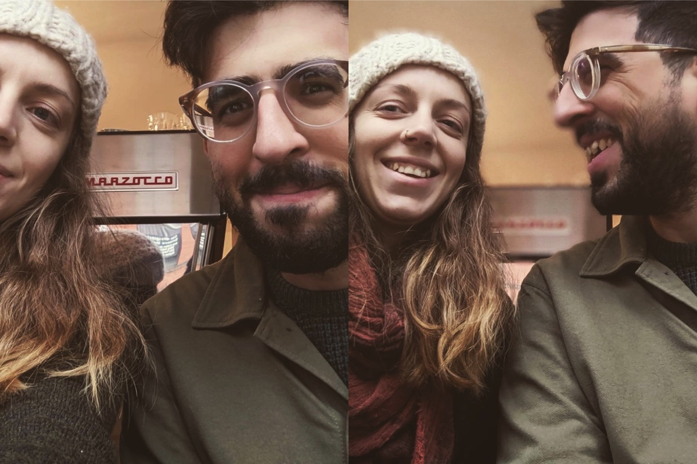
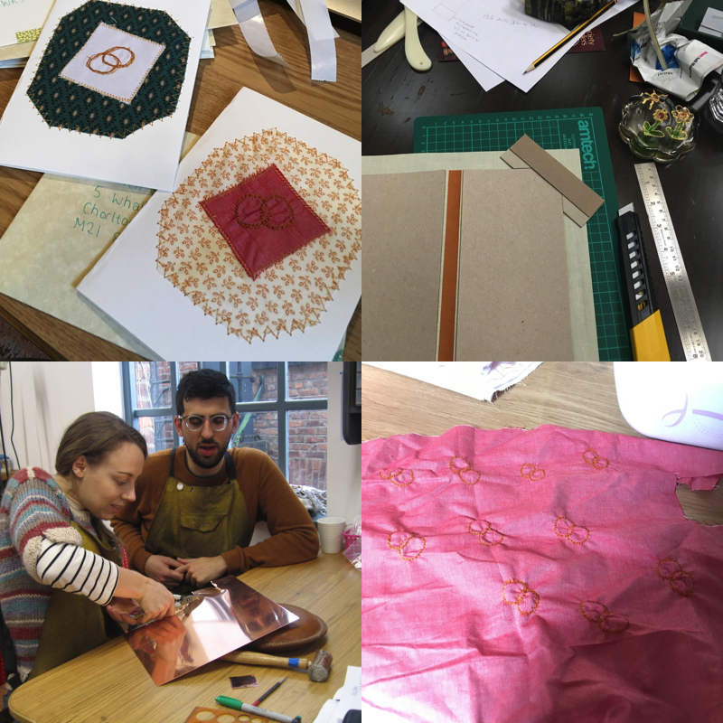
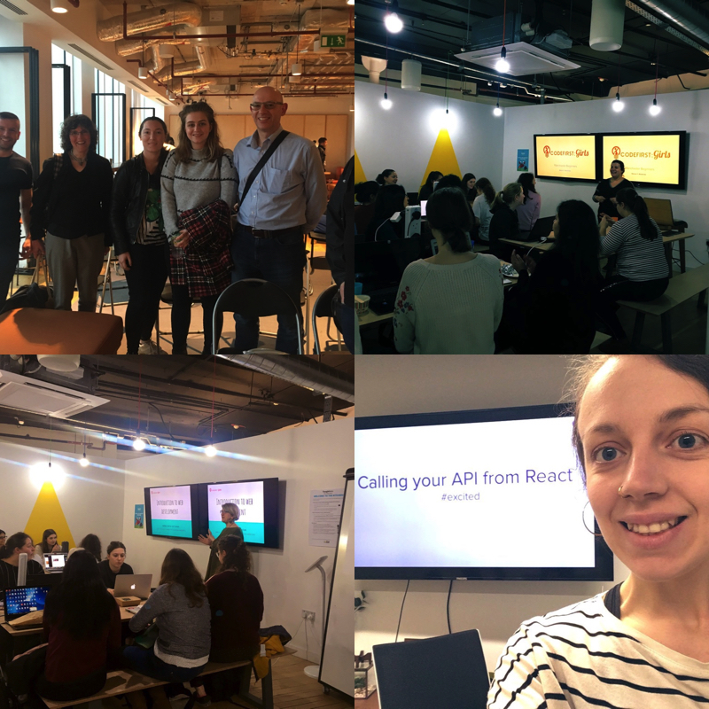
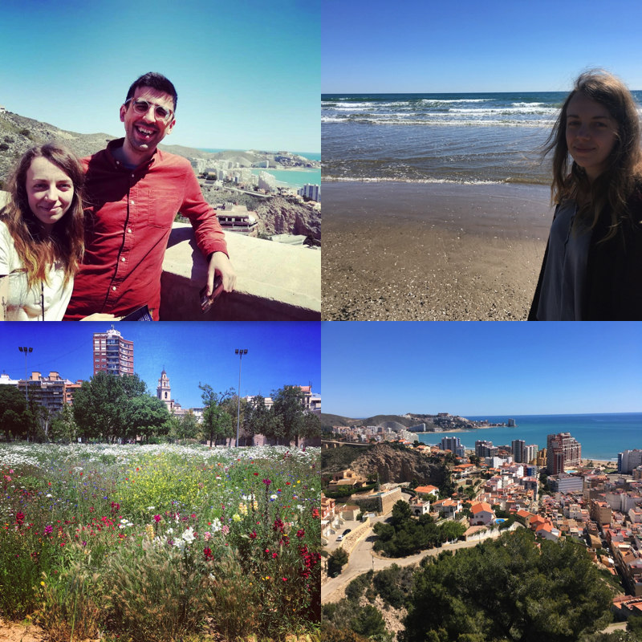
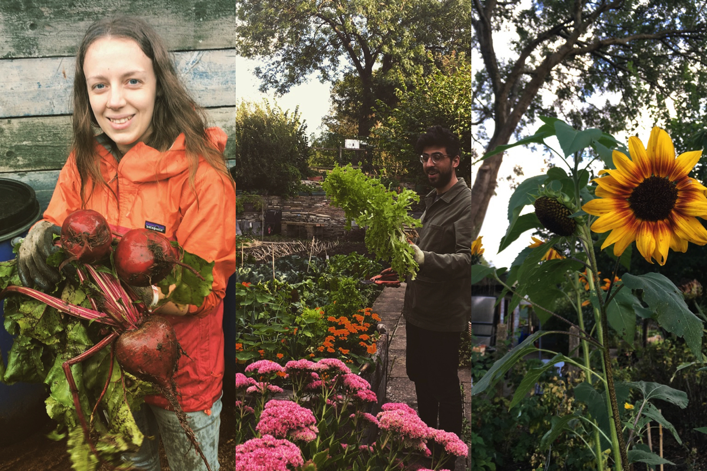
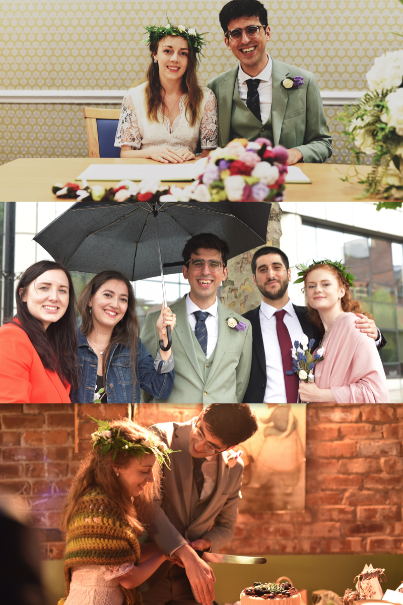
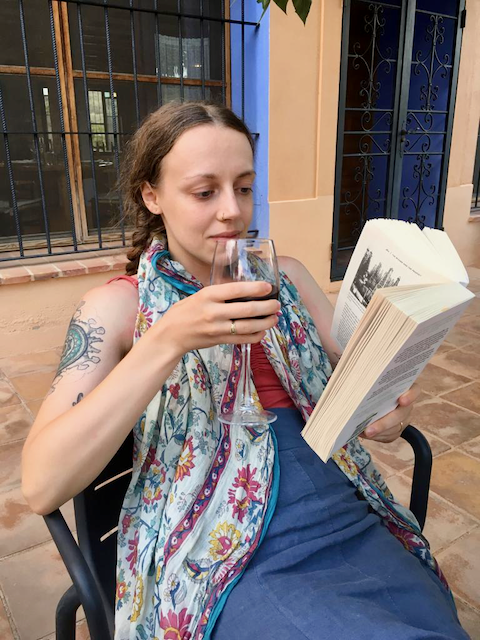
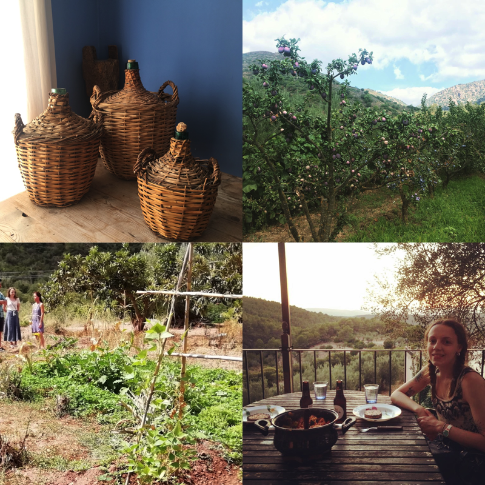
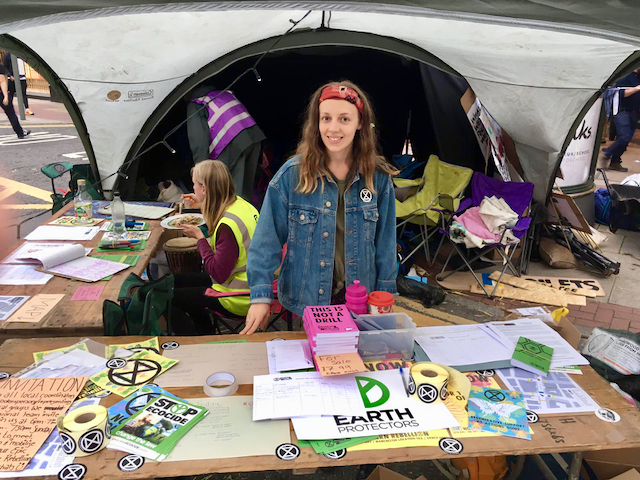
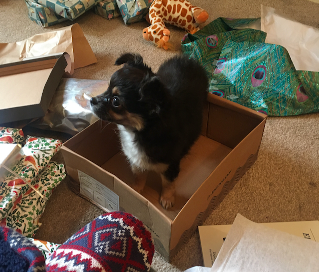

First of all, I'd just like you to take a look at my <a href="/blog/farewell-2018" target="_blank">2018 in 5 lists</a> blog post and look closely at those pictures taken a full 12 months, 365 days ago.

And tell me how much my hair has grown since then.

Yep, basically not at all. And I only had one tiny little trim 😔 Praying for greater growth next year.

This year, instead of making a tonne of lists, I'm going to try something different and look back at the year more chronologically. So, how did 2019 go for me?

I started the year out with lots of energy to pursue the things I wanted to achieve, determination to do more of what makes me happy, and goals for the year ahead. I started January doing yoga every day, which I didn't keep up, but I did practice regularly all year, and I made more time for crafts and other hobbies which has been on the back burner for a long time.

Bitten by the crafting bug, Mauro and I made our own wedding rings (and amazingly they didn't turn out the slightest bit lumpy!) and our own wedding invitations. However, after accidentially posting half the wedding invitations in a pile next to their envelopes rather than _inside_ their envelopes (miscommunication 😔) and half our invitees receiving mysterious empty envelopes, we had to re-do most of them so I got really good at making embroidered ring designs and using the zig-zag pattern on the sewing machine!

Early in the year I led a <a href="https://www.codefirstgirls.org.uk/" target="_blank">CodeFirst:Girls</a> course in Manchester. This was to be the start of a year that involved a lot of teaching for me, as I soon afterwards decided to jump on an opportunity to teach software development with <a href="https://techreturners.com/" target="_blank">Tech Returners</a> on a more full-time basis. This involved leaving my previous full-stack engineering role at <a href="https://www.formisimo.com/" target="_blank">Formisimo</a>, which I was sad about, but I felt drawn to doing more teaching and I was excited to also be able to work as a developer at the same time, doing consultancy work. I also Co-organised <a href="https://codebar.io/manchester" target="_blank">CodeBar</a> from March-December, hosting a monthly event at <a href="https://labs.uk.barclays/locations/manchester" target="_blank">Eagle Labs</a>.

This year I've felt really privileged to get to work with so many inspiring people who are making their way into tech, or returning to tech. I've taught in quite a few different places, and delivered different courses, and the <a href="https://www.techreturners.com/your-journey-into-tech/" target="_blank">Your Journey Into Tech course</a> is one of the best - well orchestrated, challenging whilst also supportive, and delivered by people who care! Check us out if you're thinking about a career in tech, or know someone who is 😊

Mauro and I managed to fit in a trip to Spain in the Spring, one of our only two trips away this year. We've worked too much these last 12 months! In May we visited Valencia for a few days, where we got a much needed dose of sun and sea and family after a pretty rubbish Spring in the UK.

When we got back, life was pretty full-on during the summer as we worked, made a few refurbishments on the house, and got ready for our wedding in August. However, during that time, we also got pretty involved in a local community allotment, which we visited most weekends, as we were deperate to get outside more and do something pratical and calming with our hands.

Over the summer we probably got about half our fresh veg from the allotment, which was a high return for a pretty low investment, but I think it also frustated us that the space wasn't totally ours to experiment with and we couldn't go freely whenever we wanted. I'm still on a waiting list for our own allotment, but we'll probably be retired by the time we actually get selected!

If we learned anything this year, it's that we really need somewhere with a garden. We are both dying to grow our own veg, have some outside space to call our own, and a shed to potter around and keep messy, dirty outdoors stuff in. In fact, this realisation led us on to considering many options for moving house, with the main aim of being able to have outdoor space. More on that later.

Anyway, back to the main event! The wedding! The wedding itself was a low-key affair, the biggest drama was probably the incident with the invitations! The ceremony was held in Manchester Registry Office and we had about 45 people to the reception afterwards, which took place in <a href="http://manbitesfrog.com/" target="_blank">Man Bites Frog</a> in Chorlton. The food, by the way, was AMAZING. Perhaps the best food I've eaten all year. It's just a shame I was squeezed into a wedding dress and not able to gorge as freely as I would have liked.

One of the nicest things about the day was seeing Mauro's family who had come over from Spain and two of his best friends from childhood who had come all the way from Argentina with their partners. It made both of us miss being close geographically to our best friends, as my best friends also live far away (although one of them has recently got closer, as you'll read later on!). One of our good friends <a href="https://www.linkedin.com/in/carolinabeiertz/" target="_blank">Carolina</a> took some photos for us, as did Mauro's friend Pablo. Here are a few pictures from the day.

After the wedding we went on a sort-of-honeymoon to Spain. I say "sort-of-honeymoon" because it wasn't massively relaxing - we had an AGENDA. We were really curious to know about the provinces on the east coast of Spain, namely the Valencia/Castellon region, to see what it might be like to live there. I've always wanted to live abroad, and we both want to be nearer to family - right now we're far away from both mine and his, which isn't ideal. Also, we knew we wanted to have more space in the long run, so looking at the countryside seemed like a good idea.

As such, we managed to cram into 2 weeks a lot of driving around, visiting remote farms and villages, seeing friends and family, meeting new people and even taking part in a permaculture course! We stayed in some gorgeous places, including a period "masia" (large country house) literally tucked away in the fold of a mountain, with the most spectacular views in every direction, and a <a href="https://poudebeca.com/en/" target="_blank">farmhouse called Pou de Beca</a> in Castellón where we ate the most incredible home cooked "slow food" every night. However, it was a very different holiday to our <a href="/blog/camino-de-santiago/" target="_blank">walking holiday from 2018</a>. I think we missed out this year on a truly "relaxing" break, something that we should address in 2020!

That said, we did manage to read quite a lot, and of course buy a tonne of books in Spanish whilst we were there, so there must have been a fair bit of down-time! I remember reading an excellent book on the history of modern agriculture and the green revolution called <a href="https://www.theguardian.com/environment/2018/jun/10/charles-mann-book-wizard-prophet-interview" target="_blank">The Wizard and the Prophet</a>, which turned out to be one of the best books I read this year. I was also going through a phase of being interested in everything to do with agriculture and food production (thanks in part to the allotment) so this book was just one of many this year which I read about soil, farming, gardening and agriculture.

While we're on the subject, I read the grand total of <a href="https://www.goodreads.com/review/list/14052431-harriet?shelf=2019" target="_blank">76 books</a> this year, which is more than last year, but also fairly normal. I read a lot, I guess, and this year was no exception. I'd love to talk about more of my favourite books with you over a coffee or a drink, and probably rant for an hour about soil degradation, intensive pasturing and the failures of the green revolution.

The outcome of our honeymoon explorations, by the way, was that large areas of Spain are likely facing multiple threats in the coming years from environmental problems related to climate change, such as forest fires and water shortages. We didn't really get a sense of this from talking to people, who seemed quite unconcerned, and of course if you're in a city it's much less at the forefront of your mind, but we did begin to have doubts about whether we would be able to live the kind of life we want to live in the long run, in a rapidly aridifying area. Growing our own food and being as self-sufficient as possible is something we both dream of achieving in the future, and it definitely made us think about where we might be able to achieve this.

After getting back from the honeymoon, I think I had a kind of mini existential crisis. I was really concerned about the problems we'd seen and heard about in Spain and the rest of the world, and since 2019 was the year of climate consciousness, it would have been amiss if some of that didn't rub off on us too. I spent a long time feeling quite down, confused about what to do and what was the best way to live, and unable to find any answers. We got involved in Extinction Rebellion, doubled down on going to the allotment, and tried making all those consumerist choices to use more tote bags and buy wooden toothbrushes but none of it made us feel any better. I couldn't understand how people were just going about their lives normally whilst the world was on fire, yet I couldn't find the courage or inspiration to figure out what I could do, myself. I was hardly preaching from the rooftops (although it might have felt like I was to some of our friends!) and giving all my money to Greenpeace, so who was I to moan?

However, luckily (or not, for the environment), life managed to keep us occupied and pulled me out of my slump eventually. It was soon time to start teaching another cohort with Tech Returners, and this cohort was especially exciting as one of my best friends, Marsha, was going to be taking part! As I mentioned earlier, my two oldest friends have both been living down south since Uni (and before - we're all from Kent originally) so I don't see them nearly as much as I'd like to. However, during the course, Marsha's been staying with us in Manchester which is lovely and we don't ever want her to leave, not least because she has a habit of keeping the house well stocked in wine and fancy vegan chocolate.

So it's been a very exciting few months, and I'm pretty sad that Marsha's cohort is coming to an end soon. We have got into the very middle-aged sounding habit of having cauliflower pizza every Sunday, and experimenting with strange flavours of Co-Op chocolate when we work at home together. It's been a whirlwind. Our house has now completely become a coding club, Silicon Valley-style, and I don't want it to end!

Finally, as if this year wasn't exciting enough already, two major life changes happened towards the end of the year. One of them was that I stopped the consultancy work I was doing alongside teaching for something more permananant, as the consultancy was drawing to an end anyway, and I was looking for a new technical challenge. I joined a small company called N3O, making software for charities and NGOs. I was really drawn to the ethical impact of the business, and I've been there for almost a month now. A big change is that I'm now fully remote - I was previously working remotely _from an office_ (i.e. I was a consultant on a remote team but I chose to do that work _from_ an office) but now I'm at home every day. Not that working from home was anything new - I've been doing it regularly for a few years - just not 100%. Anyway, that change paved the way for another big change, which is really where this whole blog/year/life has been leading...

Mauro and I got a puppy!

He is literally the best thing ever. He is a long-haired chihuahua, currently 3 months old, and just the sweetest, cuddliest thing in the world. He is doing so well with his training and he loves snuggling on laps and sleeping on people. I've always wanted a dog of my own, even more so since my family dog passed away from old age about a year ago, so as soon as it was feasibly possible I didn't waste any time - we picked him up the weekend before I started working at home!

Having a dog is definitely a commitment but life is 100% better with a little furry friend by your side. I am really excited to see how big he grows and how he turns out over the next year, and if you've been following <a href="https://www.instagram.com/harri_etty/" target="_blank">me</a> or <a href="https://www.instagram.com/maurogestoso/" target="_blank">Mauro</a> on social media you'll see that we've basically given up sharing anything other than Tofu updates.

Oh, and if you're in Manchester and want to help us socialise a small puppy, HMU! He loves people, but he could love even more!

👋
