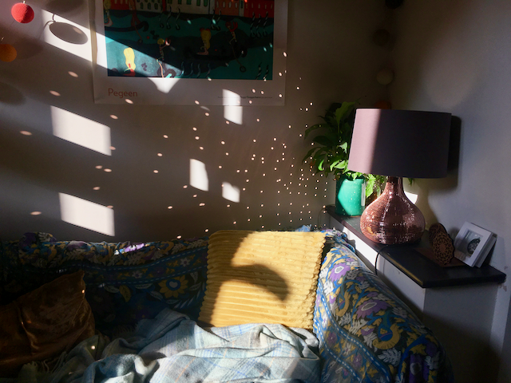
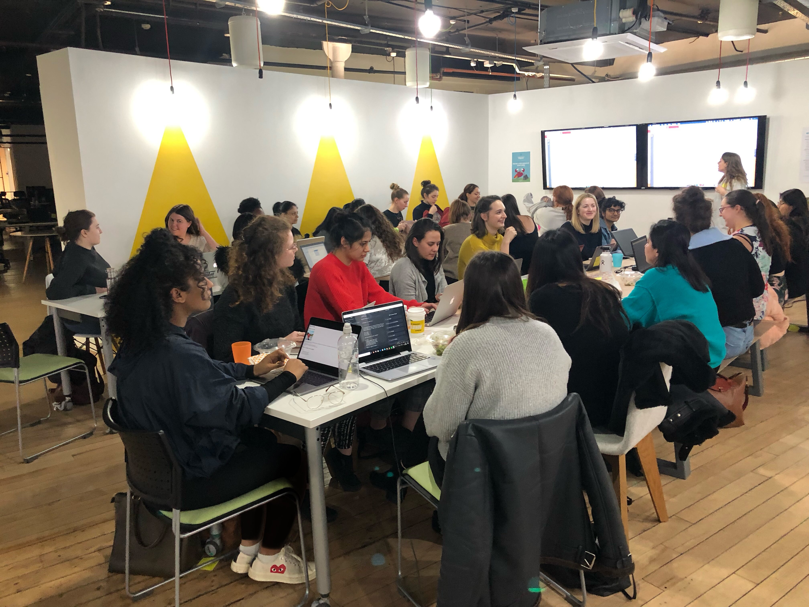
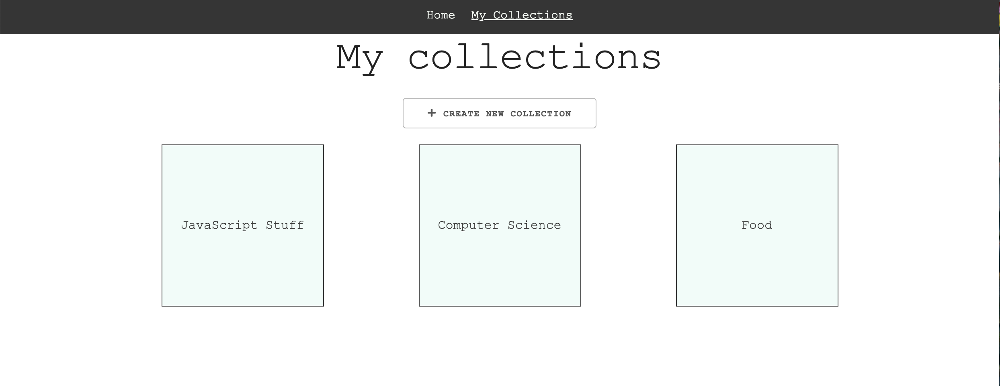
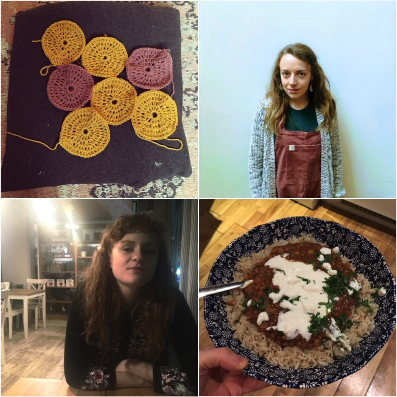
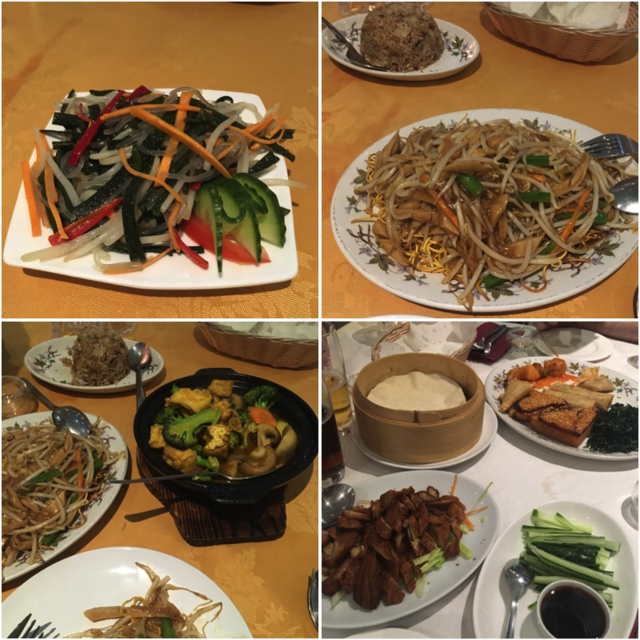

February was a strange month where, for a few days, I almost thought winter was over and it was spring again, only for the drizzle and wind to sadly return and remind us we still have a couple of months left before we can really expect to be eating outside and leaving the house without gloves.

It seems like forever ago I was reflecting on January. At the end of January, I was chastising myself a little for taking on too much and filling up my diary with obligations and commitments, something I'm always far too tempted to do, and which I seem to not be able to moderate.

Febrary was no different, although I've made an effort to be more conscious of what I'm saying yes to. I've started doing only the exercise that I really feel like doing, and not forcing myself to run every morning because it's the "right" thing to do. When my running bag I take running to work broke, I decided not to replace it and just enjoy cycling or walking instead. And when I received additional requests for mentees from <a href='https://mentorcruise.com' target='_blank'>MentorCruise</a> I decided to accept only one more applicant, who would be filling a space left by a previous mentee who I now work with less regularly.

Here are some of the other things I've enjoyed doing in February.

#### Teaching with CodeFirst:Girls

I've been helping lead the **Introduction to HTML/CSS** course in Manchester, which I was initially a bit worried about as I hadn't even _seen_ the course being taught, and normally lead instructors have assisted at previous courses before leading it themselves, so I split the teaching with Sam, who usually leads these classes.

In the end, after looking through the syllabus and running the first session I wasn't worried at all - it was all stuff I'd taught many times before, so I don't know what I was worried about. I guess I just wasn't sure how the format of the classes was intended to go, or how much leeway there was for veering off the script which is provided. I usually prefer teaching from a syllabus that I've had some input to, and from slides that I've created myself, but I found that the materials were excellent and Sam had taken a thorough pass over the slides, making them super easy to pick up and follow.

Personally, I like showing live demos and examples, so I found myself switching away from the slides and making small code examples to demonstrate a point, which is a personal preference. I had good feedback from the classes which I did, and I'm actually a bit sad that I've only got one more taught class to go out of the 6 taught sessions!

All in all, definitely something I'll be signing up for again.

We were really happy to have such a large group taking this semester's course, too: 32 students at the beginning, which was awesome.

#### Working on TweetMarks with Mauro

Mauro and I started a side project a couple of weeks ago which has keps us busy at weekends and during odd spare hours of the morning/evening. It's an application that allows you to keep track of the tweets you favourite on Twitter, putting them into categories and collections.

The idea came from the fact that we both use Twitter favourites to kind of "bookmark" stuff we're interested in - articles we want to read, things we want to check out later, threads that are interesting. I've found many times that I want to share something that I know I liked on Twitter a while ago and it's really hard to find it again.

So TweetMarks will read your latest favourites and allow you to categorise them. At the moment it's super simple - that's literally it. But we'd like to add a text search functionality, perhaps using ElasticSearch which I have experience with and think would fit the job perfectly.

We haven't made our first live deploy yet, but it's coming soon! Watch this space!

Working with someone else is massively helping me keep on track with this side project, and we're really enjoying having something cheap and fun to do together at the weekend.

Implementing the authentication with Twitter was one of the first things we cracked together, which was pretty hard but also a lot of fun. Since then, here are a few of the tools and technologies we've been using:

- MongoDB
- React
- Express
- Jest
- Styled components

We're well within our comfort zone with these technologies, but pretty soon we're going to think about getting our first iteration live and we might make some changes in our tech stack at that point, perhaps migrating to serverless functions.

#### Reading list

In February I read 4 books:

**Hot Milk by Deborah Levy**: I quite enjoyed this, and would definitely read more by Levy, although I wouldn't put it right at the top of my favourites pile.

**China Rich Girlfriend by Kevin Kawn**: I was a huge fan of Crazy Rich Asians, and this is the second in the series - equally hilarious and entertaining, and I can't wait to read the final book. I'm saving it for a while because I'll be really sad when I finish this trilogy.

**Milkman by Anna Burns**: Although this won the Booker Prize last year, I've found it hard to get into. It's a story of growing up in Ireland during the Troubles, a period I don't know all that much about and the book is also not particularly enlightening, everything being cloaked in shady references and metaphor. So I was none the wiser and also a bit bored.

**Shrinking Violets by Joe Moran**: Having read _Quiet_ by Susan Cain and found it hugely useful and fascinating in explaining common misconceptions around introversion & extroversion, and full of practical advice about how to carve out a place for yourself in the world that works for your personality type, I was curious to read more about this topic. What I learned was that introversion and shyness are absolutely not the same thing. Although I think I'm edging towards the introvered end of the scale, I'm not shy, so there was a lot in this book which I didn't identify with, and unfortunately I also found the writing forumlaic and repetitive.

#### Other things

A few other highlights of February included:

- Getting to have coffee with one of my best friends Flick, when she came to Manchester for work 💕
- Having friends over for dinner
- Realising that yoghurt with anything is amazing
- Starting crocheting a cushion cover for relaxation
- Getting amazing pink corduroy dungarees for my birthday 🎂
- Running in the sun
- Eating lunch outside in MediaCity 🌞

On the subject of my birthday, which I let pass without any particular fuss, I have to mention the amazing meal I had at **Lotus Vegetarian Restaurant** which is a fully veggie and mostly vegan restaurant in Withington, Manchester.

I absolutely adore this place, although it's kind of weird and a little overwhelming to be able to choose pretty much anything from the menu. #firstworldproblems

And amazingly, we also went back a couple of weeks later for a good friend of mine's birthday dinner, which was ideal as I hadn't been able to stop thinking about my mistake of not choosing the fake duck pancakes for a starter.

That's about it for February - although I do have some very exciting other news to share soon 🙃
