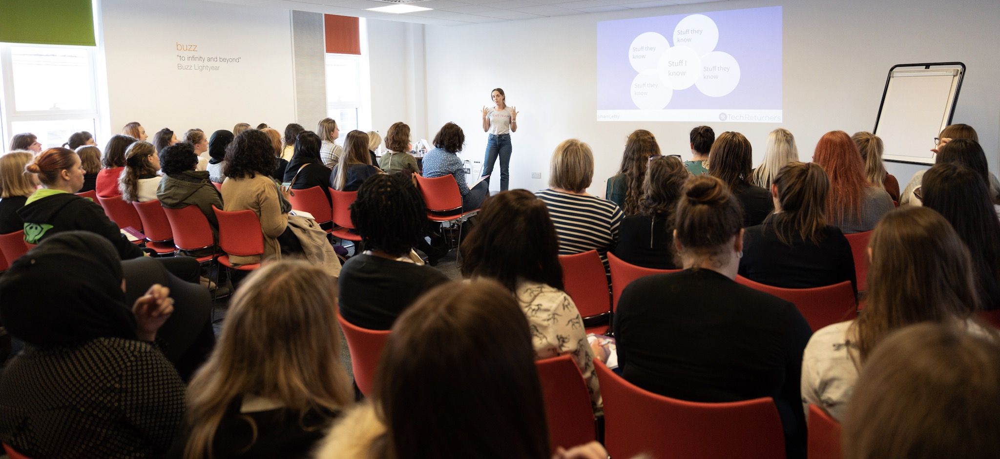

Last year was the first year I remember ever actually writing down and committing to a number of goals. Usually I just make a vague promise to myself to maybe try harder next year or stop biting my nails (if I'm in a nail-biting phase at that particular moment in time) but I'd never really made a real list before.

I really enjoyed the exercise and started the year with big ambitions and a tonne of energy which, as I guess I'll write about in another post, did not turn out to be an omen for things to come. Anyway, whether I met my goals or not, setting them helped focus my mind and made me think about what I wanted to achieve and I'll definitely do it again this year.

I think where I fell down were in setting myself numeric goals, such as how many blog posts I wanted to write. I was probably too lofty with the figures I chose. It's hard to go from 0 to 100 with no warm up - and trying to hit these targets just ends up feeling like a chore you're executing poorly rather than something I used to enjoy. Anyway, let's take a quick look at what I managed:

1. 💻 **Become a Certified AWS Developer/Architect** ✅

I got my AWS Certified Developer (Associate) cert in April, which I was super happy about. Lots of studying and revision paid off.

2. 👩‍🏫 **Run another CodeFirst:Girls course** ✅

I ran a Into to Web Development CF:G course in Feb/March. I remember it being a busy time for me as I was changing jobs at the time and had a lot going on - but it was still really fun. I didn't sign up to teach the winter class later in the year as I was scheduled to work 1 or more evenings a week anyway and knew it would have been too much - in fact I think the day of the week actually clashed so it wasn't an option anyway.

3. 🏃‍ **Run another 2 marathons**

I had a long break from running this year and got a lot more into HIIT and Yoga, so I ended up only doing 1 half-marathon which I feel super guilty about but I'M TRYING NOT TO BEAT MYSELF UP OVER IT.

4. 💍 **Get married** ✅

Done! Did a wedding! Got the dress and the ring!

5. 🐾 **Walk another section of the Camino de Santiago**

How did I think this was possible? Did I not count up how many days of annual leave I had? Actually, I think I imagined this would be part of our honeymoon, but we ended up deciding to explore the Castellon/Valencia regions of Spain on our honeymoon instead, because at the time we wanted to do some exploration and find out what it might be like to live in the countryside around there. The outcome of our investigations: dry.

6. ✍️ **Publish a blog post, video or piece of content every week**

As if! Was 2018-me aware of how many days are in a week? It appears not, or else I would have realised this is clearly unachievable unless I want to get in the habit of churning out crappy 3-liners basically saying [I'm not dead](/blog/2019/looking-back-last-few-months).

However, I did post a few blogs on <a href="https://dev.to/" target="_blank" rel="noopener noreferrer">dev.to</a> that I'm particularly proud of, including <a href="https://dev.to/harri_etty/the-introduction-to-servers-i-wish-i-d-had-44jl" target="_blank" rel="noopener noreferrer">The introduction to servers I wish I'd had</a> and <a href="https://dev.to/harri_etty/maybe-i-should-have-just-used-create-react-app-56af" target="_blank" rel="noopener noreferrer">Maybe I Should Have Just Used create-react-app</a> which both got quite a lot of traction and some nice comments and discussion!

7. 📚 **Keep reading regularly in Spanish** ✅

I said I wanted to read 12 books in Spanish this year and I've read 10.5 (half way through Game of Thrones vol 2). I'm gonna give myself this one, because GoT is massive and I _have_ been reading regularly. I even attended a 2-day course on permaculture taught entirely in Spanish, which probably gave my brain a workout equivalent to reading 10 books.

8. 💰 **Generate a side income** ✅

This one took a weird turn. I originally had in mind something like building a product indie-hacker style that would generate a small side income and I began working on a project for practicing verb conjugations in Spanish (<a href="https://conju-gator.com" target="_blank" rel="noopener noreferrer">Conju-gator.com</a>) which I never intended charging for, I was just curious to see how it might develop and it was something I wanted to build for myself anyway.

Then I started mentoring through <a href="https://mentorcruise.com/" target="_blank" rel="noopener noreferrer">MentorCruise</a> and earning £20 - £30 an hour which I thought counted towards my goal of generating a side-income but it also wasn't exactly what I had in mind and was quite hard to fit around other things in my schedule.

So I stopped doing that, went on a journey of teaching more, and then less again, in my day job, and am currently at a homeostatis of earning an additional income through teaching software development in the evenings, in a schedule that is much better for me and gives a lot more impact than I felt online mentoring provided. Again, this isn't what I had in mind by this goal but here we are!

9. 🤸‍ **Take my yoga to the next level**

Errr not sure if I've achieved this or not, I said I wanted to feel confident to teach yoga to a small group if called upon and since strangely nobody has called upon me for this duty I can't really say if I feel confident or not. Maybe I would feel confident but is it even legal? Should I have some qualification before I contort people into strange shapes? Not sure, but overall I've probably done the same amount of yoga as last year so I don't think it's really at the "next level" yet.

Maybe in 2020 I'll finally sign up for a retreat...

10. 🧘 **Take meditation more seriously again**

I meditated once or twice this year and I did take it very seriously, but that's not really what I had in mind with this goal...

11. 🐦 **Promote myself better** ✅

I wanted to get to 1000 Twitter followers by the end of the year, not sure how many I had last year but I'm now on 985. Perhaps if I post this blog and beg a little, I'll get an additional 15? I'm surprised the addition of an adorable chihuahua in my life hasn't earned me more followers if I'm honest, clearly I'm not capitalizing on his cuteness effectively.

Anyway, marking as complete because ~~depressingly, I didn't achieve the last 2 goals~~ I might not be able to run 2 marathons in the next 9 days, but there's still time to get 15 more followers!

12. 🍺 **Give up alcohol**

What? Did I actually make this resolution? Ha, I'd totally forgotten that.

Actually I do have a vague recollection of sitting in a pub in Feb/March time proclaiming "Oh, I don't drink" so I guess I must have lasted a while. However, life is short and beer is nice, so there we are...
