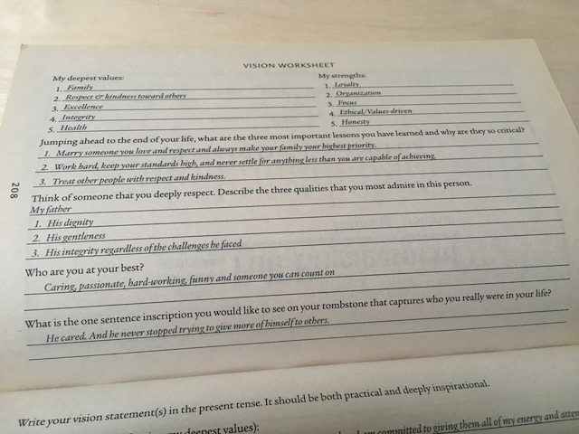

Looking at the cover of this 2005 edition of _The Power of Full Engagement_ by Lim Loehr and Tony Schwartz, you'd be forgiven for mistaking it for the last item left at the bottom of a 20p bin outside a second hand bookshop. It doesn't exactly look terribly appealing, especially if you're not in the habit of reading business-y self-improvement books.

However, it had been recommended to me by someone whose opinion I trusted so I decided to give it a go, and was quite impressed.

### The basic tenet of the book: Energy & Values

The main premise of the book is that you can improve your life by improving your energy levels, and that you can improve your energy levels by trying to maximise the amount of time you spend doing things that align with your values, and minimise the amount of time doing things that don't align with your values. Doing things that you don't connect with, from a values point of view, is incredibly draining, they say. However, when we do things that we _do_ connect with, we find untapped reserves of energy which help us approach all areas of life in a more enthusiastic, positive and connected way.

The idea of managing energy was a concept that really resonated with me, as I've always found it fascinating how my own energy levels ebb and flow. There have been times in my life when I've felt like I had almost limitless energy and would come home from work/studying/whatever full of enthusiasm and eager to continue the next day, and then there have been other periods when I've barely exerted myself at all during the working day yet come home exhausted, can barely be bothered to cook, and have no enthusiasm for my other hobbies and interests.

I'd always reflected on how strange it was that sometimes, in the most stress-free, un-demanding jobs I've had, I've often felt the most lacking in energy. And how in some of the more demanding jobs, I've ended up feeling more enthusiastic and determined. What is the correlation there? Surely if I'm spending less mental and physical energy at work I should have _more_ energy left over for other things?

I guess I had an inkling that energy isn't such a simple equation and that in fact, energy feeds energy. The more inspired and enthusiastic you feel in one area of your life, the more energy you seem to muster up for other areas of your life too. I had no scientific basis for this idea, it was just a feeling I had which seemed to be borne out by my own experience.

Reading _The Power of Full Engagement_, which focusses on these very questions, gave me a useful reference point for understanding how we respond, mentally and physically, to different types of activities. The key thing for Loehr and Schwartz is that engaging in activities that you feel are meaningful (depending on what that means to you and what your particular values are) is what generates "energy".

### The values you'd _like_ to hold and the values you really _do_ hold

The book asks you to think really hard about what values are most important to you and helps you by listing a number of values which you might like to consider.

When faced with a list of nice words like this, it's hard to pick out the top ones which resonate with you - they're all good words, after all! I mean, I might want to think of myself as the kind of person who'd put **generosity** and **creativity** right at the top but I also have to be honest with myself - I might like to think I'm creative but I actaully don't do that much creative stuff and I get more pleasure from learning something new than I do from making something, most of the time. It's hard to place certain values above others, because I used to consider myself a creative person, but somehow that's waned over the years and I have to question whether it's really an important value for me at the moment.

Loehr and Schwartz encourage you to choose 5 values (maybe from the list, or your own) which most deeply resonate with you, and use them to work through an action plan for increasing the amount of activities you do which align with these values.

### What I learned about my own values

Looking back, when I've had jobs that have been demanding it's because I've given them my all - because I've found the work meaningful and it fits with my values. Examples for me are jobs or activities that involve **teaching, mentoring, learning, writing and researching**. These fit with various values, such as **giving back to others, self improvement, learning, and excellence**. When I look at the jobs where I've felt most unenthused and stifled, it's generally been due to a lack of purpose. Perhaps in theory I ought to enjoy what I was doing, but when I've been unable to see how my work benefits other people in a meaningful way I've found my energy to flag.

The most enjoyable jobs I've had have been aligned with more than 1 value. For example, I quite enjoyed teaching English as a foreign language as I liked seeing students progress, enjoyed the preparation work, and liked knowing that I was giving back to other people. However, I have enjoyed teaching software development _more_ because it not only aligns with those values but allows me to learn and keep up to date with my trade.

I also realised that other values that I place highly are **autonomy** and **trust**. The most depressing job I ever had was probably working in a cafe of a large department store. Although the work in itself wasn't too bad, there was absolutely no ability to try and improve the way we worked, make suggestions or do anything outside the regulated way we were supposed to work. There was just no interest in any of that, even though the organisation was a shambles and it was a wonder we managed not to poison everyone with our less-than-ideal attention to stock rotation and use-by dates. Not being given autonomy to make changes and the trust to do things the best way is depressing for anyone but I realise now that my aversion to arbitrary regulations are what has pushed me away from working for large companies and drawn me towards startups throughout my software career - and any salary on offer from a big corp would not make up for how much I hate pointless or inefficient rules and processes.

### Action plan

The proactive part of the book involves helping you come up with an action plan for increasing how much time you spend doing things that directly align with your values.

You might not be able to quit your job and find a new one which aligns better, but you might find that by allowing yourself time after work to take part in a meaningful activity which _does_ align with your values you can improve your energy levels enough to make work more bearable.

You also have to take a close look at what you do which _doesn't_ align with your values and this often involves identifying a behaviour which can be unpleasant to recognise. For example, if you value spending time with family but you look at yourself and realise that you are frequently distant and distracted when you're at home, that behaviour is blocking you from actually behaving in a way that's consistent with your values.

If you think generosity and kindness are important but you can't think of a time you've recently been generous or especially kind, then you have to recognise that and consider how a generous and kind person actually _would_ behave.

The book offers lots of case studies of people going through this process, and setting themselves action plans to increase the amount of time they spend doing meaningful activities, and combatting behaviours which block them from participating in these meaningful activities. It also offers a comprehensive guide for how to create an action plan for yourself, with lots of thought experiments and activities that you are encouraged to complete.

Overall, there's a lot of thinking involved - some of it uncomfortable - but I think that it has so much that you can take away and apply to your situation.

I decided not to do an action plan as I didn't feel like I needed to make major changes in my life _at the moment_ to improve my energy and enthusiasm, as I'm in quite a good place right now. But it did give me lots of tools to assess decisions that I make in my life, and it's made me more comfortable with the choices I _have_ made as I now realise how important it's been for me to prioritize work and activities that match my values.
