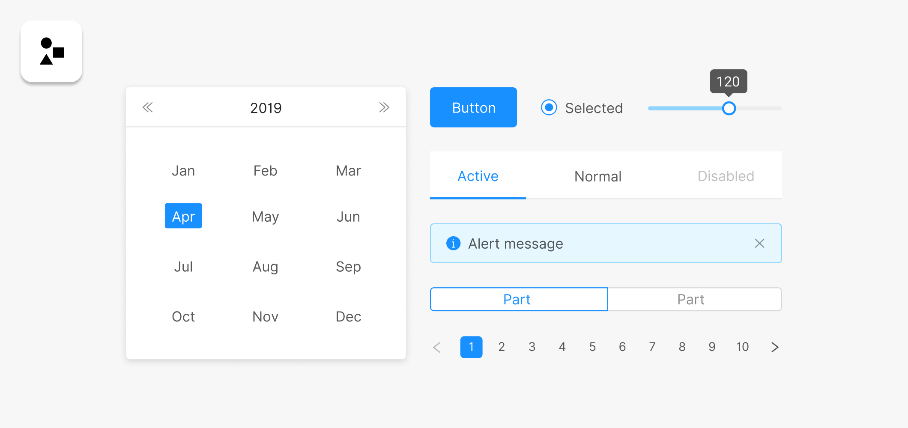

### What is Ant Design?

Since starting a frontend position, I've been working heavily with React and using <a href="https://ant.design/" target="_blank" rel="noopener noreferrer">Ant Design</a> on a daily basis.

Ant Design is a React component library - similar to <a href="https://react-bootstrap.github.io/" target="_blank" rel="noopener noreferrer">React Bootstrap</a> or <a href="https://material-ui.com/" target="_blank" rel="noopener noreferrer">Material UI</a> but in my experience, far richer in terms of components, documentation and functionality.

### Built in TypeScript for React

Ant Design was developed for React and is written in TypeScript, which means the types and definitions are great. It's also being developed for Vue and Angular by the community. The only thing I wish is that the documentation showed fully typed TypeScript examples - when you want to use Ant Design types, it's often it's not clear where to import them from, and some types that Ant Design uses are in fact pulled from sub dependencies (such as rc-select and rc-form).

### A Design Language

Ant Design is not just a set of components, it's also a design language. This means it offers resources and solutions for other aspects of design, beyond the individual components themselves, such as design patterns for common interface decisions and user experiences. The design language is built around the 4 key values of Natural, Certain, Meaningful, and Growing, and includes patterns such as "Stay on the Page", "React Immediately" and "Repetition". I think <a href="https://ant.design/docs/spec/overview" target="_blank" rel="noopener noreferrer">these guidelines</a> are interesting to read, regardless of whether these decisions are part of your job or not.

Components are also built with these principles and patterns in mind, so Ant Design recommends not to change the components' styles. Of course, you can still modify the styles if you need to by targeting the Ant Design classnames with your own CSS, and Ant Design does allow you to customize various aspects of the theme, such as the key colours, shadows, borders, padding, etc.

### Less, Not CSS

Interestingly, Ant Design chooses <a href="http://lesscss.org/" target="_blank" rel="noopener noreferrer">Less</a> as their styling language of choice. I don't know why they chose Less over the more popular <a href="https://sass-lang.com/" target="_blank" rel="noopener noreferrer">Sass</a>, especially since Sass loading comes out the box with create-react-app, whereas Less doesn't.

This doesn't force _you_ to use Less, you're free to write your stylesheets in whatever language you want, but your compilation process will need to include parsing for Less files.

This means that if you've got a CRA (Create Reat App) app, you need to update your webpack configuration so that it can handle `.less` files. To do that, you either need to eject your CRA app or use something like <a href="https://github.com/timarney/react-app-rewired" target="_blank" rel="noopener noreferrer">React App Rewired</a> to modify your webpack config without ejecting. But that's not a huge issue.

### Icons, Motion, Theme, Internationalization & More

One thing I love about Ant Design is its pretty fully-featured range of icons that come straight out of the box, which are even easier to use since version 4. No need to bring in a separate icon library like FontAwesome and the icons are really nice. Pairing an icon with other components is also super easy and looks great with minimal effort.

Beyond icons, Ant Design also offers solutions for transitions and motions via <a href="https://motion.ant.design/" target="_blank" rel="noopener noreferrer">Ant Motion Library</a>, modifying the theme, and internationalization using its `ConfigProvider` component, which can be married with a library like <a href="" target="_blank" rel="noopener noreferrer">react-intl</a> to implement internationalization across your application.

Basically Ant Design has an answer to all the common things a web app would need to worry about, and where it doesn't offer a solution out of the box it suggests great <a href="https://ant.design/docs/react/recommendation" target="_blank" rel="noopener noreferrer">third party libraries</a> that can be used. This list in itself is well worth studying if you want to keep your eye on some of the most popular and high-quality libraries available for React at the moment.

### Form Handling

With the update from V3 to V4 of Ant Design earlier this year (2020), form handling switched from being my least-favourite to my most-favourite thing that this library offers. AntD V3's form handling was incredibly fully-featured, with pretty good "out of the box" functionality but also the option to go deeper and handle validation, warning/error messages, help text, and controlling updating between different form elements. But it felt awkward to use, passing `refs` around was required in more complex forms and was a nightmare, and there were a bunch of helpful methods such as `onValuesChange` which were only available outside of the context of the component where the form was being rendered, which was pretty annoying.

Version 4 fixes a lot of these problems and it just feels so much easier.

Like other complex components, getting the hang of Ant Design forms take a while but it's fully worth it. The amount of stuff it does for you is phenomenal, and really gives you no excuse not to do amazing client side validation and feedback on your forms.

### Extensive API

As I was just hinting at, a lof of Ant Design components are pretty complex. Simple use cases are fine, but as soon as you start needing to do anything more business specific, then you do end up trawling through a lot of documentation. However, this is definitely still quicker than trying to build your own hack around a less rich component.

### Version 4

The recent update of Ant Design to V4 has brought many great improvements, especially around forms, but there are so many breaking changes that for us it was impossible to upgrade the version overnight. As a result, we've had to keep both versions side by side in our codebase as we gradually migrate. We actually ran into a lot of issues when we had both versions installed initially, because of some detail in how Yarn resolves dependencies. Many components such as the `Select` simply didn't work and styles were all over the place. We decided to switch our package manager from Yarn to NPM to resolve the issue, but it was frustrating that it was a problem in the first place.

In short, the urgrade hasn't been quick or simple.

### Lots of community support

The community around AntD is pretty good. I rarely google an issue with AntD and fail to find either a Github issue with an official answer from an Antd author, or a good Stack Overflow solution. The AntD docs are really very good, but every now and then I'll find something missing, but I almost always find that someone else has already made a CodeSandbox with an example of what I need to do.

The only downside is that currently pretty much all the community Q & As are related to version 3, but often that's good enough in cases where the API hasn't changed too much.

### Overall thoughts

Ant Design is by far the best component library that I've used with React. I love how fully featured it is - for some, it might sometimes feel _too easy_ and like you're just slotting colourful bricks together, but to me that's definitely a good thing - save your energy for where it really matters!
