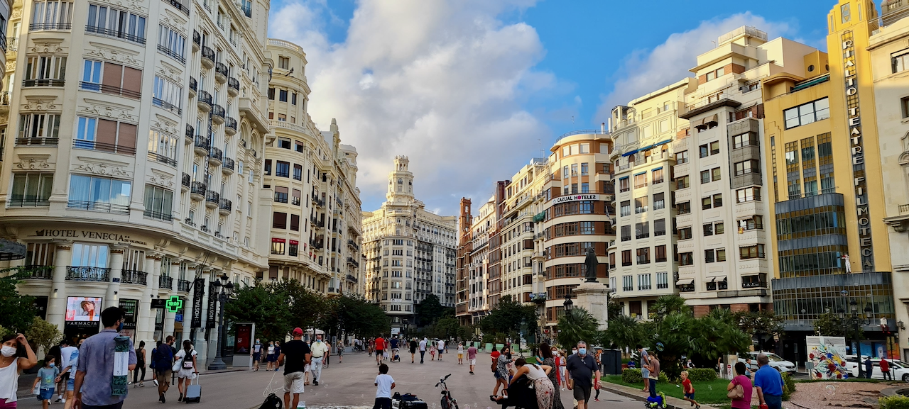
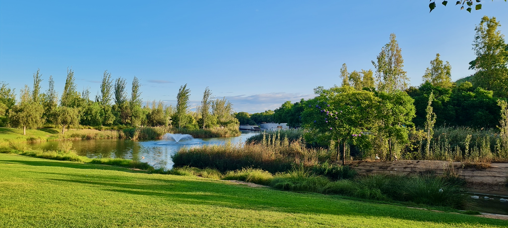
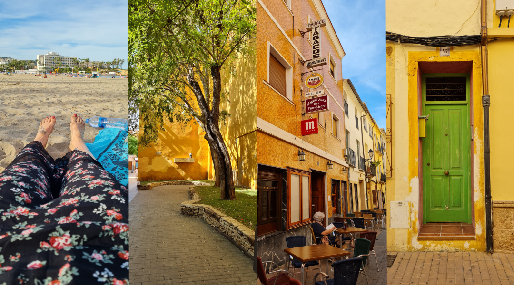
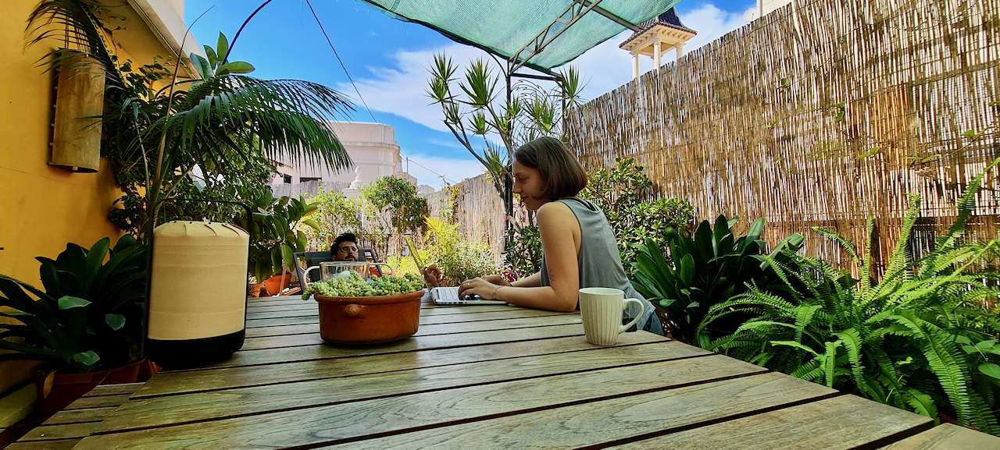
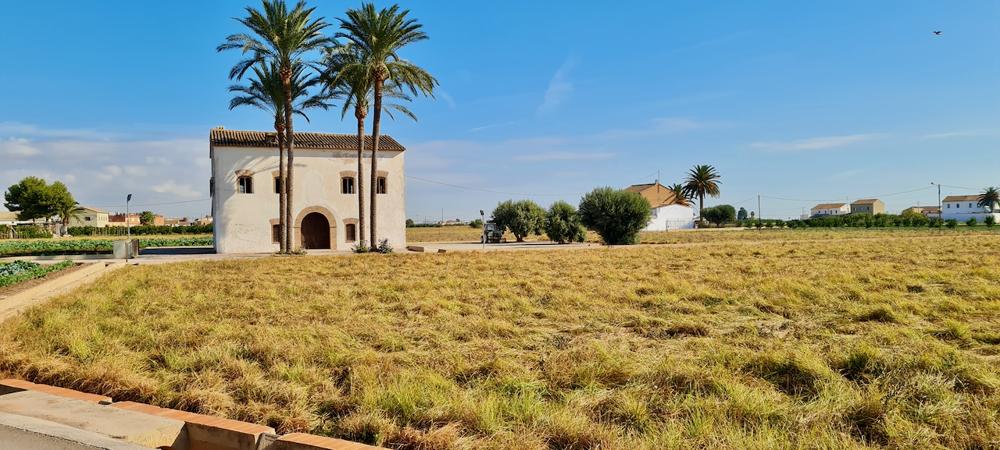

¡Hola! Ahora que vivo en España, voy a comenzar a bloguear en castellano también para practicar, y tal vez alcance una audiencia más amplia. Así que aquí lo tienes, mi primer blog en español.

Y bueno, esta es mi primera noticia. Vivimos ahora en España, en Valencia concretamente. Si me sigues en las redes sociales probablemente ya sabes que nos mudamos aquí, y probablemente ya sabes que hace muy buen clima, que se puede tomar el sol a mediados de octubre mientras que en Inglaterra la gente se está acurrucada al radiador, que he encontrado una panadería vegana a la vuelta de la esquina y que como tres cruasanes con chocolate allí cada día, que corro en la playa y que estoy viviendo la vida de mis sueños.

No, es broma, obviamente comparto las partes buenas en las redes, también hemos pasado unos meses con bastante estrés, que todavía trabajamos de las 9 a las 5 y pasamos la mayoría del tiempo enfrente de la pantalla, que el tema de la documentación es bastante agotador, que ahora somos muy pobres porque mudarse al otro lado del continente resulta muy caro (¿quién sabía?), y obviamente extrañamos mucho mucho a nuestra familia en Inglaterra, a nuestro perro que teníamos que dejar con mi madre por el momento, y a nuestros amigos.

Pero total, somos felices aquí. ¿Por qué nos mudamos? Pues, después de pasar 8 años afuera, a Mauro le apetecía volver a estar más cerca a su familia en Valencia. Yo siempre había querido tener la experiencia de vivir en otro país, nunca lo había hecho, y poder mover con mi pareja, a un lugar donde ya conocíamos gente, donde teníamos familia y a una ciudad que me encanta tanto me parecía una maravilla. Hacía mucho tiempo que teníamos la idea de escapar de Mánchester, pero no sabíamos exactamente adonde ir. La verdad es que la pandemia por todas sus partes malas adelantó la situación, dio a Mauro la oportunidad de trabajar de forma remota (yo ya lo hacía), y de repente tuvimos la opción de trabajar de dónde quisiéramos. Así que nos pusimos en marcha y en tan pronto como pudimos nos fuimos.

No te voy a contar todos los detalles sobre la mudanza, los trámites, todo eso. Tal vez en otro blog, a mí me parece bastante interesante y aprendí un montón pero no sé si os interesa así que ahora lo dejo al lado.

Llegamos aquí el 4 de septiembre. Fue una experiencia un poco rara, pedimos solamente un día de vacaciones (el viernes) para volar, aterrizamos en Valencia viernes por la noche, fuimos al AirBnB que habíamos reservado (bastante lujoso, ¡una pequeña indulgencia que nos permitimos después de meses encerrados!), nos quedamos con la familia de Mauro que no habíamos visto en más de un año (con mascarillas por supuesto, no había cuarentena obligatoria después de viajar pero tomamos muchas precauciones), compramos unas cosas necesarias para reemplazar algunas cosas que habíamos tirado antes de irnos de Inglaterra (otra historia triste… mis toallas favoritas… mis platos sentimentales… todavía tengo un poquito de trauma de todo eso…) y el lunes nos pusimos a currar otra vez, como nada había cambiado.

Después de un mes en el AirBnB, encontramos nuestro propio piso que tenemos alquilado por al menos un año. Con eso me puse mucho más tranquila, porque era el primer paso para conseguir el empadronamiento (es decir, un documento que prueba que vives en España y en qué región vives) y después la residencia que para mí, desde que no voy a ser ciudadana europea después de enero, tengo que conseguir de alguna manera. Pero ya dije que no voy a hablar de todo eso.

Ya han pasado siete semanas aquí. Parece más tiempo. Cuando muchas cosas pasan en poco tiempo y tienes muchas experiencias nuevas, siempre es así, ¿no? Que los días parecen más largos y las semanas parecen meses. Tal vez es eso, el secreto de vivir una vida muy larga.

Hay muchas cosas que me encantan de esta ciudad, y de España en general. Me encanta nuestro piso, que está en un barrio super guay, muy céntrico, en el pueblo viejo de la ciudad. Hay un montón de bares, restaurantes, panaderías, mercados y tiendas independientes en el barro. Ninguna cadena en ningún lado. Estamos a literalmente 30 pasos (los contamos) de un restaurante vegetariano que hace pimientos enormes rellenos de arroz y verduras que son para morirse.

Encontré un coworking muy cerca y trabajo desde allí, necesitaba salir del piso y quería rodearme de un ámbito español. Disfruto mucho más las tardes aquí, dado que lo normal es comer a las 9-10, que te da mucho tiempo para hacer otras cosas antes de cenar. Suelo salir a correr después del trabajo. Hay un parque enorme en el centro de la ciudad, donde anteriormente fluía el río que se desviaron hace muchos años después de unas inundaciones importantes. Se puede pasar mucho más tiempo afuera, ni siquiera tienes que pensar antes de salir porque siempre hace buen tiempo, no tienes que poner un montón de ropa o llevar paraguas, es algo muy diferente para mí y me encanta. Los fines de semana, normalmente nos quedamos con familia, para cenar o salir juntos. En mi vida adulta, nunca he vivido tan cerca a la familia y me gusta mucho.

Tomo muchas clases de español, por el momento en internet. Solo tomo clases de conversación, eso es lo que tengo que practicar, leo y hablo principalmente en español (aparte de en el trabajo) y creo que he mejorado bastante desde que llegamos aquí. Especialmente cuando se trata de entender el español hablado. Antes, dependía mucho del acento y de la manera de hablar de la gente. A veces entendía, a veces no. Pero ahora entiendo casi todo lo que escucho, a no ser que el orador haga muchas bromas o referencias culturales que todavía no capto. Como me encantan los idiomas, estoy disfrutando muchísimo esta experiencia de aprendizaje y mejoramiento.

Bueno, esto ya es un blog bastante largo. Hay mucho más que podría decir, pero esto es un resumen de mi vida reciente. Tal vez en el futuro profundizaré más en algún tema, si quieres saber algo específico (o corregir mi español jaja) me puedes contactar en Twitter como siempre.

Muchas gracias por leer, y ¡hasta luego!
