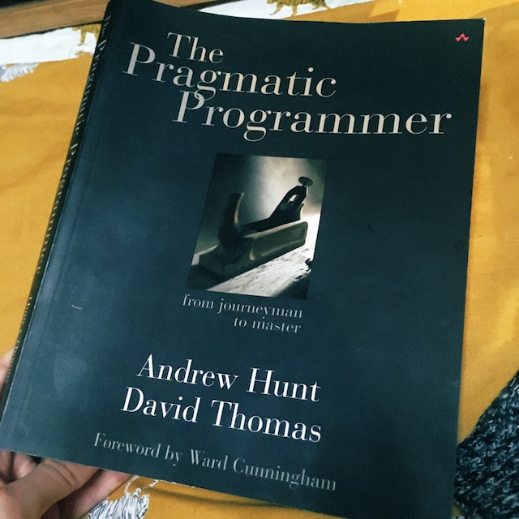
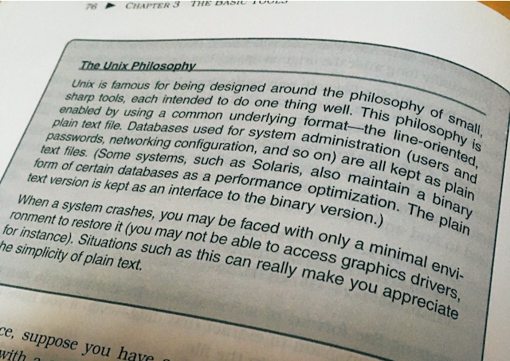

I recently read The Pragmatic Programmer, a classic in the software development/programming world. Even if you haven't read the book, it's likely you've heard some of the ideas it popularized, such as _rubber duck debugging_ and _coding katas_.

It was originally published in 1999, and my version actually dates from 2000. There is now a 20th anniversary edition from 2020, which I'd love to read - although looking at the preview on Amazon it doesn't look _hugely_ different. Anyway, it was actually really interesting to get a glimpse of what was going on in software 20 years ago - for example, **version control** was very new and barely practiced (the authors suggest that the reader try to use version control on personal projects, even if they don't get a chance to use it at work!), **UML** was the norm, and **developing for the web** was an afterthought, or at best a convenient way for developers to share documentation or expose build logs!

Anyway, it doesn't really matter that a few examples feel very dated, because the book isn't about the technical details. It's much more about general practices, attitudes, approaches and skills, which are as relevant now as they were in 1999. Many practices that the book suggests have, thankfully, become the norm now, such as **TDD**, **version control**, **automated test runners**, and **syntax highlighting in text editors** (amazing to think of all those programmers writing in plain notepads in the 90s!)

Some other things the book discusses, though, are either not so ubiquitous that they barely need mentioning, or were explained in a way that made me think or reconsider things.

Here are a few of my notes...

### Orthogonality

This is a term I'd heard of, and even thrown around a bit without being 100% sure what I was talking about. In my mind it roughly meant "things are separate to one another" and this is a good enough approximation. The technical definition of orthogonal is 2 lines that bisect at right angles to one another, which never quite made sense to me. Wouldn't parallel lines be a more appropriate way of thinking about 2 pieces of code/functions/modules that have no commonality and do not influence one another?

Well, in fact, a slightly more nuanced look at orthogonality in software makes the analogy make a bit more sense. If software is designed orthogonally, modules should not have side effects which affect one another (separation of concerns, encapsulation), but software modules, components or APIs can be combined with one another arbitrarily, to do more complex stuff. Additionally, the software should expose a single way to do a single thing, so that it's easier to combine. In this sense, you're not just looking at multiple parallel lines - you're looking at lines that are concerned with totally different things (they go in different directions) but which _can_ intersect with one another in specified ways.

### Tracer Bullets and Prototypes

The idea of a tracer bullet was actually new to me, although it's definitely something I've engaged in many times, without realising.

Tracer bullets are bullets that ignite or shine (can't remember how - phosphorous?) and basically show you that you're hitting the target when it's dark. In programming, the idea is that you need to trace a line from start to end and make sure it hits the target. This is different to prototyping - in prototyping you are creating throwaway code to prove a point. Tracer code is actually a lightweight path from start to end, it will probably become the **scaffold** for the future work and it's not going to get thrown away.

Whilst prototyping might be good for getting a demo in front of someone, and getting a feel for how something works (lots of it might be hardcoded, you might be using a temporary database or a framework you wouldn't normally use, just because it was quick), tracer code is more about proving a technical pathway that producing a demo.

What about **spiking**, which is a similar activity? Well, spiking is somewhere in between, I'd say. It's ususally smaller-scope than a tracer bullet because you might just be trying out one technical part of the problem in isolation. Or, equally, you could spike part of the UI to gain feedback or test some UI library, but it wouldn't be a full prototype.

I think it's useful to define tracer bullets, spikes and prototypes as it gives you the language to think about which of the three makes more sense in different circumstances.

### The Importance of Text Files

I was surprised to find a chapter dedicated to how important text files were - until I realised that storing config as plain text files is (or was, perhaps Windows has by now followed suit?) very much a Unix thing. Being a Mac person myself I just took it for granted that system config is plain text.

Plain text is a really powerful way of storing configuration (for the operating system, or anything!) because it ensures the configuration will be human-readable in the long term, and therefore more likely to be usable in the long term (as opposed to binary files, for example). The Pragmatic Programmer takes the idea even further and encourages developers to store any configuration for their projects in plain text files in the repo, too. Now, this idea completely ubiquitious - basically everything I configure at work, I do with text files in YAML, JSON, TOML or some other easy-to-read format, even configuring the IDE itself.

### Make Everything Configurable

What do they mean by make everything configurable? They mean, take as much logic out of your code and store it as config instead. Not just environment variables, color themes, magic numbers (e.g. `MAX_BASKET_SIZE`), and all the usual stuff you'd keep in config. But actual business logic too.

This chapter really made me think, because initially I thought "but that sounds like premature optimisation". Why take a single piece of logic, used in just one place, and make it into config? For example, imagine a business requirement that accounts with more than 1000 posts get a special message on their profile. One single requirement, that affects probably just 1 area of the app. If we were to make this concept configurable, then we'd need instead the abstract idea of a "profile message space" which could hold any message, according to a configurable rule, which is stored as configuration somewhere and pulled in by the app.

If you're building software for multiple clients, then this might well be the approach you have to take with a lot of things anyway, as you know different clients will want to use your software in slightly different ways. But for an app built with one client in mind, who just have one rule about this "profile message", it might feel like over-engineering.

However, The Pragmatic Programmer convinced me that making stuff configurable is also really valuable in this case because _requirements always change_. How much easier to change a simple config file (plain text! See above!) than dive into the code and figure out where to make the change? And so often, a requirement that starts in one place quickly spills into other areas. In addition to the profile message, you now also send a "congratulations email" on the 1000th post. Now you have 2 places to update when the client says, "actually, make it the 500th post". And so on, and so on.

In general, the more you can keep in plain text, and out of the code - the better. I really like this idea!

### Code Generation

With code generation, we're talking about using or building tools that generate code for you, which has loads of benefits as you can probably imagine - speed, accuracy, reducing duplication (this point needs a bit more explanation) and consistency.

There are 2 kinds of code generation you might use - **active** and **passive**.

**Active** code generation is when you create a certain file or bunch of files all the time. You can delete the files and create them again whenever you need them. Developers do not touch these files, they are auto-generated and auto-updated. The `package-lock.json` file is an example.

**Passive** code generation is where the generated code forms a scaffold which the developer then builds from, the code eventually becoming integrated into the project and being indistinguishable from other project code. An example is running `rails scaffold` to create a full set of controller, view, database migration, and test suite files. Or running `create-react-app` and getting the basic React app files.

Using code-generation features built into the tools we commonly use is fine, but what interested me more is the idea that we can even write our _own_ code generation tools for our own projects. Actually, this _is_ something I use in my job - for example, we use Umbraco as a user-friendly interface for storing and entering data that multiple parts of the system need to know about, such as permissions and routes. When new data is saved in Umbraco, we (currently manually) run a short script to generate C# code, which we then depoloy and is automatically built into Typescript clients. Multiple services consume these clients, but as developers we never had to duplicate the definitions of these routes and permissions across multiple services. True, the code _is_ duplicated, but it was produced automatically so it doesn't really count as duplication as it's never going to get out of sync, or cause us technical debt.

Another benefit we have in the above example, which The Pragmatic Programmer mentions too, is that automatic code generation helps us transform code into multiple languages from one source. This is a huge advantage, because this is where efforts to share code reach the limits. A solution may be to reach out to another service with an HTTP request to request the shared data or definitions, but code generation may be a more appropriate alternative.

I'm also interested in using tools like <a href="https://yeoman.io/" target="_blank" rel="noopener noreferrer">Yeoman</a> to build some of the frontend scaffolding we often need when we create a new page or component, it's something I've been meaning to look into for ages.

### Good Requirements

The Pragmatic Programmer isn't just about purely technical concerns, it also has some really valuable insights into teamwork, learning and communicating. The section on good requirement gathering really hit home to me!

Take these two expressions of a requirement:

A) Only users with the "finance" role should be able to view the financial summary

B) Only users with the correct roles should be able to view restricted pages

Notice how one is specific (it's what the business needs right now) whereas the other has been made more generic, expressing the general rule that needs to operate.

The Pragmatic Programmer argues that variant B is a much better way of expressing a requirement, as it will influence the kind of solution that is built. With variant A, we might end up with some hardcoded `IF user.role === "finance" THEN` type logic, whereas variant B is more likely to produce an extensible mechanism where pages, in genral, can be exposed to users of different roles. Again, the "isn't this overengineering?" thought might spring to mind, but I think that depends on the situation. In this case, you still need a mechanism for roles, role management and assignment etc. anyway, which is generic. So having a generic role checker mechanism that can check _any_ role just seems like a good idea. But I can imagine other scenarios where you might decide it's premature optimisation to build a whole generic system.

Often, I treat requirement gathering as "give me as much information about everything during this window of time where I've got your attention on this topic", but The Pragmatic Programmer has definitely made me think about how I could gather and record requirements in different ways.

### Improving Yourself

As well as covering communication and teamwork, the book has lots of tips for improving as a programmer - for how to approach learning, how to practice and how to grow in your career. One particular idea that I liked is to treat knowledge and learning like a financial investment and think of it as your **knowledge portfolio**. This means: diversify you knowledge into different areas, revise your knowledge portfolio regularly to ensure you're still up to date, think about balancing high-risk/high-reward with low-risk/low-reward elements, and try to buy low and sell high, which means learn about something when it's still very new and young, in the off-chance it will become the next big thing and you'll be ahead of the crowd.

