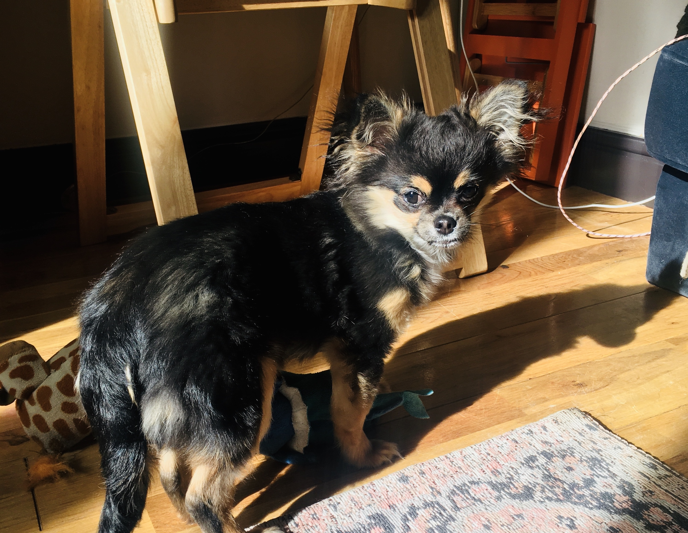
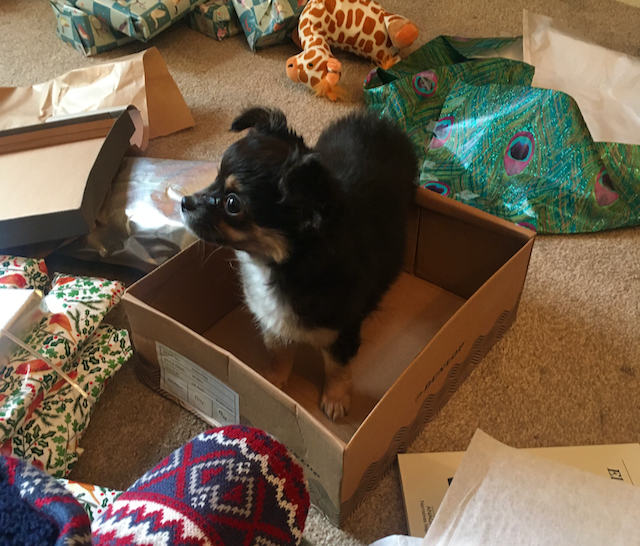
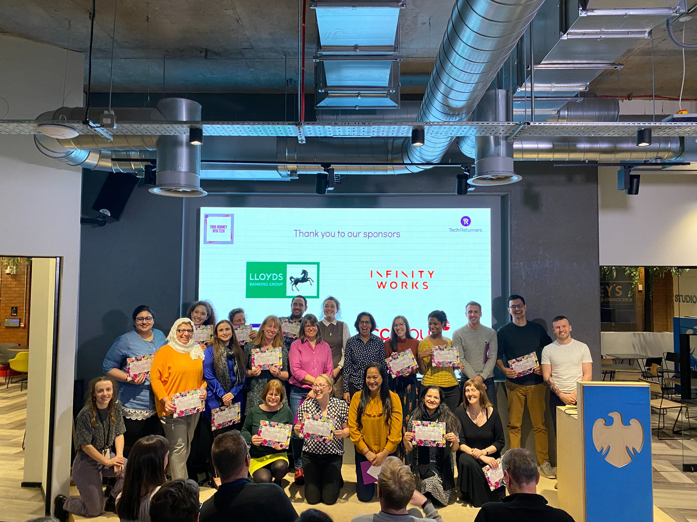

Oh, how fresh-faced and naive I was. At the end of 2019, I sat down and <a href="https://www.harrietryder.co.uk/blog/farewell-2019/" target="_blank">reflected on the year just passed</a> and, feeling buoyant and optimistic, wrote some <a href="https://www.harrietryder.co.uk/blog/2020-goals-progress/" target="_blank">rough goals</a> for 2020.

2019 had been challenging. Personally I'd had a low, anxious period in the middle of the year, the spectre of climate change really pushed to the front of the global consciousness (far too late), it was finally confirmed that Brexit really would be going ahead, and the British Labour Party fell apart at the seams when the British public decided they didn't much care for the only decent guy in politics and preferred a racist toff who seemed to be taking speech-writing tips straight out of the Trump playbook.

Anyway, with all that to live up to, 2020 would surely be better, right? Or maybe just more of the same, but certainly not apocalyptic. Anyway, we'd just got a puppy, so life was immediately improved 400%.

Of course, we all now know how easy we had it in 2019, sweet summer children that we were. Back in the days when it was still possible to buy tinned tomatoes, when children still went to school and when [millions of people still had jobs](https://www.ft.com/content/9f3661b9-14cb-472a-9246-d784d436ea52).

The beginning of the year started in Yorkshire, where we spent Christmas with my mum (and the dog). We barely took any time off, just a couple of days around Christmas itself, deciding to save as much annual leave as possible for the plans (oh, the plans!) we had for 2020. I wanted to visit one of my best friends in Italy in April (ha!), we wanted to walk more of the Camino de Santiago in June (as if), move house before the summer (lol) and fit in a yoga retreat in autumn (can I be bothered to be hopeful about this one?).

Besides, I'd just started a new job and was working hard to get up to speed with the product and a bunch of new tech. I was really enjoying what I was doing, and didn't feel like taking a break just then.

I was also teaching classes with <a href="https://www.techreturners.com/" target="_blank">Tech Returners</a> which I've been doing for over a year now, and at the start of the year I was teaching 2 cohorts. So I was pretty busy, but in a good way.

In early January, one of those cohorts graduated, and later in February, so did another. I was really proud to have seen these two cohorts through their journeys into tech, and was delighted when Booking.com, the partner that sponsorted one of these cohorts, immediately filled all its open positions from within the cohort when they graduated.

As always, the presentation nights for both these cohorts were stunning, with the various project groups demonstrating amazing skills and real commitment to learning tech, having been taught by us for just 2.5 hours a week over 15 weeks.

At the end of February, I also started teaching another cohort - which is now the only cohort I'm working with. I teach on a Wednesday evening, remotely now of course, which is fine - I miss the in-person lessons which I much prefer, but it's no problem for me conducting the lessons remotely and it's the best we can do at the moment.

So here we are in April, and what a weird 3 months its been.

As we've all watched Coronavirus sweep the globe, all I can really think is how remarkably lucky Mauro and I have been, and are, that we're so minimally affected. I'd already been working remotely for a while before the lockdowns started, so I saw no major difference in my day to day life. Mauro's job is also secure and easy to do from home, we don't need to go out for anything other than food and exercise, and our families are safe, so the only minor inconvenience has been the installation of a monstrous standing desk in our living room and the fact that it's now impossible to get a Tesco delivery.

Although it's been hard not to see friends, I'm just incredibly grateful that neither of us, nor our families, have been adversely affected so far. Walking the dog gets us out of the house for a bit of fresh air each day, and we live right next to a park so we're not completely deprived of greenery. I manage to go running every other day, and the roads are so quiet that I'm actually enjoying taking the road routes that I normally avoid. We're not sure what's happening with our house sale, and we're sad it doesn't look like we'll get a holiday for a while, but really we have nothing to complain about. Strange times, for sure.

So, how's that ambitious list of 2020 goals going?

Plenty of people have been banging on on social media about taking this time to learn new skills and work on yourself, and honestly, that was my plan in the first place anyway but hearing all these productivity gurus creep out of the woodwork (they were never in the woodwork to be fair) and take advantage of a global pandemic to peddle more of their guilt-inducing self-optimization rubbish has made me kind of feel like just watching TV (we've been loving _Line of Duty_ and _The Bodyguard_ lately).

But old habits die hard, and I've been reading lots of books in Spanish, dabbling in C#, running more than usual and taking (and actually enjoying!) online pilates classes. I'm feeling healthier than I have in a year or so, since I ran a marathon in 2018, and I'm on track for about 50% of my hastily devised <a href="/blog/2020/2020-goals/" target="_blank">2020 goals</a>.

It's the Easter Bank Holiday now, and the longest block of time I've had off since our wedding, last August. And it looks like we won't be taking any more time off before all this is over either, because what's the point? Having said that, I really did need this sort-of-break where we can't do anything, because I've been working _a lot_ over the last few months and it feels like my brain has been on overdrive most nights, still mulling over problems from work, and thinking about work stuff that I need to do as my head hits the pillow, and as soon as I wake up in the morning.

This weekend, I've been detached enough to actually consider taking up a new hobby, and a new hobby for me usually means a new side-project or a new (natural) language. Of course this is utterly ridiculous, just because I had a spare hour during this bank holiday doesn't mean I _actually_ have time for a hobby, but I do feel like it's time to add something new to my well-tested repetoire of choice activities. Mauro's been making sourdough bread, maybe I'm just a teeny bit jealous.

I guess you'll have to wait till the next year-review installment to find out whether I managed to make anything stick!

Hasta Luego 👋
