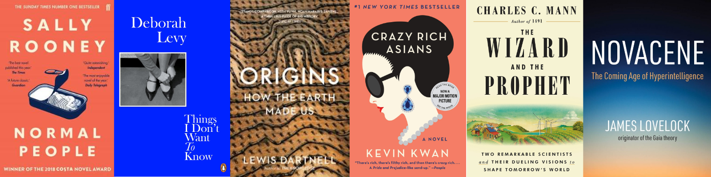

I read/listend to a grand total of <a href="https://www.goodreads.com/review/list/14052431-harriet?shelf=2019" target="_blank">**76** books in 2019</a>, up from 50 in 2018. A lot of them focussed on farming, agriculture and climate change, as I become pretty obesssed with these themes for about 6 months and read voraciously on the subject. Perhaps in another blog post I'll share some of my favourite reads around those issues in particular.

In the meantime, here are a few of my favourite titles from last year, from various categories.

### Crazy Rich Asians, Kevin Kwan

I absolutely loved this trilogy of books (_Crazy Rich Asians_, _China Rich Girlfriend_ and _Rich People Problems_). The best word I can use to describe them is a "romp". Thoroughly entertaining, funny, mad, just completely enjoyable reading. I took away nothing particularly deep from these books, but I had such a good time reading them and I feel like I really did experience a fun glimpse into the world of the ultra-rich.

### Normal People, Sally Rooney

There's a reason everyone raved about this book, and I was number 142 on the waiting list when I tried to borrow it from my local library: this book is amazing. Sally Rooney has firmly become one of my favourite authors. This story follows the course of a young couple's relationship throughout late school and university years in Ireland. Rooney's character development is what made this book so unputdownable for me - _Normal People_ is about flawed individuals, misunderstandings, miscommunication and melancholy. The university experience narrated in Dublin in the 2010s was familiar, but just distant enough from my own university experience that it didn't make me cringe. I also love when authors are brave enough to deliver unconventional, even disappointing endings... so this book hit the mark there, too.

### Novacene: The Coming Age of Hyperintelligence, James Lovelock

If you've heard of Gaia Theory you've heard of James Lovelock. He's the scientist, critical thinker, author and environmentalist most known for proposing the theory of the Earth as an all-encompassing self-regulating, single being. In other words, the theory that if humans push the world too far in one extreme, then planetary self-healing mechanisms will kick in to return it to its desired conditions. He's been massively influential and often misunderstood in environmentalist thinking and I really recommend reading Gaia if you haven't already!

Now he's 100 years old and he's still going strong. Reading _Novacene_, his latest work, was like peeking into the mind of someone on a completely different plane of existance. Lovelock sees things in a completely different way to most people, and in this book he explores his prognoses and aspirations for the future of the planet. They're not what you would expect. I really recommend this book if you want to challenge what you think you know, and leave feeling quite disorientated and confused. Books that make us feel like this are the ones with the most interesting ideas, I think.

### The Wizard and the Prophet, Charles C. Mann

Another non-fiction book which has really influenced my thinking, and will stay with me for a long time to come. This book follows the story of two prominent figures in global agriculture/environmentalist thinking in the 20th century - the "Wizard" Norman Borlaug, the father of the "Green Revolution", and William Vogt the "Prophet", a major influence in 20th century environmentalism.

Both figures represent contrasting ways of looking at the world, contrasting methodologies and contrasting legacies. Borlaug believed in the progress of science to overcome global food shortages and improve the material conditions of our ever growing population, whilst Vogt believed the world had, at some point, a carrying capacity which would be reached one way or another, and could only be avoided by employing sustainable techniques and caring for the planet.

Both approaches proved problematic in many respects, and have left huge legacies in our culture, both in terms of the way we think, and the way we solve (or ignore) many of the environmental problems we face today.

The book has a bit of a _Sapiens_ feel about it, in that it's a broad sweep over a huge field of study, linking many areas together and really changing my outlook on many subjects.

### Things I Don't Want to Know, Deborah Levy

I found another brilliant new (to me) author last year: Deborah Levy. _Things I Don't Want to Know_ is an autobigraphical novella focussing on her childhood in South Africa. I have a coincidental interest in South African literature, after spending a month there when I was 17, and studying it at university some years later. Coetzee is one of my all-time favourite authors, and I find the history and culture of the country really interesting, so I really enjoyed reading this account of her upbringing.

However, I also read serveral of her other books last year, and enjoyed all of them equally.

### Origins, Lewis Dartnell

This is the book I always hoped existed, and it did! I've always been really interested in how the natural world and our natural surroundings might "shape" us. How much a desert culture be different from a mountainous culture? Might living next to a volcano, or a waterfall, shape our cultures in some way that might have long-lasting influences in history? Maybe natural languages "evolved" to be better suited to different environments, in some way? These are questions I used to wonder about in school haha but unfortunately Geography classes didn't really answer them. This book, and also _Prisoners of Geography_ by Tim Marshall go some way towards answering some of my questions, and basically just provide a really interesting account of human history which gives nature a much more prominent role than many accounts would give. Again, another book that shows you the world from a slightly different angle, widening your view that little bit more.
