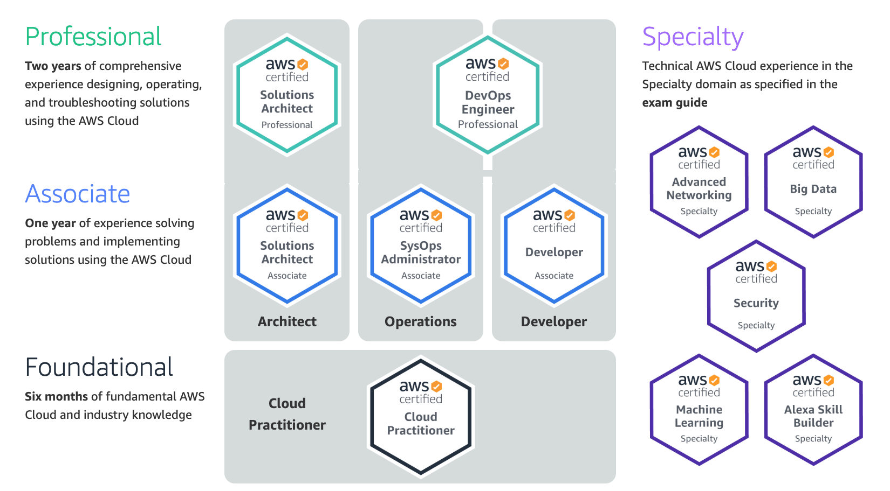
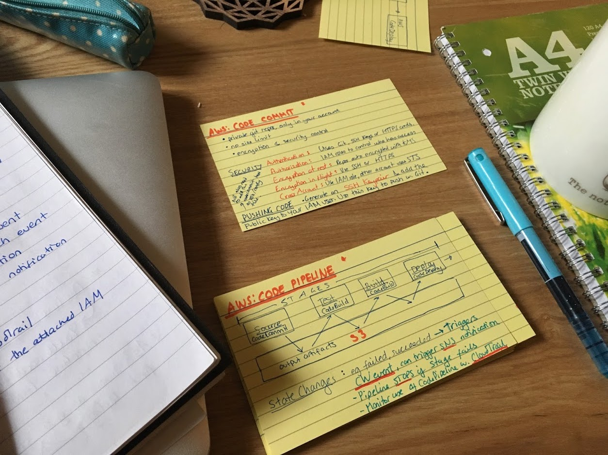

Earlier this year I got my <a href="https://aws.amazon.com/certification/certified-developer-associate/" target="_blank">AWS Developer Associate</a> certificate. A few months later, after answering a bunch of questions from a few people who wanted to know what was involved and whether it was worth it, I thought I'd pull together a few thoughts.

### What is it?

AWS offers a <a href="https://aws.amazon.com/certification/" target="_blank">number of certifications</a> which are obtained by taking a multiple choice exam, to prove proficiency in using AWS technologies. You basically study a curriculum for a while, and sign up to sit an exam at an examination centre near you. The questions are multiple choice, covering a range of AWS services and practices, delivered via a PC screen (a bit like your driving theory test), and you find out there and then whether you passed or not.

Some exams are fairly generic, covering a large range of services and architectural patterns, whereas some of the more advanced exams specialise in areas such as <a href="https://aws.amazon.com/certification/certified-big-data-specialty/" target="_blank">big data</a> or <a href="https://aws.amazon.com/certification/certified-security-specialty/" target="_blank">security</a>.

Among the non-speciality exams, there are 3 main tiers - **Foundation**, **Associate** and **Professional**. The Associate tier is great for people with a year or more of practical experience with AWS, whereas the Foundation tier is a good entry point for those with slightly less experience, or just want to make sure you're covering the fundamentals to start with.

As you can also see, AWS draws a distinction between **development**, **operations** or **architecture**, at associate & professional level at least.

### Which one should you choose?

You need to decide both on the tier (Foundation, Associate, Professional) and potentially also the speciality (Ops, Developer etc.) that you want to pick.

The first decision is easy - it really depends on how much experience you have.

| Certification level | Experience required                                                    | Cost of Exam (aprox) |
| ------------------- | ---------------------------------------------------------------------- | -------------------- |
| Foundation          | AWS says 6 months - I'd say 3 is probably fine too, to start studying. | 100 USD              |
| Associate           | AWS says 1 year. I'd agree!                                            | 150 USD              |
| Professional        | AWS says 2 years.                                                      | 300 USD              |

However, the exams are quite expensive and get more so the higher the level you choose, and the prep is obviously more time consuming too. Personally I'd be a bit scared of going straight for the \$300 one, without "testing the water" a bit first with a cheaper one to get the feel of what is expected.

The second decision, in my view, doesn't matter so much unless you have a really specific goal in mind like becoming an AWS Operations Engineer in which case having the cert with the word Operations on it probably helps. But for most people, the certs are just a way of proving that you know what you're doing with AWS, more or less, and are not a replacement for actualy real experience, which will not map directly onto your certification anyway.

Architect and Developer are probably slightly broader than Operations, and I chose "Developer" because it looked like the broadest of the 2 and covered a lot of serverless stuff which I was interested in.

### What does it cost?

You can see the basic cost in USD in the table above (it does change and I think it depends where you're based too so that's just an approximation), but you also have to factor in other costs:

- Learning material: **up to \$100** This depends on whether you sign up for <a href="https://acloud.guru/" target="_blank">acloud.guru</a> or similar for a few months, or buy a Udemy course or whatever, but you'll definitely need some kind of official study materials so you know you're revising the right stuff.

- Practice exams: **up to \$50** You can take practice exams on websites like <a href="https://acloud.guru/" target="_blank">acloud.guru</a> and buy packs on Udemy, but you can also buy official past question packs on <a href="https://aws.amazon.com/certification/certification-prep/" target="_blank">the AWS website</a> which are worth doing, so you get a real idea of what the questions will be like.

- Time: your time has a cost too, of course. How/if you want to factor this in is up to you. Maybe you're getting paid to study this during work time, which is awesome. More about this below...

### How long does it take?

It depends on the exam, how much time you have available to study, your experience with AWS and a host of other factors. A few useful guidelines are:

- The Udemy course I studied has 16+ hours of video. And it took me at least double that time to watch, as I was taking notes.

- Practice exams tend to take a couple of hours. If you do 5, then you're looking at 10 hours.

- I did a few small projects to embed stuff throughout my studying. Probably unnecessary but I wanted to play around with a few services I hadn't used.

Overall I spent 6 months studying, but that's because I was taking a fairly leisurely approach. I didn't study every week, and only got serious in the last month or so.

I also tend to over-prepare, and I know I could have got by with less revision.

### Is it worth it?

Personally, I think the time and energy involved were worth it, as I learned a lot and I did enjoy learning about some services I hadn't had a chance to use in work. Cost-wise, I am sure that my employers have benefitted from my increased competence at least to the value of \$100 so I'm sure it's been worth it for them too, although these things are hard to quantify.

Now, months later, having actually used Azure and GCP more recently than AWS at work, how much have I retained? It's really hard to tell. I have forgotten loads of specific figures that I had to memorize for the exam but my overall cloud knowledge is surely better from having gained the cert.

So far, no employer has been particularly bothered by my certifications (at least, as far as they've let me know) but if I had applied for a more backend-focussed/cloud role then I'm sure it would have been of interest.

### 5 Revision Tips

1. **You cannot hope to pass the exam just based on the knowledge you've accumulated during your practical experience** - You definitely need to study some kind of course or video series to make sure you have learned the right stuff. Some of the questions asked will be very specific, you need to memorize all sorts of numerical figures such as "How may expiration rules can you define for each of your S3 buckets?" which you would just Google in real life but you need to know off the top of your head for the exam.

2. **The certifications are not valid forever**. They need to be renewed after 3 years.

3. **Not all practice questions online are realistic.** I took a range of practice questions from various sources, including the official AWS ones, as I noticed that their style and difficulty varied a lot and I had no idea, when I was revising, whether the practice exams were realistic. I advise taking the official AWS ones and at least 1 other source, to cover as much ground as possible.

4. **There is no need to get all the certificates**. Unless you are a certificate collector, there is no need to get all the certs. Just get _one_ at the right level for your experience. They aren't _that_ different.

5. **Revise like you're back in school**. These kinds of exams, where there's a lot of rote memorization, benefit from the techniques we learned in school - flashcards, spaced repetition, bright and memorable notes, spider diagrams etc.

### 5 Exam Tips

1. **You can flag questions to come back later** In practice and the real exams, you can flag hard questions to come back to at the end. Sometimes your brain works away on the question in the background and you actually have a better idea of the answer by the end! I mention this as my husband thought the little flag symbol was for finishing the exam, so never pressed it!

2. **Count your anwsers** Some questions ask you to **select 2 possible answers** not one, or even 3! It's very easy to mis-read this part of the question and select the first correct answer, missing easy points.

3. **Use all the time** The exam felt longer than necessary but use this time to go back and check all your answers. Guaranteed you fill find at least one question you've mis-read and can earn a quick extra point.

4. **Write stuff down** If you aren't sure of something, or even if you are, I find that beginning to write some notes on paper about what I _do_ know about a topic unblocks my brain and sometimes helps me figure out the answer.

5. **Some questions answer other questions 🔍** The questions are random, and often fairly detailed, so you might actually encounter parts of an answer to one question in the description of another, or information that contradicts another question, which is also useful!

### Links and Resources

Stephane Maarek's <a href="https://www.udemy.com/course/aws-certified-developer-associate-dva-c01/" target="_blank">Ultimate AWS Certified Developer</a> course on Udemy which I took.

Stephane Maarek's <a href="https://www.udemy.com/course/aws-certified-developer-associate-practice-tests-dva-c01/" target="_blank">Certified Developer Practice Tests</a> on Udemy.

<a href="https://acloud.guru/" target="_blank">acloud.guru</a> - great site covering loads of cloud platforms and technologies.

<a href="http://jayendrapatil.com/" target="_blank">Jayendra's Blog</a> - links to cheatsheets, whitepapers, loads of resources on AWS.

<a href="https://awsnewbies.com/" target="_blank">AWS Newbies</a> - great intro resources created by <a href="https://twitter.com/hirokonishimura" target="_blank">Hiro Nishimura</a>.
