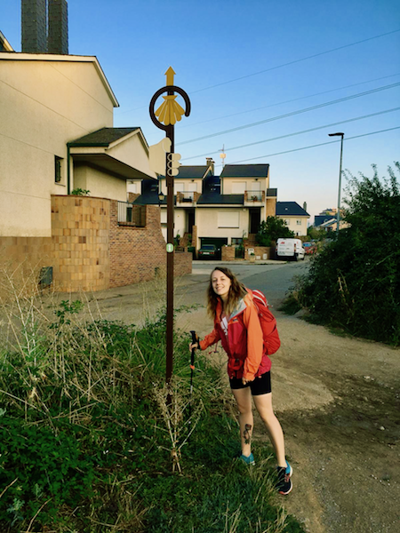
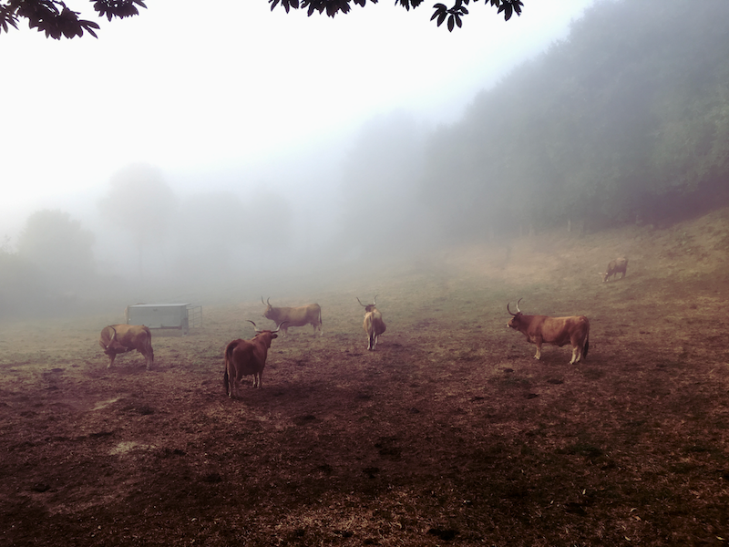

Last weekend, Mauro and I got back from our main holiday which was walking the Camino de Santiago. The Camino is a long distance pilgrimage route primarily in the North of Spain, although there are routes to Santiago de Compostela from all over the place, including Portugal, Madrid and Valencia. The main route, which we followed, starts over the border in France although we didn't have time to walk the entire distance, so we chose a 300km section that starts in Leon, ending in Santiago.

We walked for 12 days, averaging about 25-30km per day. We followed a little guide book which described the distances, the towns we would pass through and gave interesting facts about what we would see along the way. We didn't need a map because the Camino is so well-known and well-maintained that there are arrows and markers everywhere, which are really hard to miss. (I read online that the word for the marker stones in Spanish is _mojón_ which literally means "turd" - Mauro laughed so much when I first refered to the _mojones_ but eventually we heard someone else use the term so I was vindicated!)

I was surprised how hard the walking was. I naively thought that walking 25km per day would be easy - after all, I'd just been training for a marathon and was used to _running_ longer distances. But it turns out, walking can be really hard! Especially on days when the terrain was very flat and there was no variation in the muscles you're using, or the area of your foot you're landing on. Hills and valleys were a huge relief after the first couple of days in the province of Castile-Léon, which was very flat and just maise field after maise field.

However, the hills came with their own disadvantages because it turns out (as any seasoned walker would have known) that going downhill can be really tough on your knees and ankles. After about 5 days of walking, I ended up having a really bad pain in my left ankle, which sounded like it was tendonitis. I was really worried, as tendonitis needs rest to heal and definitely more walking, but we didn't have a choice to continue if we wanted to reach our goal.

Luckily, one evening in a little restaurant (which served vegan food - a mircale!) Mauro asked for some ice for my ankle (I was trying to put ice on it whenever we stopped) and a sweet, elderly lady who was working in the kitchen said she would come and take a look at my ankle as she was a masseuse. Amazingly, she came out and spent about 20 minutes giving me a rigorous foot massage, the kind of which you might give to someone with a dislocated joint to try and get it back into position. She diagnosed my problem as twisted tendons, probably from going downhill carelessly, and told me it was a little bit _jodido_ which roughly translates to 'fucked' and shocked me a bit, coming from the mouth of a sweet Spanish grandmother.

Anyway, the massage really helped and although it remained a bit _jodido_ for the next few days it was a lot better and by the end of the trip was giving me no problems.

The towns and the scenery we passed through were absolutely stunning. We stayed in just a couple of cities, the majority of the time we were in the deep countryside, lodging in _albergues_ (hostels for pilgrims) in tiny villages and towns. It was lovely to be outside all day, every day, and to have nothing to worry or think about apart from walking, eating and sleeping. It was a true break from our normal lives, and I decided to keep my phone on airplane mode for most of the time and only use it for taking pictures.

Staying at the _albergues_ was one of our favourite things about the trip, because of the many other people you meet who are also walking the Camino, for their own reasons, from all over the world. It is a very communal atmosphere wherever you stop, people will sometimes cook for each other and people travelling alone can be certain of finding other people to explore the towns with or go out to eat with.

The _albergues_ were in general very cheap ($5-$10 a night) because they're often run by people who view the _albergue_ as a Christian service rather than a money-making venture. Some _albergues_ were more religious than others - there was one where we found a Jesus CD on our pillows and were encouraged to come to a pre-dinner screening of a film about Jesus' life which we declined under the very real guise of needing to do some washing - and others were not religious at all, just fulfilled the function of providing somewhere basic to sleep. One of my favourites was in Foncebadón, a tiny village high up a mountain which was almost completely in ruins, with just a few cafés and hostels emerging from the rubble to service the pilgrims who come through in the summer. We stayed in a fairly religious _albergue_ where the owners cooked us a hearty meal, which 12 pilgrims shared together around the table, chatting for hours in Spanish and English.

For the final few days, we had a burst of energy and managed to walk really long days, going further each day than our guidebook suggested. We finally got to Santiago de Compostela a little earlier than we'd hoped, giving us an afternoon free to explore the city, which was beautiful (and finally find some good vegan food that wasn't white bread and Pimientos de Padrón).

In summary, we both absolutely loved the trip and can't wait to choose another section of the Camino de Santiago to walk in the future. It was an amazing way to have a break from the routine of normal life, far more relaxing than a city break, and gave us such a sense of achievement that you don't usually get from a holiday. We came home feeling healthier than ever, and feeling like we'd been away for months. 💯% recommended!
