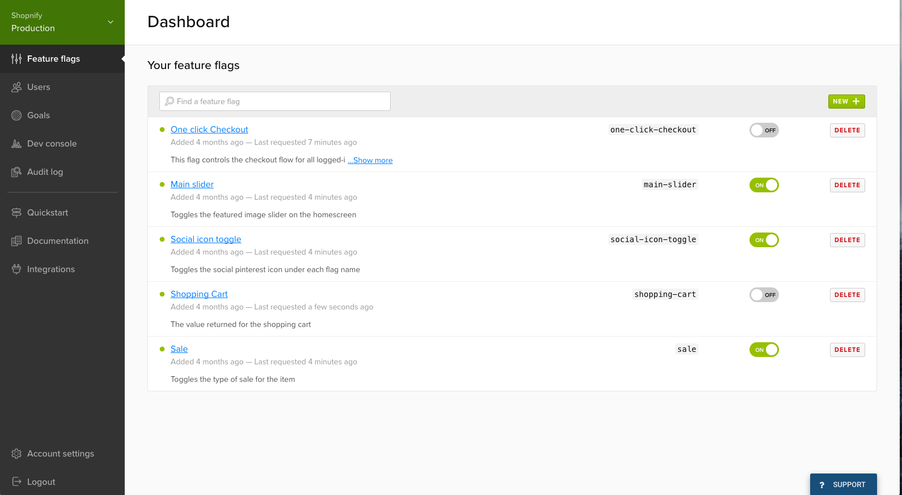
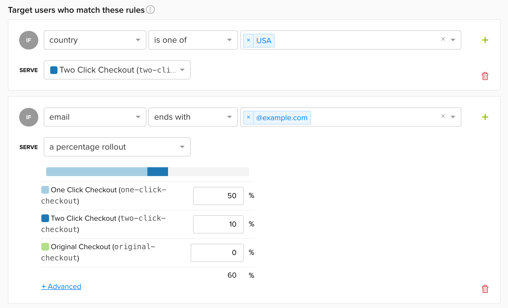

### What are feature flags?

In programming, a "flag" means a marker of some kind. Usually it's a boolean value - `true` or `false` which identifies or flags some piece of data as being in a certain state.

A feature flag is a marker that identifies whether a specific feature should be available to the user of a piece software. If you want to enable a feature of your application for only specific users, you can employ the concept of a feature flag to indicate whether the feature should be enabled or not. This feature flag will either be `true` or `false` for a specific user, and your application logic should check this value before rendering any UI or performing any functionality related to the specified feature.

### What are the use cases for feature flags?

**Hiding features when not applicable to certain users:**

Imagine your application is a platform for collecting donations from donors around the world for numerous different charities. In the UK, there's a concept of Gift Aid, which allows charities to claim back tax on donations made from UK tax payers. So for a charity operating in the UK, it makes sense for the application to ask the donor if they are UK taxpayers. But for a charity operating in France, that option makes no sense and is just confusing. You could use a feature flag to decide whether, for this particular charity, you want to enable the Gift Aid feature.

**Safety when rolling out new features:**

Another very common use case of feature flags is to provide some protection when rolling out or testing new features. It can be hard and slow to roll back a lot of changes relating to the implementation of a new feature, but if you can control a simple boolean value and easily switch it from `true` to `false` or vice versa, you have a really quick way of turning off a feature if it looks like it's going pear shaped or you want to pause it for a moment.

The key is, your code needs to check the feature flag wherever there is some functionality relating to a given feature, so that turning the flag to `false` will seem to remove the functionality. All the code and logic for the feature remains - you're not reverting any changes - it's just not accessible any more:

```javascript
function Header() {
  return (
    <Container>
      {flags.darkMode && <DarkModeSelector />}
      <Navigation />
    </Container>
  );
}
```

**A/B testing and percentage rollouts:**

Another use case is when you want to slowly expose your users to a new feature to begin gaining feedback/metrics before unleashing it on the whole world. For this, you might select an arbitrary percentage of users for whom to enable the given feature, and begin to up the % as you gain confidence. Or you might want to test 2 different variations of a feature (A/B testing) on two different segments, so you'd need to manage which users belonged to which segment through some kind of feature flag management.

### What is Launch Darkly

<a href="https://launchdarkly.com/" target="_blank">Launch Darkly</a> is a piece of software that enables you to manage feature flags in one place.

You can set a list of flags through the Launch Darkly web application, obtain a client token, and using an SDK for your programming language of choice, access these flags anywhere in your frontend or backend code.

One great feature about Launch Darkly is that its SDKs receive real-time updates whenever a flag changes. This means that even in a SPA, the end user will receive flag updates as soon as you change them on the Launch Darkly app, so you can turn features on/off immediately. You don't have to wait until a user does a hard page reload and fetches the flags again for the feature to turn off. When I first tried this out and saw how smoothly it worked, how the features just "popped off the page", it felt like magic!



### Launch Darkly users

Not only can you turn featues on/off for your whole application, but you can manage features for specific users (i.e. the UK charities vs French charities example).

To this end, Launch Darkly offers the concept of "users". You can create a Launch Darkly user (you'll want to create this user when a user signs up to your application). This Launch Darkly user is identifiable as that specific user in your application (most likely by ID), and you can also store other information against this user such as Country of Operation, age bracket, or any other custom piece of data that might help you evaluate whether they should be shown a feature or not. These users don't need to be (and probably shouldn't) be exact copies of the users you store in your own database - just store the info you need and don't store PII unless you absolutely need to.



From the Launch Darkly dashboard, you can very easily apply feature flags to a selection of users based on the attribute you have stored about them (e.g. by country of operation), or by an abritrary percentage.

### Managing Environments

Launch Darkly makes it super easy to manage environments - you get a different client key for each environment, so it's a piece of cake to have features turned on/off in different environments. For example, you want your Dark Mode feature turned on for all users in QA as you're testing it at the moment, but you can keep it turned off in Production for now until you're happy with it.

You are probably loading different environment variables in different environments anyway so it should be simple to load a different Launch Darkly API key too.

### Integration in a React App

Just so you can get a picture of how this looks from the front end, here are some contrived code examples.

Imagine your backend has already done something like this upon signup to create a Launch Darkly user:

```javascript
const user = {
  key: "aa0ceb",
  country: "GB",
  custom: {
    groups: ["Google", "Microsoft"],
  },
};

ldClient.identify(user);
```

Through the Launch Darkly dashboard you've enabled the "Gift Aid" feature for all users in GB.

Your frontend React Application is wrapped in a Launch Darkly provider at the root:

```javascript
import { withLDProvider } from "launchdarkly-react-client-sdk";

export default withLDProvider({
  clientSideID: "your-client-side-id",
})(App);
```

When a users signs into your frontend application, you need to match them with the Launch Darkly user and retrieve their flags. In your sign-in success flow (within your wrapped `App` component) you'll do something like this, to identify your current signed-in user with Launch Darkly:

```javascript
import React from "react";
import { useLDClient } from "launchdarkly-react-client-sdk";

const App = () => {
  const ldClient = useLDClient();

  const onLoginSuccessful = (user) => ldClient.identify({ key: user.id });

  return (
    <div>
      <MainApp />
    </div>
  );
};
export default App;
```

If you don't have users, and you just have flags for your entire application, that's fine too, you can skip the `identify` step above.

Anywhere in your wrapped application you can use the `useFlags` hook to obtain the flags for the current identified user or for the application as a whole. NB there is also a higher order component pattern that you can use - but in my view hooks are easier and nicer to use.

```javascript
import React from "react";

import { useFlags } from "launchdarkly-react-client-sdk";

const Header = () => {
  const { darkMode } = useFlags();

  return (
    <Container>
      {darkMode && <DarkModeSelector />}
      <Navigation />
    </Container>
  );
};
export default Header;
```

There are various options for working with HOCs, async components or hooks in React, so you can use whichever pattern you prefer. There are also client-side and server-side SDKs for a large range of languages, <a href="https://docs.launchdarkly.com/home/getting-started" target="_blank">see the docs</a> for more information 🙂
