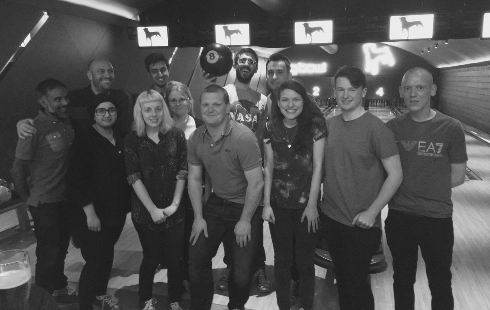

A couple of months ago, I decided it was time for a change of direction and left my job at [Northcoders](https://northcoders.com/) to pursue programming full time.

I've had an amazing time there and the decision to leave was not taken lightly. I loved what I was doing and I especially enjoyed getting to work with and watch the progress of so many enthusiastic, smart and inspiring people from so many different backgrounds.

Here I am on the first cohort!

However, in the long run I wanted to develop as a programmer so I thought it was time to move into the software development industry full time. I've had lots of opportunity to work on internal and student-facing projects at Northcoders, but I wanted to get my hands dirty working on something bigger where I'd be stretched and introduced to new technologies.

I only interviewed at one place in the end. I was planning to interview at a few places and be in a position to choose between offers (hopefully!) and I started off in talks with a few companies, but it turned out that one place I was really excited about turned everything around really quickly. Since interviewing is stressful and I was really excited, I decided to accept their offer right away and stop my other interviews.

I thought I'd share my interview process, just to give an idea of what it involved for anyone who might be interested.

**CV Application**

I applied with my CV via Northcoders. The great thing about working in a coding bootcamp is the variety of companies we have connections with and how easy it is to leverage that network.

My CV described some projects I'd been working on, and also linked to my Github where I had some personal apps and projects, but nothing I was especially trying to show off. I didn't have big projects on there as they were private repositories belonging to my organisation, but I did have a big green streak (the amount of commits you are making to repositories) and regular activity. I had recently also been working on some side projects such as <a href='https://github.com/harrietty/hexpress' target='_blank'>reimplementing Express</a> which was available on my Github.

I also linked to my [Medium Blog](https://medium.com/@harrietty). Neither my blog nor my personal Github projects were mentioned or questioned during the interview so I don't know whether they contributed or not. 🤷

**Online Tech Test**

The first stage was an online tech test. This was to be completed in an hour, in my own time, on an online environment. It was an environment similar to [Hacker Rank](https://www.hackerrank.com) which luckily I had used before. If I hadn't used it before it might have confused me for a moment, as it feeds input via Standard In and expects output via Standard Out, rather than having a function to complete and a test suite, which is something I've seen more often before.

The three challenges started off easy and the last one was unfinishable, at least for me. However, knowing that we regularly set unfinishable challenges at Northcoders and that the aim is to see how you break something large down into smaller pieces and work through it, I didn't let that phase me.

I reckon I got pretty close, and I was happy with how I'd done. I started by writing comments about how I was going to approach the problem, and then when the time ran out, the comments spoke for themselves about where I would go next with the problem, if I'd had more time. I left myself a little bit of time at the end for tidying and refactoring - which I thought was more important than getting an extra fraction of the problem done.

**Telephone Chat**

The next stage was a telephone chat which lasted around an hour. It was with the CTO, Chief Technical Officer. It was not really a technical talk - in fact it was mostly just about the company, my experience and why I wanted to work there. As he said, it was to make sure we could have a decent conversation and therefore communicate and work together, which is super important.

I was happy when I was asked why I wanted to work there because I had LOTS to say, and not just awkward, rehearsed stuff. I genuinely had no problem rambling about why I loved the look of this company, and as I was talking I realised that this was probably a really good sign!

**Paid day of work in the office**

This was awesome, although I was quite nervous. I have heard of companies doing this but never experienced it first hand. Given the cost of making a hiring mistake, I think it's a brilliant idea and I think more companies should embrace it. Seems like a lot of effort in the short term, but in the long term it's a great way for both parties to really see how you work and how you fit within the team. And it probably saves a lot of those first day nerves and awkwardness too.

I'd been given a brief about the tasks I'd be doing on the day, and told that I didn't need to prepare in any way, and I tried to be strict with myself about that.

I read the document and made some notes but I deliberately didn't Google anything or dig too deep into it because I wanted to be able to ask natural questions on the day and interact with the team in a natural way. I didn't want to turn up with the idea that I knew exactly what I was going to be doing and then not ask questions. I wanted to discover problems organically and have reasons to ask for help if I needed it.

It was great to meet the team, do a sample commute, and feel the vibe of the office. Working on a genuine problem for a day (on a special "safe" version of the code base) confirmed the fact that I would enjoy the day to day work. I also got lots of opportunities to chat to people, find out more about the product and what the company was going to look like in the short and long term.

**Offer**

So then the final stage - an offer! Which of course I accepted since I was super excited.
