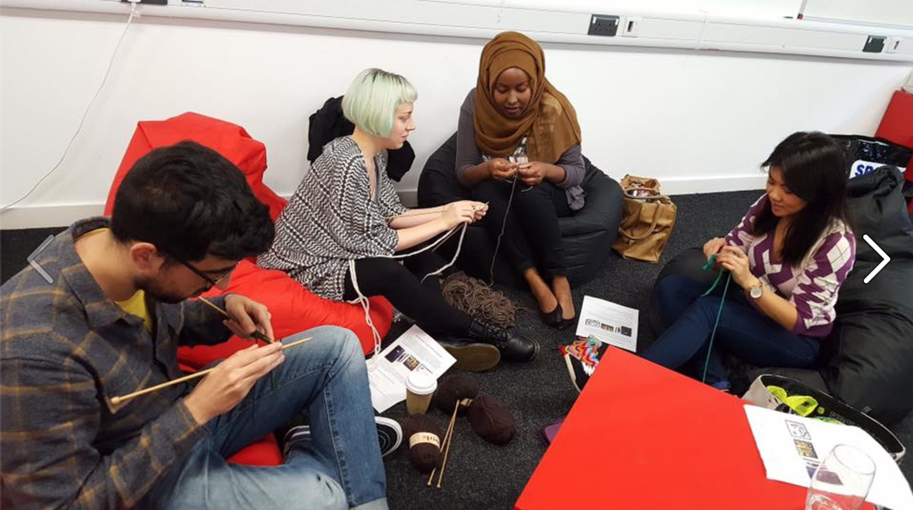
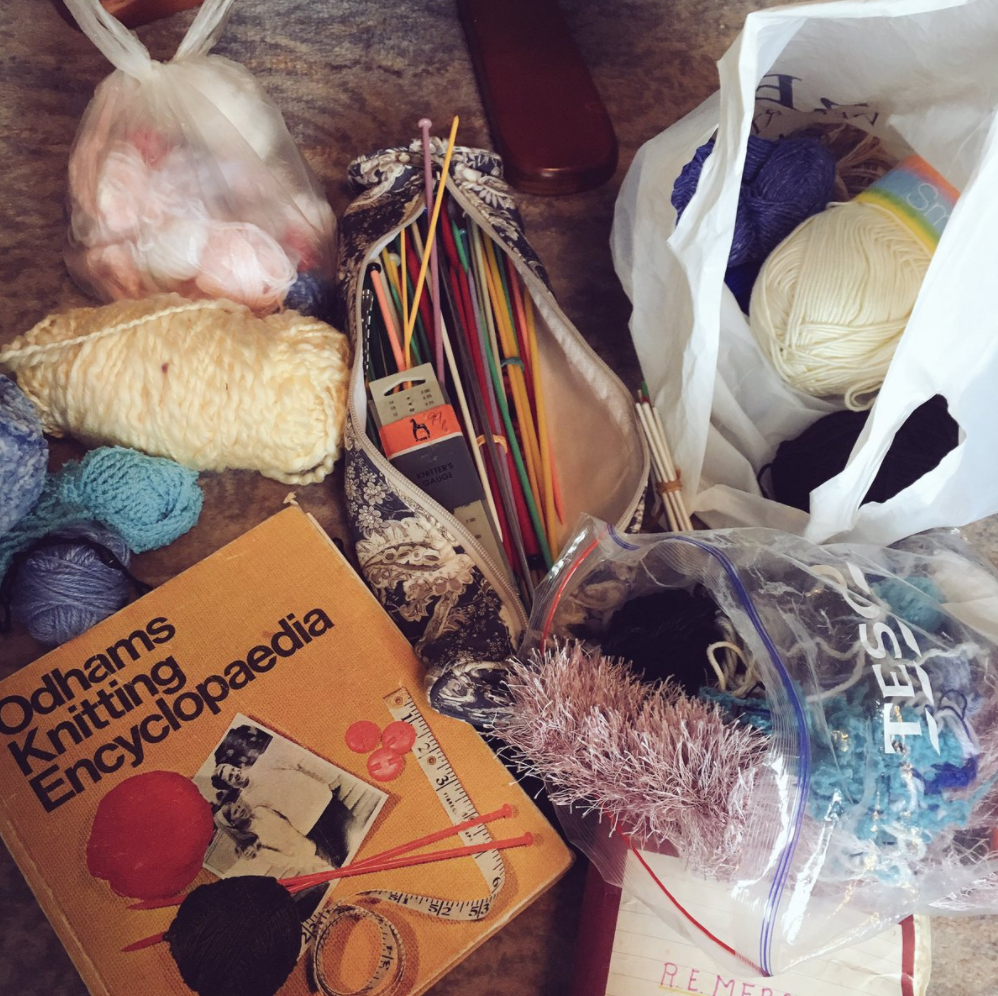

A couple of months ago, one of the students at [Northcoders](https://www.northcoders.com), [Jack](https://twitter.com/_jgilla_), asked me whether I would be interested in doing some knitting for a local yarn bomb. He knew that I knitted because I'd previously brought a knitted bat into work (it's not worth explaining why) and wondered if I could contribute a few squares for the project. I was more than happy to, but it also occurred to me that I might as well teach him and anyone else how to knit, too, since it doesn't take long for even a beginner knitter to make a simple square and then we'd be able to contribute even more material.

Thus, the Northcoders knitting club was born. It bloomed for a while and became especially popular during project phase of the second cohort, when everyone was grateful for something distracting to do during lunchtimes to take their mind off the code they'd been battling with all morning.

In fact, I was surprised by just how popular the club became. Not that people were queueing at the door to get in, but I'd expected maybe two people to come along, and those two people to be the ones I bribed and cajoled. But at its peak, I managed to lure a full EIGHT people. I even had to get more knitting knitting needles from my Granny to meet demand.

Thanks granny! It's died down a bit now with the start of a new cohort but I plan to revive it again during the next project phase, when the opportunity to step away from the computer and use a different part of your brain is especially welcome. And since I started the club, I've found that knitting is now increasingly the default activity I turn to at home and at work sometimes too when I just need a break.

There's just something about knitting that is a perfect antidote to coding. While coding requires intense concentration and problem solving, knitting is kind of the opposite. It requires a half-concentration. You need to pay attention, but you don't have to do any intense thinking. Your brain is just occupied enough to keep it from wandering to all the things you don't want to think about, be it the coding problem you've been trying to solve or otherwise, but not so occupied that it feels taxing.

As someone who's always been interested in the idea of meditation but never managed to make it work in practice, knitting feels like how I imagine mediation might feel. Thoughts do come and go sometimes but they never lodge in your mind for long enough to dwell on, because your attention is busy keeping track of the stitches. You can sit there for a long time counting stitches and rows and patterns and become absorbed in the rhythm of the numbers, and feel mentally refreshed when you finish. The pace works your brain at a slower, less hectic speed. You don't need to hold lots of things in your head, you just need to focus on one clear thing; where you are putting the wool with your fingers.

Knitting's not the complete opposite to coding, though. Like coding, it appeals to me and I enjoy it because through mastering a skill, you are able to create something. Like coding, it can also go wrong and be frustrating, and to "debug" it, it takes a level of expertise which is difficult to acquire but ultimately satisfying when you manage it. Like coding, it is the sort of thing that takes many hours of deliberate practice to improve at, but things that require long investments are also very rewarding. It is also creative, of course, like coding, and it allows you to make useful or interesting or simply fun or aesthetic things.

I would encourage anyone in need of a bit of downtime or a bit of a brain-rest at the end of the day to try knitting. You might be skeptical - plenty of the cohort were before they gave it a try - but if you pick up a pair of needles and find a youtube video to follow you'll probably be surprised firstly at how easy it is to get going and secondly at what an enjoyable process it is.
