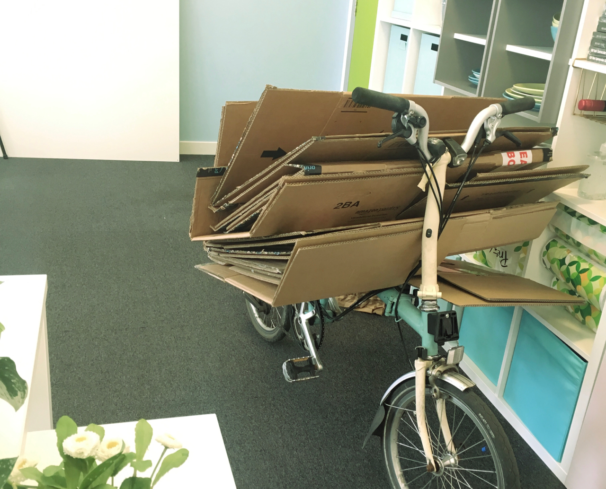
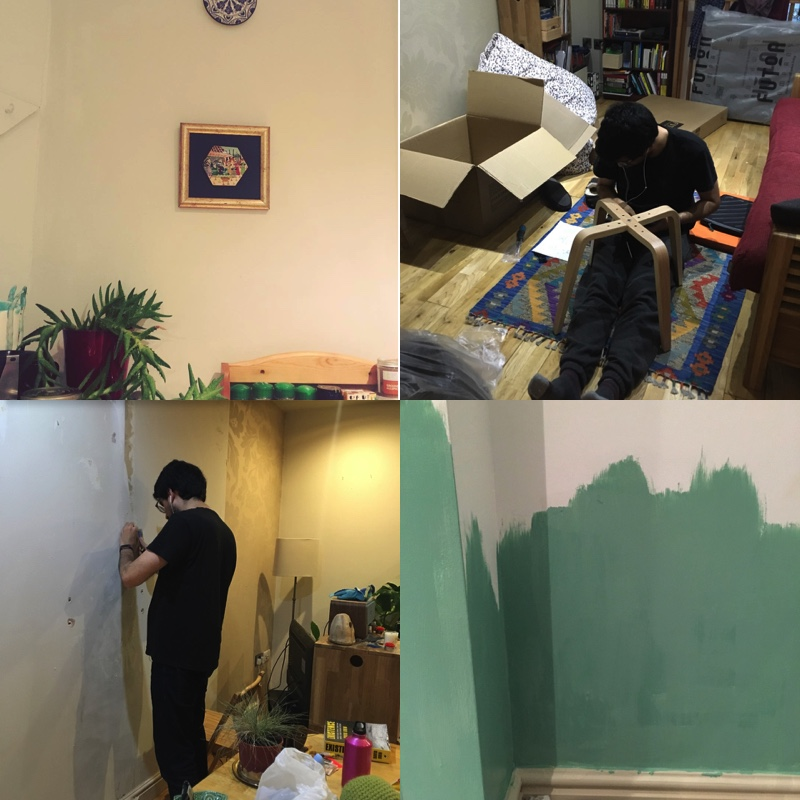
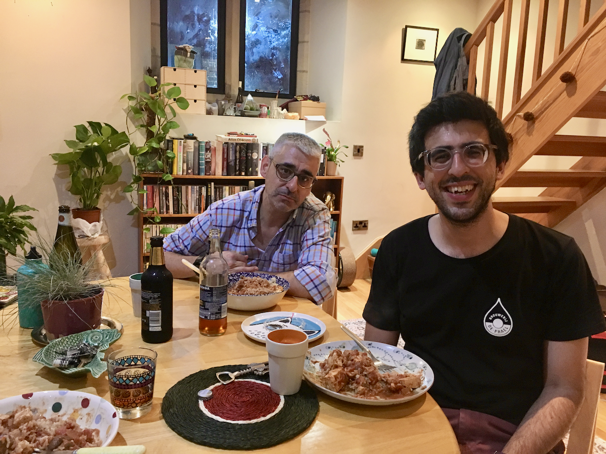
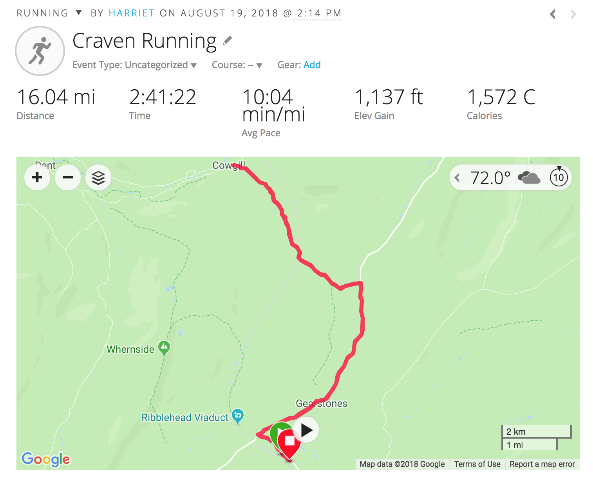
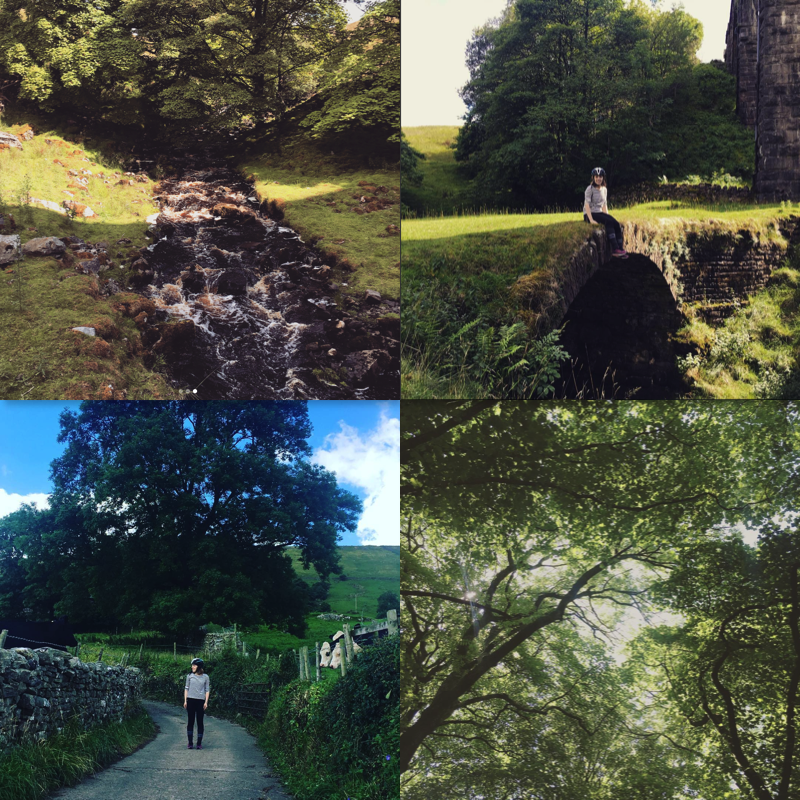
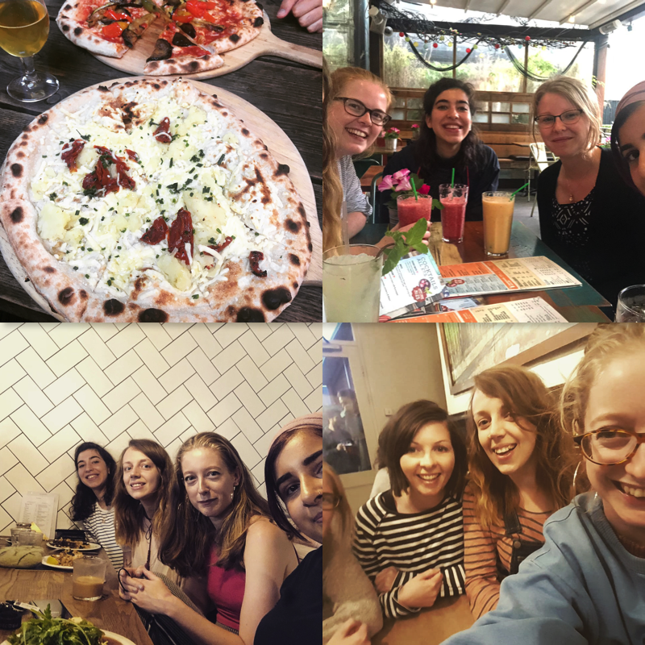

August has been a top month. One of the best months ever, probably!

##### A new house!

So the biggest news of this month is that we bought an apartment!! After months of waiting we finally got the news at the beginning of the month that the sale was going to complete... in two days time. Great, we thought, since we were very eager to move out of Manchester's tinyest flat ever into our new place. Until after signing all the paperwork we got home and realised that it would take a week for our deposit to be withdrawn from investments and actually be available.

Luckily for us the completion date then got pushed back another 5 days so it was fine in the end.

I collected many boxes from work and heroically transported them home on my bike.

Apparently nobody's ever seen so many boxes before in their lives because I got a lot of comments along the lines of "That's a lot of boxes! Look at all those boxes!"

Our new place is lovely and we are slowly amassing furniture and making it more our own.

It's amazing to have so much space - not that the place is huge by any means but we previously lived crammed into a studio flat with no real kitchen, just a bedroom and a living room with a counter along one wall. The only place you could be was either in bed or on the sofa, there was just no other option. So we would usually go out a lot - to sit in coffee shops or bars with our laptops and books, which entailed spending quite a bit of money. It's amazing to actually be writing this blog post at a table, in my own house.

Mauro's dad also came to stay with us from Spain during our first week in the new house, which was lovely!

##### Running

A couple of months ago I started training for a marathon and I finally booked the marathon for December. The training has been going really well and I love getting up early for my morning runs. They are second-best only to long evening runs on a summer weekend. Absolutely perfect. I recently did my longest run so far - 16 miles.

Although I didn't take my phone on this run, I've previously taken some pictures from along this route which is out in the Dales near my mum's house. It was such a beautiful route - I wish I could run around here every weekend.

I was proud of myself this month because I started feeling an Achilles tendon injury coming on, and I sensibly rested for a couple of days, bought new shoes (I'd been running in trainers that I've had for about 3 years, oops) and started doing some strength excercises for my calves, and the pain went away completely. However, just this last week I've been getting another pain, this time in my right calf, which I think is more serious and even with reducing my mileage significantly, stretching and doing strength work, it still gets bad again after every run. I know the best thing to do is rest for a couple of weeks but that makes me really sad. 😞 Still, I guess it is better to rest now than make it worse and then have to rest for longer, later on.

##### Work

It's been another great month at work - I really love the job I do, which is nice for me but makes for boring conversation because there's nothing to gripe and moan about! We've started using React in a semi-experimental way, which is pretty cool, because it's a lovely technology to develop in and will really help us on the front end which is in need of some sort of framework to stop it soon becomming unwieldy.

Yeah, not much to say here. Like I said, nothing to complain about.

##### Side Stuff

Chachara is the working name of my side project, an app for practicing speaking in a foreign language. I think I will begin writing about my side project in separate blog posts because I'd like to document my progress on it month by month, but for now let's just say it took a back seat during August because we were so busy with the house move, but I'm going to get back on with it now that I've got a DESK AT HOME! 🎉🎉🎉

##### Women in Tech Meetup

A friend and I decided a while ago to begin an informal women in tech meetup. It would be a casual, regular get together for drinks and food, where we could just chat - not necessarily about tech and work but of course those topics would come up natually in a group of developers. We've met maybe half a dozen times since then, and each time has been awesome. We usually eat some pizza and drink some beers but the other week we were also more sophisticated and went for brunch. I always look forward to our meetings and we're always looking for more women who code, are interested in code, or work in tech in general, to join us!

##### Goals for next month

✨ Get back into meetups and mentoring. (I've taken a deliberate break for a few months after a period of intense workload (not at this job) but I'm feeling rested enough to get back into things again)

✨ Self-treat my calf injury - I want to be running 16 miles again, without pain, by the end of September

✨ Re-start my side project with React Native but without the starter kit Expo

✨ Finish painting the living room and bathroom

✨ Bake and cook more and make the most of our lovely new kitchen!

✨ Plan/run a workshop somewhere ⁉️🤷🤔💻