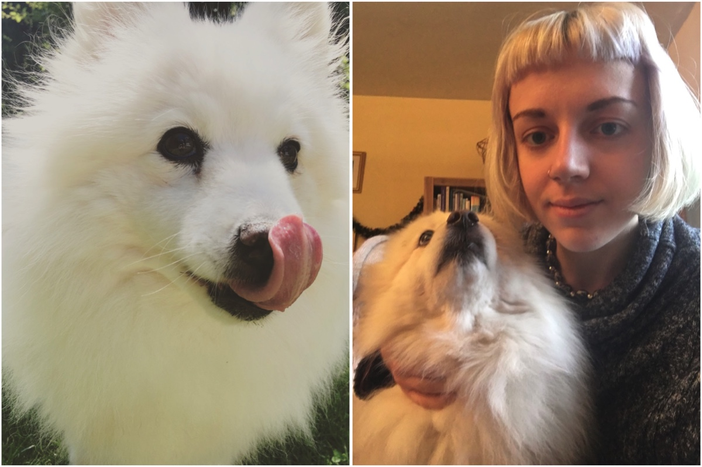
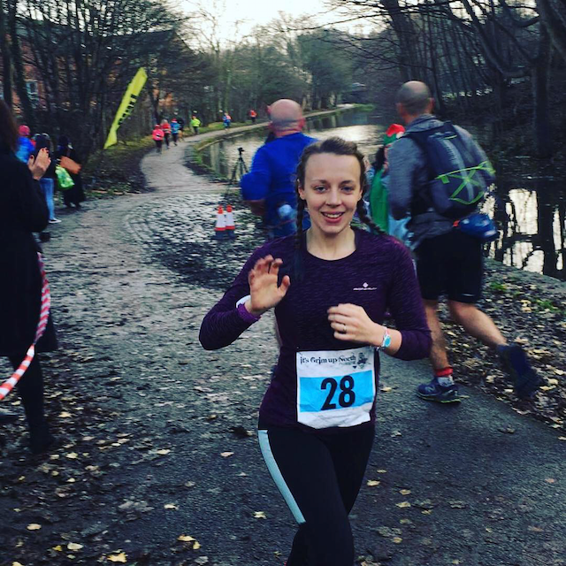
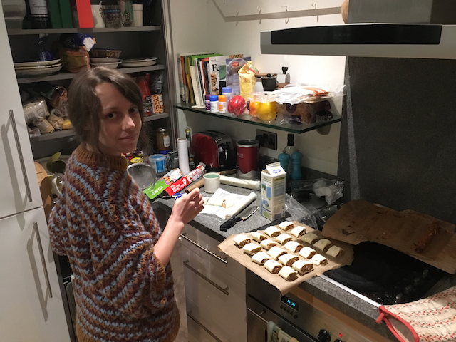
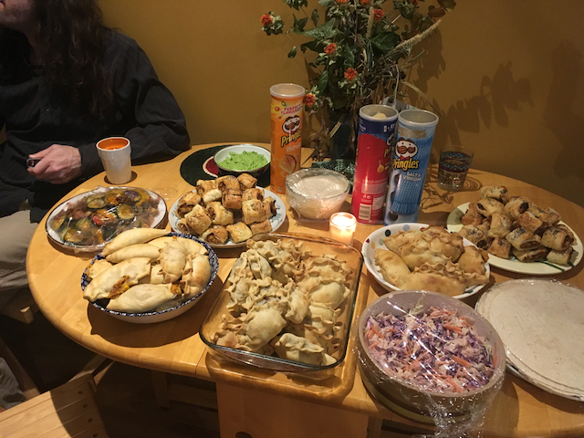
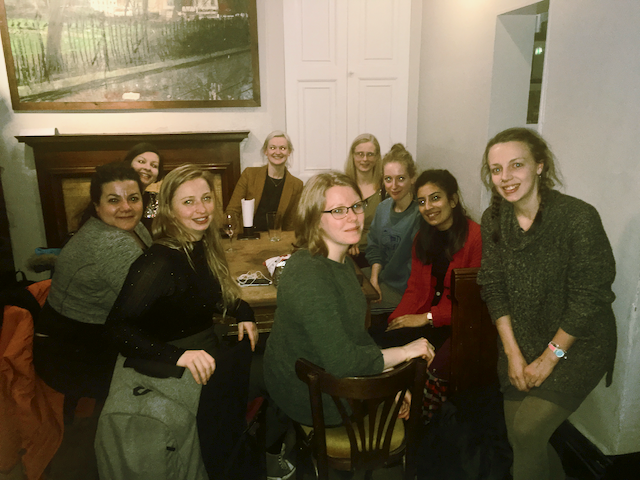
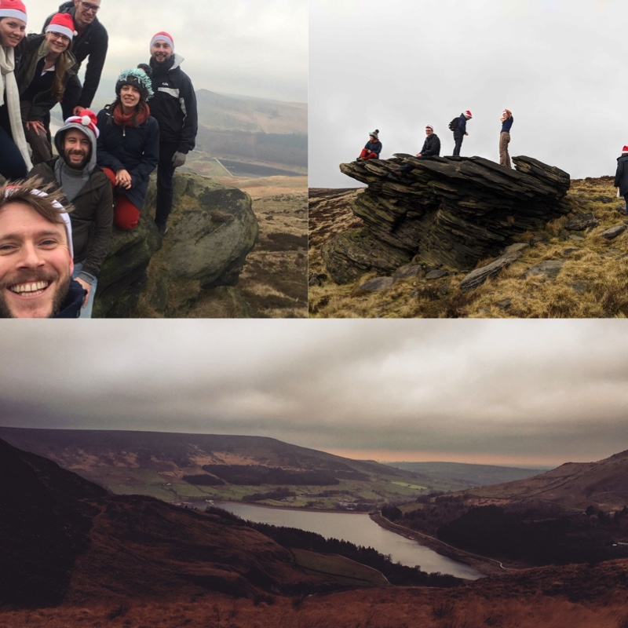
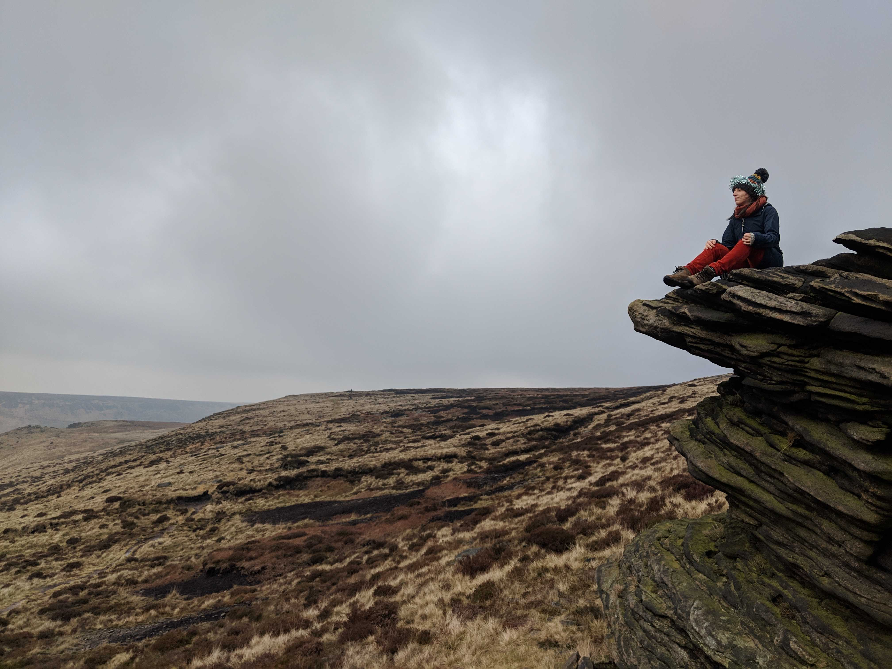
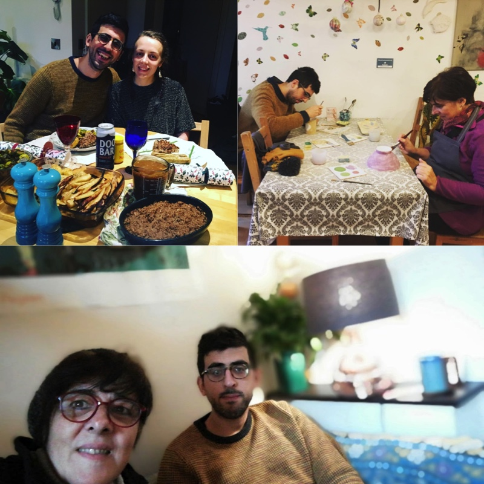

You might not be aware of this, but a little while ago it was December 2018. Getting all caught up in the end-of-year reflections and resolutions for personal transformation, this fact almost completely passed me by. Now it's well into January, but so that poor December doesn't get left out (and my blog posts are all uniform) I'm finally sitting down to post a review of The Forgotten Month.

So what happened in December?

Well, it was very busy and mostly lovely, actually.

Although unfortunately my family dog, who was very old, was put to sleep. A rescue Japanese Spitz, she'd been in the family since I was 13 or so (I'm now 27) and she was probably about 16. I was surprised how sad I was when we finally decided to let her go - I'd always imagined I'd be sad but pragmatic, not wanting to see her suffer. But actually it was a lot harder than I'd expected.

😔😔😔

I really miss taking her for long walks (although it's been a long time since she'd been up for that) and just generally hearing her snuffle and shuffle about. Dogs are the best - all they have to offer is love and it's all they want in return - I miss that simple, loyal presence.

Onto happier subjects, one major high of the month was completing my **first marathon**. And actually not being traumatized by the experience. I'm not sure I'd say it was enjoyable - it was quite boring in places, and in other parts it was just plain hard - but if wasn't awful and the feeling of crossing the finish line was brilliant. In fact, the last few miles were all pretty good - I managed to muster a bit of extra energy to sprint towards the end, and ended up coming in with a time of about 4h 30. I would definitely do it again.

The next weekend, Mauro and I had our **engagement party**. We cooked many vegan empanadas and sausage rolls, and invited a few friends round for drinks and games. It was nothing extreme but it was lots of fun.

I didn't take many pictures, because I was just busy chatting and enjoying it, but I did manage to get a picture of one of the most important features - the final table of food before everyone arrived.

Another lovely evening was the final **Women in tech meetup** of the year, an informal get together for women in tech I've been organising for the last 10 months or so. We need a better name, because surprisingly 'Women in tech' is already taken, but since the only suggestion anyone's come up with so far is 'Binternet Explorers' the jury is still out on what it could possibly be. If you have an ounce of imagination please let me know what we can call ourselves.

We went to our regular haunt of Sandbar, and in festive spirit lots of people turned up, even some new faces, which was lovely!

Did you know there were so many lady developers in the entire world? Nope? Now you do! And there are even more of us than that!!

Another highlight of the month was going on a lovely **Christmas walk with my team** at work. Instead of a booze-fuelled traditional Christmas party, we dedicded to go on a wholesome walk around a reservoir near Manchester instead, an activity and sentiment I massively appreciate as I'm definitely not one for boozy late-night parties.

It was really stunning to see Manchester in the distance as the sun set - and even more impressive when I asked how far away it was, and the answer was "12 miles" - meaning less than half of what I'd run just the other day! No distance at all, then!

I particularly like this moody picture of me hanging out on a rock, slightly adorned in tinsel.

Finally, of course, we need to talk about the main event of December - **Christmas** (as though everything else wasn't enough!) Mauro and I were very lucky to have both our Mums come to stay with us over Christmas and New Year, and their visits crossed over by a day, which meant they got to meet each other for the first time! We went out for some lively meals, a couple of walks, cooked them some of our favourite food, went into the city centre, painted some pots, played lots of board games and generally had a very nice, relaxing time. Christmas itself was pretty chilled, we just opened presents, cooked, ate and did an obligatory and somewhat half-hearted quiz.

Featured in all 3 pictures above is Mauro's wonderful new mustard jumper which I got him for Christmas - have you ever seen a more glorious jumper? He tells me he received exactly 0 compliments on it at work, so if you see someone in an amazing mustard jumper, make their day and tell them it's great.

Finally, how did I do on my goals from November? I've completely forgotten what they were, so let's take a look...

##### Goals from November

✅ **Fill all my plant pots with plants, and get plant pots for all my potless plants** I've finally done this, after many failed estimations at exactly how large an 8 litre bag of compost is (not as large as you'd expect - I've had to buy several to finally fill all my pots)

✅ **Throw a lovely engagement party**

✅ **Organise end of year Women in Tech dinner & drinks**

✨ **Work through at least half of my AWS certification course** Not quite, was on about 40% by the end of the year. But in no rush to finish - as long as I do the certification in 2019 some time.

✨ **Keep working on my side project** What even is that again? Why did I not leave any more information on this item?? Urmmm.. well... I've got a different side project idea now so let's just forget about whatever this was...

✅ **Get back into yoga after the marathon** I started doing yoga again after I finished the marathon, and realised I missed it so much I've been doing it EVERY DAY in January!

✅ **Read another book in Spanish, for a total of 14 this year** By the end of December I'd almost finished "El Libro de la Obscuridad" (The Book of Dust, vol 1) by Philip Pullman, a prequel to his awesome Northern Lights trilogy.

✅ **Do a talk at Northcoders Lightning Talks** I did a talk on the JAMStack, which I need to write up.

There are no goals for January since we're almost half way through already as I'm writing this, but check out my general [Goals for 2019](/blog/goals-2019/) if you want to know what I'm hoping to set my mind to in the near future!

Thanks for reading and hope you had a lovely end to the year.
