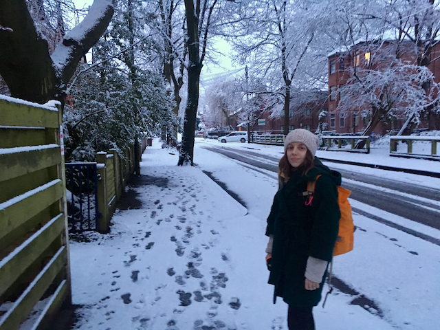
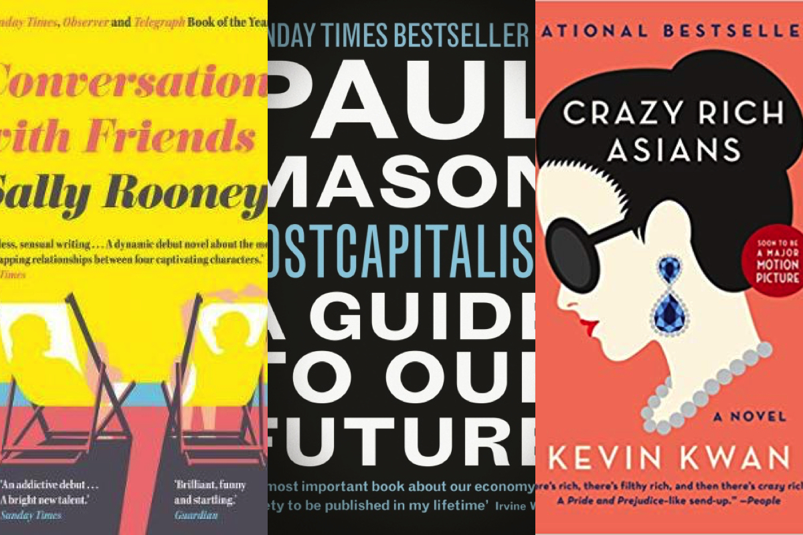

Apparently it's only been 1 month since my last monthly review, but it feels like about 74. What is it with January being so ridiculously long?

I didn't help the situation by starting off the year with bundles of energy, and thus cramming as many commitments and activities into the month as possible. As a result I was feeling a bit exhausted by the end, and have been trying to take it a bit easier lately!

A few of the things I've been doing:

- Running again
- Going to yoga once or twice a week
- Travelled to London to see family and friends
- Started work on a side project
- Blogging every week
- Following my AWS training course
- Mentoring

On top of that, I've been trying to also keep on top of learning Spanish, reading often (I got through 7 books in January!) and chilling out with crochet and, recently sewing. Although chilling out kind of loses its effect when you have to block out time in your calendar to actually do it, and end up rushing through it so you can do something else afterwards!

As a result of my somewhat hectic month, I found myself sleeping badly for a little while, which was a wake up call as I usually have pretty good sleep. I've still got quite a lot on at the moment but I'm starting to say no to things now, which I always feel bad about, but is important if I want to stay sane!

#### Working with MentorCruise

One of the most intesting things I've been doing lately is mentoring. I signed up at the start of the year with [MentorCruise](https://mentorcruise.com), a service that connects mentors with people learning software development, data science etc. I've had a handful of requests, and in the end accepted one mentee whose aims really aligned with my skills. I have started meeting with my mentee on a weekly basis via Hangouts, and it's been a really positive experience for me so far, and something I'm definitely keen to continue. The definition of mentoring in this context can feel a bit vague, and what I offer probably falls somewhat in the realm of "tutor" as well as "mentor" but I guess that's something that mentors and mentees need to work out between them, depending what the goals and expectations of the mentee are. The platform is great, though, and in active development right now, so it's exciting to see it progress as I'm using it.

Dom, the creator of MentorCruise, asked me to do a short interview with him to share on the MentorCruise blog. You can read it here: [Meet the Mentor: Harriet Ryder](https://blog.mentorcruise.com/harriet-ryder-meet-the-mentor-9bbdbe9287fe).

I'll write more about my experiences with MentorCruise soon :)

#### Books

I read some awsome books last month, a selection of which I feel obliged to share.

Firstly, Sally Rooney's _Conversations With Friends_ was mavellous and I devoured it in almost 1 sitting. I am now number 143/143 on the list of library reservations for _Normal People_, so hurry up people of Manchester and get reading because I am SO excited to get my hands on this book. Unfortunately none of my career choices are working in my favour as I don't get to move to the top of the list because I used to work in libraries, nor can I hack their computer system.

I also adored Kevin Kawn's _Crazy Rich Asians_. It was such a romp - yes, a _romp_ really feels like the right word. I promptly bought the next 2 books in the trilogy, _China Rich Girlfriend_ and _Rich People Problems_ which I hope are equally entertaining and rompful.

And finally, Paul Mason's _Postcapitalism_ gave me some real food for thought. I'm not fully convinced by his optimistic view for the future of the economic system - logically of course I agree with him that capitalism as an economic system will not last forever, no system can last forever, and I could even be swayed by his argument that a combination of climate change, financial instability and a lack of new markets will converge in around 30 years or so to create a crisis of humungous proportions for capitalism (his doom mongering in this respect is quite convincing), but I am not sure I fully share his vision for how techology is already beginning to shape a radically different economic system. I feel like writing a full blog post in response to his book, but perhaps the more appropriate thing to do is buy 3 acres of land and a borehole and try to become self-sufficient ASAP.

#### Learning

Jauary was all about AWS, as I'm still prepping for my as-yet-unbooked exam. I'm about 60% through the course I'm following, which is only about 10% further than the start of the month, but I got quite distracted by beginning a side project of a flashcard app, which was leveraging a few of the AWS services I wanted to try out.

I hosted my app with Elastic Beanstalk, a service I immediately fell in love with when I saw how easy it was to set up a whole managed environment with just a few clicks from the AWS console. I've also been loving AWS CodePipeline lately, and have found it really easy to replicate the automatic deployment I am used to setting up with Gitlab. CodePipeline can also read from a Github repository as a source to trigger tests, builds and deployments, which is great, as I prefer Github to GitLab but Github alone doesn't offer free CI/CD like GitLab does. However, Github + AWS CodePipeline === 💕💕💕

In reality I probably need to rethink my hosting solution as I'll have to start paying for the instance that's running under Elastic Beanstalk in a few months when my free tier expires, which I really don't want to do for a side project with 0 users. Something completely serverless would be ideal, so I'm not paying anything if there are no users, so I might need to think about this before going much further. Or look for a free, alternative compute provider such as Heroku and just deal with the sleeping dynos until I have a good reason to pay for something better.

Anyway, if the past is anything to go by, this side project won't be around a few months from now so we'll see!

#### London

I went to London to see family and one of my best best best friends. I spent an hour and a half running around a park in Bromley with my uncle, and then a long lovely day in museums and coffee shops with my friend, before catching the train back to Manchester.

Unfortunately I didn't get any pictures of us, but I did end up fangirling over Queen Anne and Sarah Marlborough in the British Portrait Museum and as such these are the sole photos from my trip:

Yes, of course, we watched the Favourite!

That's about it for January... this month, I refuse to set myself any goals or targets, apart from to plod on with the AWS course and the running.

Thanks for reading!
