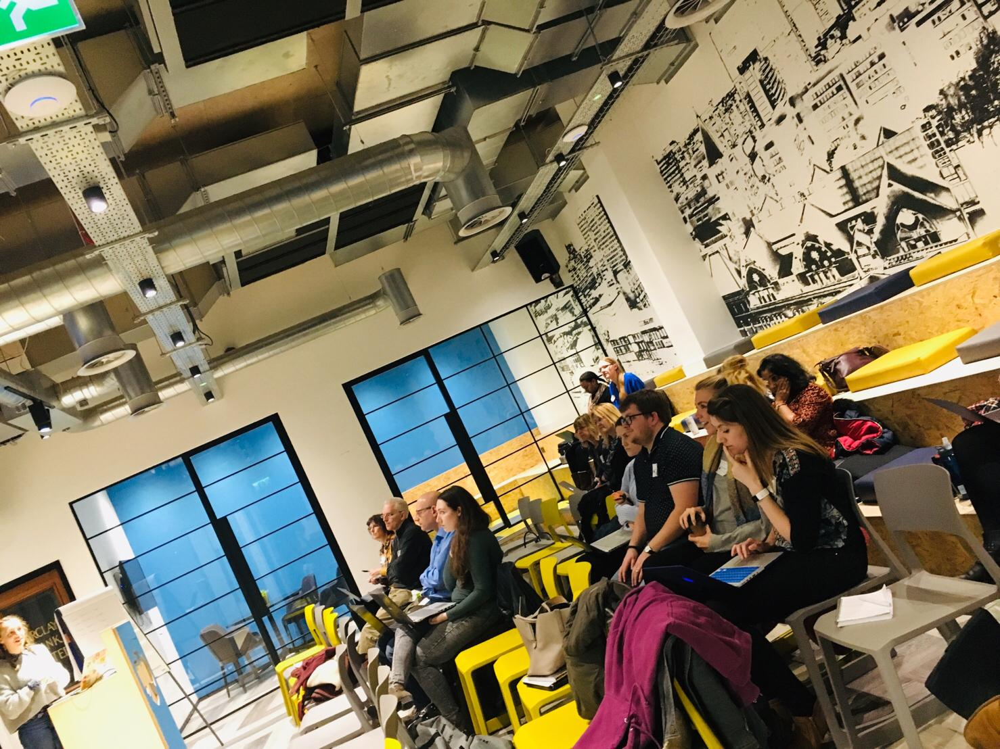
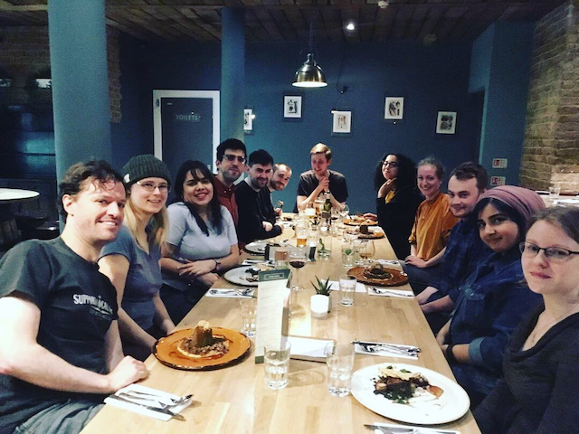
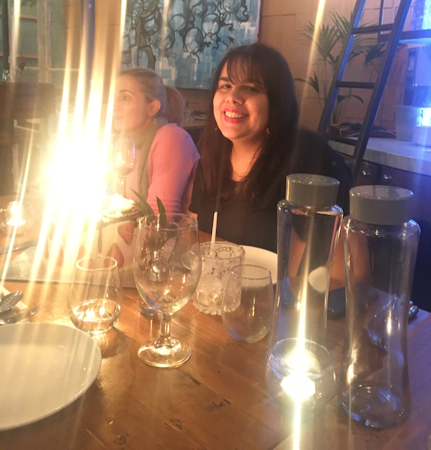
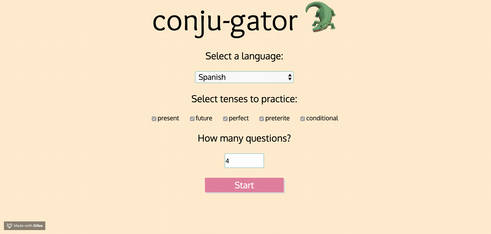
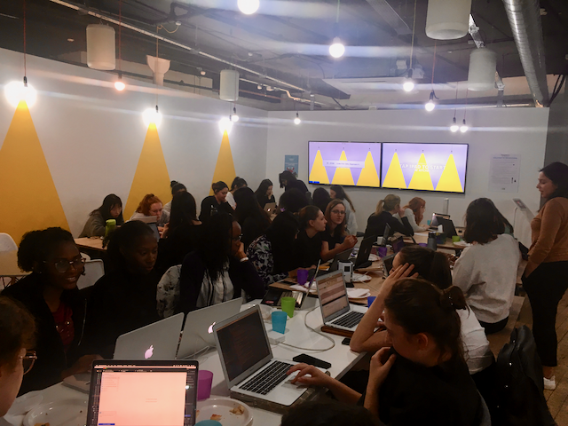

So I've been sitting on a little bit of news for a while, which is now out in the world - I started a new job in the middle of March!

I am now working with a small consultancy called <a href="https://closconsultancy.com/" target="_blank">Clos</a>, as a software developer and tech coach. My time is split roughly half and half which is amazing, as it's what I always wanted - the opportunity to work as a developer since I love building stuff and improving my skills, whilst also being able to give back to new learners.

We run a course for people re-entering tech after career breaks. It's called <a href="https://techreturners.com/" target="_blank">Tech Returners</a> and the week after I joined we just began running a new cohort. It's a part-time, cloud-first course which is sponsored by companies, so free to the individual taking the course. This is all pretty exciting as I'll be teaching some stuff I haven't taught before (although I have _done_ it, don't worry lol) and I am really happy to be working on something that is so accessible to everyone.

I've been here about 3 weeks now and am enjoying working with the students, excited to get stuck into dev work soon too, and looking forward to the many opportunies which I can see presenting themselves for me in this role. I was sad to leave Formisimo, especially as the new product I'd been working on for the last year was really beginning to take form, but I couldn't pass up this opportunity to do something so much at the intersection of everything I love.

A few other highlights from March include...

### Many Birthdays!

Mauro turned 30, and I organised drinks at <a href="http://woodandcobar.com/" target="_blank">Wood & Co</a> followed by dinner at <a href="https://allotmentvegan.co.uk/" target="_blank">Allotment</a> vegan restaurant which was _amazing_. I can't believe we hadn't been before! It's definitely very fancy and probably only for special occasions but it was some of the best vegan food I've had.

I also booked Mauro and I a bookbinding course for later in April, since we love learning random crafty things and are always trying (often failing) to do more things with our hands.

It was also our friend Amanda's birthday. We ate at <a href="https://www.elgatonegrotapas.com/" target="_blank">El Gato Negro</a>, an award winning tapas place. Although delicious, the vegan options all seemed to be tahini-based, which is not super imaginative for vegan food as it just gives everything the vaguely hummus-y quality. Still a great evening though, followed by an improv comedy show which I really enjoyed.

It was also our friend Carolina's birthday, and we ate at <a href="https://www.cantorestaurant.com/" target="_blank">Canto</a>, the sister branch of El Gato Negro, and we both preferred the vegan food here so thumbs up for Canto. 👍

### Learning

I finally booked my AWS exam which means I need to stop doing random side projects and actually knuckle down on the revising. I bought some flashcards though, and have started really going over all the material, which is making me more confident.

I just need to stop getting distracted by other stuff.

For example, I've been working on a small app called Conju-Gator which gives you random words in Spanish to conjugate correctly. This was an app I desperately needed, and seemed like a small job to build myself - no database or auth needed, just a big old file of data and a randomiser function.

As expected it was easy to get a first prototype together, but I now need to import at least 200 common verbs so that it's actually useful, so I'll need to scrap a dictionary such as WordReference for that data.

I'm really determined to do it though, because it's _exactly_ what I need to practice my conjugations.

### Self Development

As part of my new job, I've been attending leadership training which Beckie, one of the founders of Clos, runs for women who work in tech. The course, **Tech Future Female Leaders** is designed to help women think about their career progression and to chart their paths, based on their own strengths and interests, and delivers specific training to help women achieve this.

I've been to one session so far which was based around discovering our own strengths and values, and gave me a lot to think about.

I will probably write a full blog post about this course at a later date so I won't say too much now, apart from the fact that I'm looking forward to what the next weeks will bring!

### CodeFirst:Girls

Another month of the <a href="https://www.codefirstgirls.org.uk/" target="_blank">CodeFirst:Girls</a> beginners HTML/CSS course has flown by. We've had lots of awesome guest speakers, I've led a few more sessions, and students are now working on their final projects which they present next week.

This course has seriously gone so fast, I feel like I've been in a bit of a whirlwind in March with Tech Returners starting, all these awesome students still progressing, and me learning so much in a new role too!

### Strength training/Class Pass fun

I've been enjoying visiting a few different gyms around Manchester now I work in the city centre again and have been using <a href="https://classpass.com/" target="_blank">ClassPass</a> to get access to a bunch of different classes.

The variety of classes is awesome and I've been really enjoying trying out some fancy boutique gyms such as <a href="https://madebykor.co.uk" target="_blank">Kor</a> and <a href="http://v1be.com/" target="_blank">V1BE</a> (which are not as intimidating as they sound) and going to some strength classes. Me and Mauro also enjoyed (slash almost died, depending who you ask) a spin class and we're planning to go weekly from now on.

I'm seriously debating joining somewhere for regular access to classes, since I've been enjoying them so much, but we'll see!

### Booked our wedding 💍

We've booked a date for our wedding but little else yet!

Nobody really knows this though, as we haven't managed to make the invitations yet. I wanted to make them myself so I bought some paint, but it turns out I can't paint, so I'll have to learn to produce something acceptable with a brush first before anyone's getting any invitations!

Or maybe we'll just text people...

### The month in books

I read 7 books in March!

- Hazards of Time Travel by Joyce Carol Oates
- Más allá del invierno by Isabel Allende
- The Ministry of Utmost Happiness by Arundhati Roy
- The Power of Full Engagement by Jim Loehr
- The Uninhabitable Earth: Life After Warming by David Wallace-Wells
- Talking to My Daughter About the Economy by Yanis Varoufakis
- The Cost of Living: A Working Autobiography by Deborah Levy

Actually, I enjoyed all of these, especially _Talking to My Daughter About the Economy_ and _The Cost of Living_. I would highly recommend _Talking to My Daughter About the Economy_ for anyone who's vaguely interested in politics, the economy and what's going on right now, but who doesn't have a good grounding in economic jargon and wants relatable, common-sense explanations of how stuff actually works.

_The Uninhabitable Earth_ was also very interesting although I feel like unless you only started believing in climate change ten minutes ago you're probably aware of most of the issues in the book about how our world will be affected (and is being affected) by rising C02 levels, but still worth a read if you like to make yourself feel depressed about the future.

_The Power of Full Engagement_ was also an interesting one. I'm not usually one for business-style self-help books but someone I respect recommended it, and it was actually very interesting. It focusses on how we can explore what really matters to us, and encourages us to take a hard look at our actions and see where we're failing to behave in a way that's consistent to our values. If we fail to behave in a way that's consistent with our values, it can be extremely exhausting just to live, a feeling I'm sure many of us can empathise with. Of course, changing how we live is not always in our control but the book made me realise that in some ways, for many of us, it is.

For example, one value I believe in is the importance of people and of family, yet I regularly choose to stay in instead of let myself go out and enjoy time with people, feeling like it's an "indulgence" that I shouldn't do too often. Another value I hold dear is self improvement so if I'm staying in to learn something, or read, or work on a project, that's great, but it shouldn't be at the exclusion of other meaningful activities. As a result of reading this book, I've been thinking a lot about how I can maximise the time I spend doing _meaningful_ activities which align with what I believe is important, and luckily I've just started a job which allows me to do this even more, but there are lots of other ways that I might seek to spend my time more valuably and allow myself "indulgences" which are important to me (and which are not really indulgences at all).

### Plans for next month

🔸 Continue to go to strength classes and to work on my fitness

🔸 AWS revision

🔸 It would be awesome to get Conju-gator live, so I can finally say I've "launched" a side project, even if it's the most simple thing in the world!

🔸 Bookbinding course

🔸 Mum visiting us for Easter, yay!

🔸 Host a dinner party with friends (it's been too long)

🔸 Read another book in Spanish
