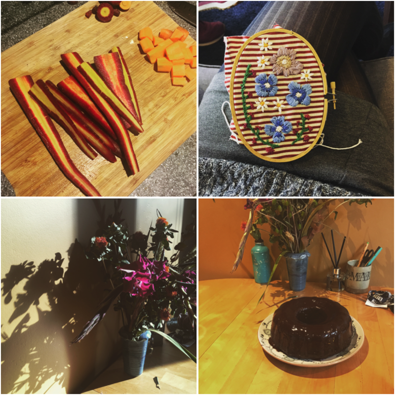
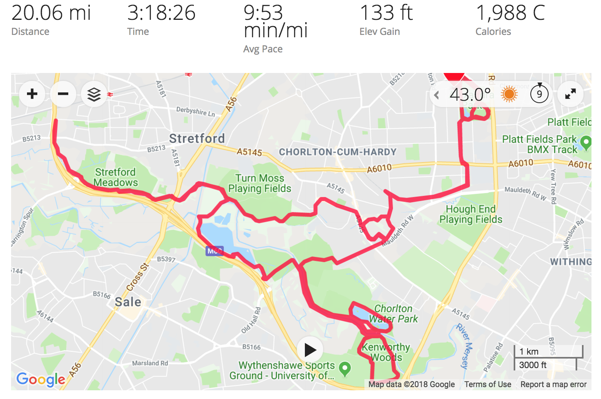

October seems to have absolutely flown by, and it's been one of those months where I feel like achieved a lot and made the most of all 31 days, but without feeling exhausted at the end of it all. There have been evenings I've wished there were a couple more hours in the day to unwind and read a book or relax, but overall I've happy with the things I've prioritised.

Things like cooking and crafting...

And running on lovely chilly mornings...

Mentoring at [Codebar](https://codebar.io/manchester) and [CodeFirst:Girls](https://www.codefirstgirls.org.uk/)

... and spending time with friends.

##### Running

At the beginning of the month, Mauro and I spent the weekend with my Mum in the Dales and I began running long distances again after being injured and on holiday during September. And last weekend, I ran my longest run *ever* of 20 miles. It was supposed to be a race in Leeds but there was a train strike (do trains ever actually run between Leeds and Manchester?) so I had to relocate and do it on my own in Manchester instead. 20 miles is probably the longest I will run before my marathon in December. I was a bit miffed because my Garmin didn't tell me that it was my longest run, but I'm absolutely positive I've never run that far before. I think I would have remembered.

It wasn't nearly as bad as I was anticipating. It was a cold day which helped, since I didn't sweat too much and get dehydrated, and surprisingly my legs were absolutely fine the next day. I really hope I have another 6 miles in me to get me to the finish line of the marathon... everyone's got another 6 miles in them though, right?

##### Reading

I've read some really good books this month, my favourite being [Bullshit Jobs by David Graeber](https://www.amazon.co.uk/Bullshit-Jobs-Theory-David-Graeber/dp/0241263883). He originally published an essay ([read it here](https://strikemag.org/bullshit-jobs/)) about the phenomenon which became really popular and catapulted the phrase "bullshit jobs" into common use. His book is a deeper exploration of the subject and it felt like essential reading for anyone coming into the workforce in this current economy.

He differentiates bullshit jobs from just shit jobs. Bullshit jobs are truly pointless - the kind of job that sucks your will to live because you feel like everything you're involved in is just a waste of time. It might be well paid and secure but it still destroys your soul because you can't even lie to yourself that you're providing some benefit to humanity (which is what we all crave, to have a positive impact on the world and do something we believe in). They are also often characterised by not having enough work to do, and feeling like a fraud or questioning why you're even there. Shit jobs also exist which might be hard work, gruelling hours and badly paid but that's not what Graeber is interested in.

It was truly enlightening to see so many of my feelings about various jobs I've had explored in this way. I always thought it was "just me" if I was feeling bored and hopeless at a job which on the surface ought not to be a bad job. But as he explains, with the way the labour market is arranged these days (with many layers of managers and middle managers, and whole bearucratic systems which seem to undo and re-do work that's already been done or could be done 100x more efficiently) it's an extremely common phenomonen to feel like the thing you do all day is truly pointless. He explains why he thinks these jobs exist, how they affect people who work in them, and why he believes that universal income is a much better alternative to how we've currently organised our workforce.

##### Learning

I've been focusing on learning Bash Shell scripting in October, which was my plan from last month. My steps to learning have been:

🔸 Watch a Pluralsight course

🔸 Follow along with the examples

🔸 Devise sets of 'challenges' to complete to test myself

🔸 Choose to be involved in tickets in work that use these skills

🔸 Writing detailed notes, as though I was explaining to someone else

By far the most helpful thing has been to set myself real-world style excersises to complete. I strongly believe that you can only learn in a very limited way if you don't actually use a skill, and when you use it you should need to do additional research and googling to complement the knowledge that has simply been provided to you (via a video, tutorial etc). I couldn't find any good exercises to test my Bash skills so I had to make them up myself.

I am thinking of sharing them in some format once I've finished my Bash course as they might help someone else.

Surprisingly, knowing more deeply about how Bash works has helped me at work on numerous occasions this month. I thought it would take me longer to come across a real need for what I'd been learning, but it turned out that just having another tool in my tool-belt gave me more options for solving small problems and I was able to put it into use sooner than I'd imagined.

Next month I'll continue with Bash, but I also want to look at Tim Berners-Lee's [Solid](https://solid.mit.edu/) project. I'm really excited about how the web might evolve over the coming years and I immediately have a great respect for anything that the creator of the current web has put his name to!
 

##### Goals from last month

✅ Complete my 20 mile race in Leeds (Okay it wasn't in Leeds but I did the distance!)

✅  Bake bread - I made various cakes, and pizza dough!

✅  Learn Shell Scripting - going well but still in progress

❓ Write a new technical blog post - Almost! I'm half-way through editing a post on benchmarking an API!

✨ Run a film night for our Women in Tech Meetup - We planned this but we cancelled as not many people could make it. So that probably doesn't count!

✨ Work through as much of the free Linux Academy courses as I can - I only just started a couple of courses so I don't think I can tick this one off, sadly.

##### Goals for next month

✨ Run 40+ miles per week in the runup to the marathon

✨ Finish my Bash course on Pluralsight

✨ Make public the Bash exercises I've been creating

✨ Write a notebook entry in Spanish per day (my equivalent of NaNoWriMo)

✨ Publish a technical blog post

✨ Take more pictures!

✨ Read a book in Spanish

✨ Look into [Solid](https://solid.mit.edu/)
