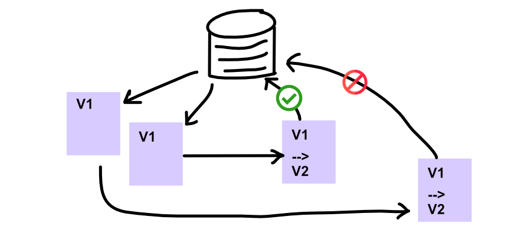
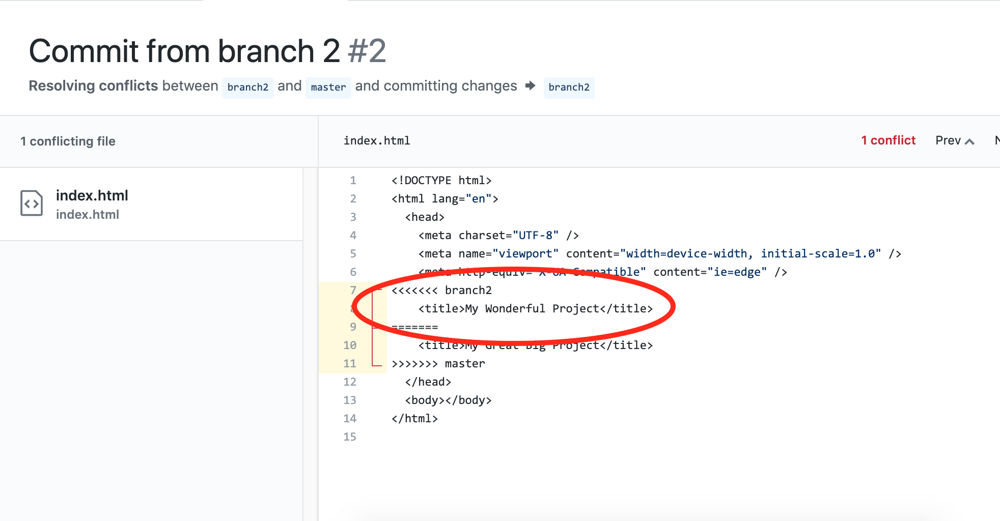

### What is Optimistic Concurrency? First, a scenario...

Imagine you are a humble bookseller and you have signed into your shop's stock management system. A customer has just called you to tell you they want to add 2 more copies of _Normal People_ to their order. You have their customer record open and you can see their order. They've already got a copy on order, but they've decided to give copies to their mother-in-law and their brother, too. It's just such a good book. While they're on the phone with you, they ask you to change the delivery address to their office, which you do, as well.

However, whilst you're updating the order, your colleague has just got to work and has opened her inbox to see an email from the same customer that they sent over the weekend, before they decided it would just be easier to phone. And also at that point they were only thinking about their mother-in-law so they only asked for 1 extra copy. Your colleague actions the email, opening the customer record, and sees that 1 copy of _Normal People_ has been ordered, so she updates the total to 2. The email makes no mention of changing the delivery address so she doesn't touch that.

Both you and your colleague have the order record open, and you have both made different changes. One of you is going to save the updated record first, and then the second person is going to save the record. Whose changes are going to "win"? Will the customer end up with 2 or 3 copies of _Normal People_ and will their books get sent to their home or office address?

This scenario, where two or more people have got a copy of a record and are are about to overwrite the other person's changes, is pretty common. It is often called **The Lost Update Problem** or a **Mid-Air Collision**.

We could simply say that the last person to submit the update "wins", but that wouldn't be great because we'd potentially loose a really important update that somebody else had attempted to make. In the above example, the humans involved know that the correct number of books is 3, because that was the most recent thing the customer said. But if your colleague made their update after yours, the order would end up with 2 books on it.

There are two solutions to this problem, and **Optimistic Concurrency** is one of them. **Pessimistic Concurrency** is the other one.

### Optimistic Vs Pessimistic Concurrency

Concurrency is the idea that two processes (in this case, updates) might be going on simultaneously.

Both Optimistic and Pessimistic Concurrency offer solutions to deal with the conflicts that this concurrency might cause. They are both _concepts_ and don't prescribe specific technical implementations.

**Optimistic concurrency** is the idea that these kinds of conflicts won't happen very often (hence it's "optimistic"), but when they do happen, the humans involved should be given the opportunity to react and decide what to do. In the above example, that means that if your colleague saved the record first, then when _you_ attempted to save the record afterwards you would be warned somehow, and would have to decide whether to overwrite the other changes or not.

**Pessimistic Concurrency** assumes that these kinds of conflicts might occur regularly, and that it would be a pain to have to keep asking a human what to do, or perhaps not even feasible. A solution that employed pessimistic concurrency would need to ensure the system was protected from these kinds of conflicts ever happening. That generally means applying a "lock" to a record, so that if someone else is in the process of updating it, another person or system wouldn't be able to. In the above example, that means that your colleague wouldn't have been able to open the record while you were busy with it, thus preventing any possible conflicts.

### Optimistic Concurrency in Web Applications

Web applications are one environment where pessimistic concurrency isn't really possible. This is because to maintain a "lock" on data in a database, the record would have to be kept in a "locked" state throughout the whole process of:

- You opening the record when the customer first calls you
- All the time you are updating the record

The lock would only be released when you are done with your call and you click the button to submit the Update request to the server. A fair amount of time could have passed without anyone else being able to update the record, which could easily cause a problem. And you might just get distracted and walk away, and then the lock would just stay in place until it expired at some point...

In web applications, the app doesn't maintain a constant connection with the server or the database, so it's impossible to know whether you're still actually editing the record and the lock needs to remain, or whether you've gone off to do something else. In other kinds of applications, where the app is directly connected to the database, locking can be a solution, but not in web apps.

Therefore we have to rely on Optimistic Concurrency, which means that we need a mechanism for identifying when these conflicting update requests happen, and ideally we need to bounce the problem back to the user for them to verify.

### Isn't this just a merge conflict?

If you've worked with Git and have experienced merge conflicts, then you might be thinking that this whole idea of multiple conflicting updates sounds pretty familiar - and you'd be right.

Merge conflicts are a great example of **Optimistic Concurrency** in action. Because Git by its nature is _distributed_ there's no way a single user could maintain a lock on a file they're editing, so the only solution is to allow multiple people to concurrently edit files, but when it comes to submitting those edits, if there are conflicts (to Git, this means lines of code which have been changed by two people) then the user submitting the most recent update is left with the oh-so-pleasant task of sorting out those conflicts and deciding which is the "right" version.

### How is Optimistic Concurrency actually implemented?

Technically, optimistic concurrency is usually implemented by using version numbers. Every record in a database will be given not only a unique `id` but also a version number or timestamp. This means that every time a record is updated, logic can be executed that compares the version number of the record that its trying to save against the version that's stored in the database.

In the above example, that means:

- You would have loaded version 1 of the record from the database
- Your colleague would have also loaded version 1
- You press "Save" first, making a request to update the record. The application submits the version number (1) along with the edits you want to make.
- The backend accepts the request and updates the record. This is now version 2 of the record.
- Your colleague presses "Save", making another request to update the record. The application submits the version number (1) along with the edits they want to make.
- The backend rejects the request, because it can see that version 1 is not the most up-to-date version.
- Your colleague is informed about the conflict and may be presented with an option to overwrite your changes, or resolve them.

### Optimistic Concurrency in action

Here are a few examples of how various frameworks/technologies implement Optimistic Concurrency:

- **DynamoDB** uses the mechanism of <a href="https://docs.aws.amazon.com/amazondynamodb/latest/developerguide/WorkingWithItems.html#WorkingWithItems.ConditionalUpdate" target="_blank" rel="noopener noreferrer">Conditional Updating</a>, where you can declare that the item should only be updated if certain values match what you expect. You could check a version number, or you could check that a property hasn't been changed by someone else.

- Rails uses version numbers, which it calls <a href="https://blog.kiprosh.com/implement-optimistic-locking-in-rails/" target="_blank" rel="noopener noreferrer">Optimistic Locking</a>.

- Azure's CosmosDB gives every document an <a href="https://docs.microsoft.com/en-us/azure/cosmos-db/database-transactions-optimistic-concurrency?irgwc=1&OCID=AID2000142_aff_7593_1243925&tduid=%28ir__spfhq39rt9kftkabkk0sohz3x22xni99q9xxsasq00%29%287593%29%281243925%29%28je6NUbpObpQ-eQuFHzSCimUVNDuxI6.GGA%29%28%29&irclickid=_spfhq39rt9kftkabkk0sohz3x22xni99q9xxsasq00#optimistic-concurrency-control" target="_blank" rel="noopener noreferrer">\_etag</a> property, which it updates automatically when the item is saved.

- In fact, plain HTTP requests can implement <a href="https://developer.mozilla.org/en-US/docs/Web/HTTP/Headers/ETag" target="_blank" rel="noopener noreferrer">etag response headers</a>, which can also be used like version numbers to check whether a resource has been changed or not since it was last loaded. Frameworks like Java's Spring provide support for generating HTTP etags for resources available at URLs.

### Optimistic Concurrency on the frontend

On the frontend it's really up to you how you handle optimistic concurrency!

Assuming you receive a server error that you can identify as a concurrency error when trying to update an outdated record, it's up to you what you want to do.

You might decide to tell the user that the record they're trying to update has been modified by someone else, and ask them to reload the page.

Or you might provide a more interactive way for them to resolve the conflict, like some live document editing apps do - or think how Github allows you to resolve merge conflicts.

### Not be be confused with.... Optimistic Updating

Okay, one more thing! Optimistic concurrency isn't the same as optimistic updating.

Optimistic updating is specifically a front-end concept and it means updating the UI before you've actually got confirmation from the server that the change was written to the database.

In our humble bookseller example it would mean that after pressing "Save", the request is sent to the server but rather than wait the 500ms or whatever for a response, the frontend application updates the UI to show the changes as though everything was successful. As you can see, this is optimistic!

Optimistic updating allows for a more fluid user experience. A great example is when making quick inline edits to a record, like editing a comment or upvoting an article. The edit/action results in a request to update the database record... but if you had to wait for confirmation before you saw your little "thumbs up" appear, the experience would feel very laggy.

I hope this has been helpful, <a href="https://twitter.com/harri_etty" target="_blank" rel="noopener noreferrer">follow me on Twitter</a> and let me know if you have any comments 🤗
