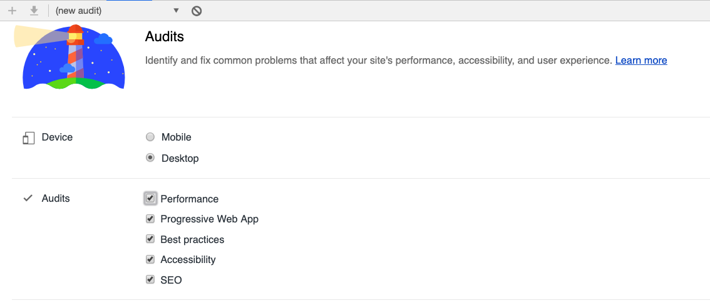
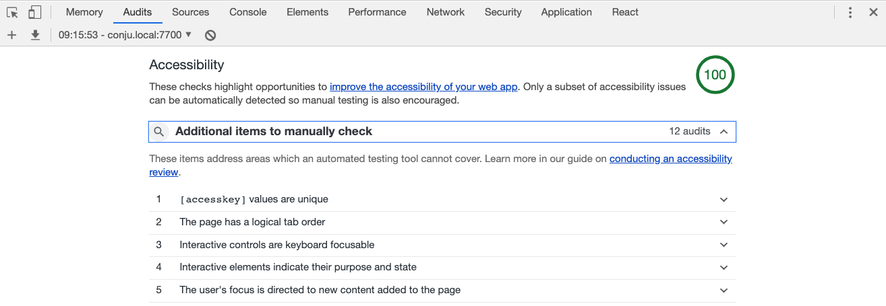
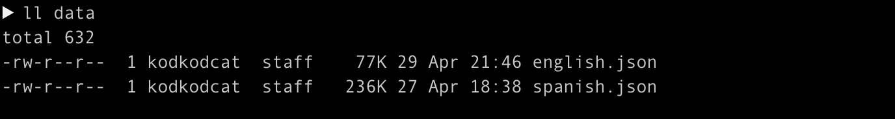
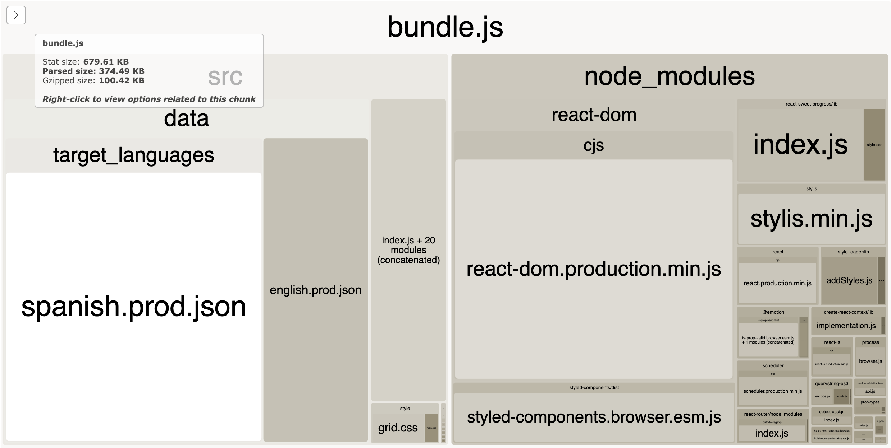
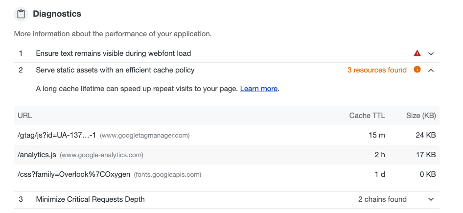
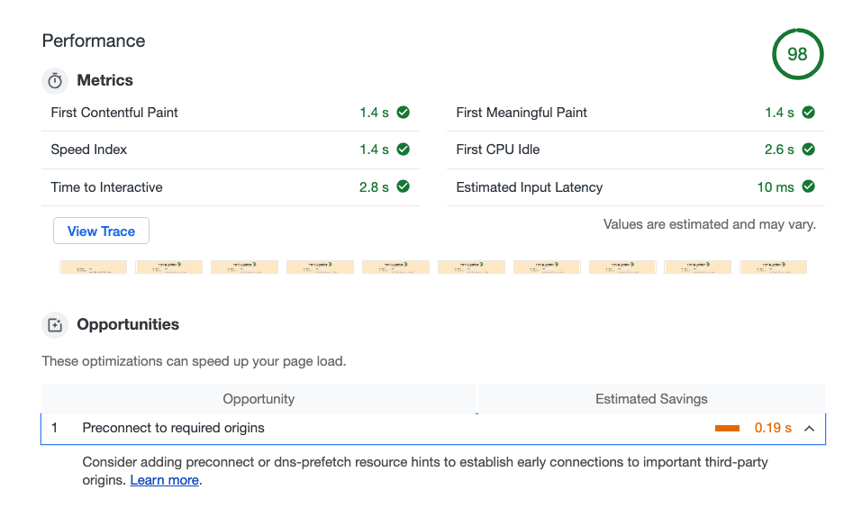

For the last week or so in my spare time, I've been toiling to achieve a 100% audit across all aspects of Chrome's Lighthouse web auditing tool. Lighthouse is super simple to use - you go to the developer console in Chrome and select "Audits". Run whichever audits you want, on whatever type of simulated connection you want, and it will tell you how well your site is deemed to perform as well as recommend improvements and opportunities. Another similar tool is <a href="https://tools.pingdom.com/" target="_blank">Pingdom</a>.

Lighthouse will score your site out of 100 in the following areas:

- **Performance** (e.g. how quickly does the page load, how quickly is it usable and how quickly does it respond to input?)
- **Progressive Web App** (e.g. is it suitable as a progressive web app? Can a user install it as an app, does it have a suitable splash screen and icons etc?)
- **Best practices** (e.g. are there any erros logged to the console? Is the site served via HTTPS?)
- **Accessibility** (e.g. are you using semantic HTML?)
- **SEO** (e.g. are you using meta tags correctly to help Google rank and categorise your site?)

I decided not to worry about Progressive Web App for now, although it's something I'd like to revisit in the future. Most importantly, I wanted to tick off the **Performance**, **Accessibility**, **Best Practices** and **SEO** audits.

The latter 3 were easy to fix. When you run a Lighthouse Audit via Chrome, it tells you a score out of 100 and if it recognises any problems it'll give you a list of things to fix, with links to find out more information.

Performance, however, was a bit trickier.

### From 0% ---> 98%

My site started out with a 0% score on the performance audit! 😥

What was I doing wrong?

Well, a _lot_ of things, but it took a while to figure out what exactly those were. Lighthouse told me about a few issues but I had to dig deeper to find the root causes. The main problems were:

- Sending large assets
- Not compressing resources with gzip or similar
- Not setting appropriate caching headers on resources
- Not minifying code
- Google fonts blocking page load

#### Bundle size

I immediately decided to focus on the large assets, which was mainly my JavaScript bundle. When you build with modern tools such as React or Vue, you generally use a bundling tool to compile all your source code and dependencies together into one single JavaScript file for production, usually referred to as a "bundle". My bundle was a whopping 3000KB. For reference, it's recommended to keep your bundle size below around 250KB so I was waaay over the mark. My initial instinct was that it was the verb data which I was currently bundling up with my source code which was bloating the bundle. I'd been thinking for a while that at some point my verb data would need to be moved to a database of some sort, but I'd been putting it off until necessary.

Now it seemed like this was necessary.

However, on closer inspection, these files weren't actually that big. It didn't seem like they were the main culprit.

I installed a Webpack plugin called <a href="https://www.npmjs.com/package/webpack-bundle-analyzer" target="_blank">Webpack Bundle Analyzer</a> which shows you graphically what your compiled bundle is composed of and I immediately realised that what was _actually_ bloating my bundle was libraries such as React and React DOM! React DOM is the library which handles the rendering and updating of React components into the DOM and is larger than the React library itself.

React DOM was taking up about half the bundle which surely wasn't right - a minified, production build of React DOM ought to only be about 100KB. In comparison, my data files looked quite small.

Of course, the problem was that I _wasn't_ using a minified production build of React DOM in my bundle! I'd made some schoolboy errors such as omitting `mode: production` in my webpack production configuration 🙈, a change which added about 30% improvement to my performance audit.

It turned out there were a few other optimisations I could add via Webpack, including **minification** (removing whitespace), **uglification** (making code hard to read, which often involves shortening variable names thus delivering a performance increase), and ensuring that **no source map** was generated in production (source maps allow console messages and errors to have accurate line numbers according to your source files, not the _bundled_ file, and since you don't want any console messages in production you don't care about the source map).

After my configuration changes, my bundle size was greatly reduced. React DOM was still a major constituent but my own verb data was the biggest bloater, meaning I had the option in the future of removing my data to a database if I needed further performance improvements.

#### Should I have just used create-react-app?

Webpack improvements alone accounted for over half of my score improvement in the audit, which was awesome, although I couldn't help thinking that I would have saved myself a lot of work if I'd just used **create-react-app** in the first place which comes with all this webpack configuration pre-packaged, and would have given me much better performance out of the box.

The reason I didn't go for CRA in the first place is because I like to build up any configuration complexity as I need it. With CRA, making configuration changes is harder because your webpack configuration is about 400 lines out of the box, and it's hard to know exactly what it's doing.

On the other hand, my custom webpack configuration is still < 50 lines and I know what every line does, and can easily update it.

However, I spent a 4 hours or so working on improving it for the audit.

Was it worth it? We'll never know what pain points I might have hit if I'd needed to update the CRA webpack configuration, so who knows. But something to think about.

#### Compression with Gzip

Gzip is a common compression program and supported across pretty much all browsers these days, meaning you can send files that have been compressed with gzip and the browser will be able to decompress them.

Gzipping saves a lot of bandwidth so it's definitely something you want to enable on your server if possible. I was serving my files with S3 with CloudFront in front so I had to enable compression with S3, you can read about how to do this <a href="https://www.thepolyglotdeveloper.com/2018/10/serving-gzipped-javascript-files-amazon-s3/" target="_blank">here</a>.

Compressing my files added an extra 40% onto the audit score!

#### Enabling Cache-Control headers

Again, with S3 you can add cache-control headers to your individual objects, and if you are using CloudFront these will be passed through CloudFront and the resources will be cached appropriately at CloudFront and the browser.

This was a simple case of adding the **Cache-Control: max-age=604800** header (or whatever age in seconds you want your items to be cached for) to my resources at the point of upload to S3.

For some resources, such as Google analytics and Google Fonts, I couldn't set suitable cache-control headers as I was not in control of where these resources were served from, so the Lighthouse audit report continues to tell me that I could make further improvements in the cache policy for these resource - but I can't!

#### Deferring non-essential CSS and JS

When I'd exhausted all other avenues of performance optimisation, the last thing that lighthouse kept telling me was to defer all non-critical CSS and JS to after page load. This means putting JS scripts at the end of the `<body>` section, so that the page can render before the JS is downloaded (not much help in a single page application where there isn't really any page to render in the first place without the JS). It can also mean creating a `<link>` tag asynchronously with JavaScript, as described <a href="https://www.filamentgroup.com/lab/async-css.html" target="_blank">here</a>.

I also discovered <a href="https://github.com/typekit/webfontloader" target="_blank">Google Web Font Loader</a>, a tool that keeps checking for us when fonts are loaded onto the page and will apply classes such as `.wf-loading` and `.wf-active` at relevant points of the font loading lifecycle. Using Web Font Loader instead of loading the link tag asynchronously bought me a couple more points on the performance audit, although there is a noticeable **FOUT** (Flash Of Unstyled Text) now, but I think that's preferable to a slower page load.

#### Loading verb data asynchronously

Finally, although I was satisfied with my bundle size now, I decided to remove the verb data from the bundle to reduce it down even more and load it via AJAX instead. I uploaded my two JSON files of Spanish and English verb data to S3 and fired off an AJAX request to fetch the data when needed.

No noticeable audit improvements here but it at least means I've got more space to play around with in the bundle now and won't have to worry about that any time soon.

#### The final score

The final performance audit score was 98%, at which point I decided to call it a day.

One final opportunity Lighthouse was suggesting was to "Preconnect to required origins". I can't do this, since the connection to the origins in question (google-analytics.com and fonts.gstatic.com) are connected to by resources which I load, not resources which I control.

I wonder whether I'd get to 100% if it were possible to fix this final point, or whether I could claw back the final 2% a different way, by reducing my bundle size even more? It's an area I'll explore more in the future but for now I'm happy.
