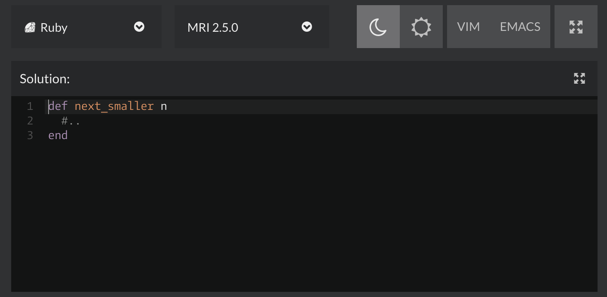
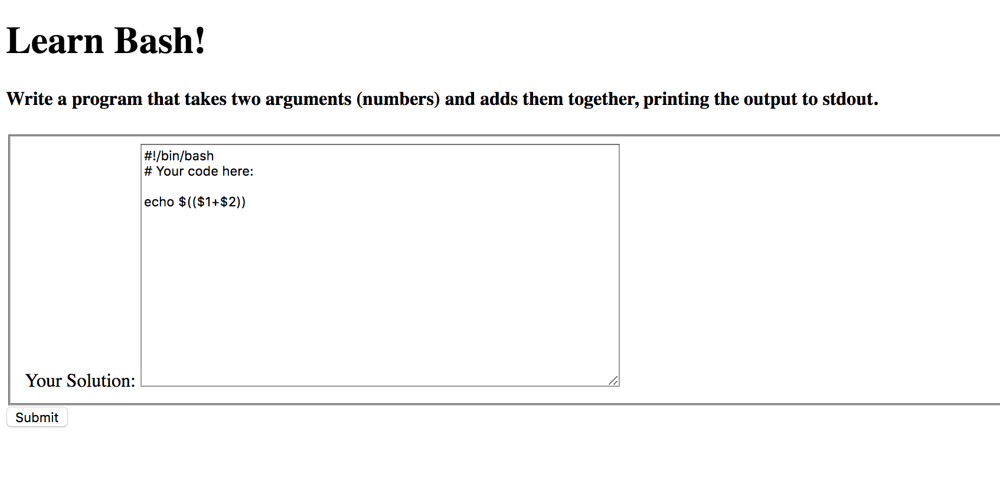

Before reading this, it would help if you knew the very basics of Docker:

- What a Dockerfile is
- How to create an image from a Dockerfile
- Running containers
- Mounting volumes to containers

If not don't worry - I won't go into much depth on Docker and will try to explain as I go along.

#### The background

Have you ever wondered how sites like [Codewars](http://codewars.com/) and [Hackerrank](https://www.hackerrank.com/) work behind the scenes? You write some code in the browser, generally in a box that's styled to look like a terminal or a text editor, press a button and are then displayed the results of running your code through a number of tests.




These sites are not executing your code in the browser - they are sending it to their own servers to execute. Firstly, browsers only contain JavaScript runtimes, so they wouldn't be able to interpret code in languages such as Ruby or Python. And you'd only have access the the browser evironment, so no Node or anything like that. Secondly, there would be a risk of the user ending up doing something weird and breaking the site they were trying to interact with, or even crashing the whole browser. It wouldn't be a security risk, since users can already execute JavaScript on any page they like by going to the console and running it themselves, but limitations and poor user experience already make it a big enough no-go.

The solution that these sorts of sites come up with is to devise a secure environment on the back-end to run the user's code. There are lots of articles about this topic, and many of them mention Docker as a solution to providing this secure environment. Prior to Docker, virtual machines such as VirtualBox may have been used, or companies may have implemented their own "sandboxes" (which CodeWars allude to in [this article](https://medium.com/@Codewars/next-gen-code-execution-engine-is-live-5a6692bb6d2e)), a sandbox being a secure(ish) environment that exposes enough of a programming language's features to be usable, but not enough for the user to do any harm to the system. However, CodeWars admit that their early sandbox was hackable, which sounds about right. I certainly wouldn't like the responsibility of attempting to build a completely secure sandbox for user submitted code. In short, thank the lord for Docker.

#### What I wanted to achieve

I wanted to learn how hard it would be to replicate the basic components of a system that receives user input and executes a test suite for this code in a Docker container, reporting back to the server and then to the user on how whether their code passed the tests.

I was particularly interested in running *shell scripts*, becasue I have been frustrated recently at the lack of online exercises to practice shell scripting that actually make use of Bash to its full advantage. You can solve problems in Bash on CodeWars, but these tend to be problems that were actually designed for other programming languages. As such, you aren't solving real-world problems that you would actually *choose* Bash to solve.

For example, Bash is a poor choice for arithmetic and number manipulation, but it can do extremely powerful manipulation of large text files. It would be great if there were exercises out there that asked you to manipulate or search log files, or generally do the sorts of things you'd actually do with Bash. This would involve not only running a test suite for the user's code, but providing an environment in which those log files existed.

#### How it works: Basic principles

The principle is to create a Docker image into which you can copy the user's code and the test code, execute it, and find out the result.

I first created a simple Docker image from a Dockerfile like this:


```
FROM alpine:3.8
RUN apk add --no-cache bash gawk sed grep bc coreutils
CMD ["./tests.sh"]
```

Apline is a lightweight Unix operating system which is all we need, just something quick to spin up in a container.

The second line uses `apk` (Apline's package manager) to install bash and some other command line utilities which the user might need to use. (Well, they certainly need bash if they're going to be writing bash scripts!)

Finally we run a file called `tests.sh`, assuming that when the container is launched a file called `tests.sh` is copied onto the container (called **mounting** into the container).

To create a container, the **image** first needs to be built from the Dockerfile. Once you have an image you can run it as many times as you like to create new containers. The Dockerfile just lays out what components should be included in the container (i.e. what operating system), any files that should always be included, and any commands that should be executed when a container running this image is started.

`$ docker build -t test_runner .`

You can see your built image in a list of all images you have available to run:

`$ docker image ls`

We are not telling our Image to include the `tests.sh` file OR the user code because we don't know what code the user is going to submit at this point. We might know what tests we want to run, but I'm imagining a situation where the user could complete any one of multiple exercises. So we wouldn't know which exercise they were completing until we get a request from them to run some code, therefore we don't know which test files we'd need to run in our container.

We could add **all** the test files to our Image, but that seems a bit unnecessary. We have another option for copying files to a container and that is called **mounting** which I mentioned earlier.

When we run a container, we can do use the `-v` option and mount a volume. This basically just means copying a folder or directory from the local machine to the Docker container. To run our image (which we called `test_runner`) and mount the user's code and a test file, we can run:

`$ docker run --rm -v $(pwd)/user_code.sh:/user_code.sh -v $(pwd)/tests.sh:/tests.sh test_runner`

The test file should execute the user's code and exit with a success exit code (0) if the test passed, and a error exit code (1) if it failed. If we imagine a simple challenge, such as to implement a script that takes 2 arguments and prints the sum of these arguments to stdout, we could write a simple test file like this:

```shell
#!/bin/bash

res=$(./user_code.sh 5 10)

if [[ $res -eq 15 ]]; then
  exit 0
else
  exit 1
fi
```

Let's say the user submitted code like this:

```shell
#!/bin/bash

echo $(( $1 + $2 ))
```

The test would pass, whereas if they sent code such as the below, the test would fail.

```shell
#!/bin/bash

echo $(( $1 + $1 ))
```

This is just a very simple example of a test - something more complex could run a series of tests on the user's code and count up the amount of failures that were incurred. If there were more than 0 failures, this would indicate an overall fail. You could even add some logic to do random tests, so that a user couldn't cheat in any way. But for a simple proof of concept, this is enough.

### Getting the user's code

To get the user's code, we need some kind of user interface. I built a very ugly, simple interface where a user could enter their solution to the sum arguments challenge. The code is sent to the server as a string in a POST request, which is safe as the code is not being executed on the server at this point.



On the back end, which I built in Node, we need to save the user's code as a temporary file and then match it up with the correct test suite (for now, I'll imagine we only have 1 possible challenge a user can complete, so there's only 1 test file) and run the Docker container with the command shown above.

Node's [child_process](https://nodejs.org/api/child_process.html) module comes with a few commands for running child processes. I chose `spawn` because it's one of the most efficient of Node's child process methods and it streams the output back to the main process which also seems more efficient than some of the other options which buffer the output and provide it back to the main process all at once as an argument to a callback. I found [this article](https://medium.freecodecamp.org/node-js-child-processes-everything-you-need-to-know-e69498fe970a) really useful for explaining the differences.

When you spawn a process, you can then listen for error, data and exit events (and others) on the child process event emitter which is created. This is how your server will find out what's going on with the Docker container it spun up to run the tests on the user's code. Ideally, no errors will be encountered and you will be able to listen for the exit event, at which point the exit code of the Docker process will be available.

And we already wrote our test code to return 1 in the event of a failed test, and 0 if all went well.

Here's a short snippet of code from the server, demonstrating how we can create a temporary file, execute the test in a Docker container, and be notified of the exit code:

```
const filename = `${__dirname}/tmp/${uuidv1()}.sh`;

console.log(`Saving temporary file ${filename}`);

const data = req.body.code.replace(/\r/g, '');

fs.writeFile(filename, data, {mode: 0755}, (err) => {
  const runner = spawn('docker', ['run', '--rm', '-v', `${filename}:/code.sh`, '-v', `${__dirname}/tests.sh:/tests.sh`, 'test_runner']);

  runner.on('exit', (code, signal) => {
    console.log(`Deleting temporary file ${filename}`);
    fs.unlink(filename, (err) => {
      console.log('Runner exited', {code, signal});
      if (code === 0) return res.status(200).send('Pass');
      else return res.status(400).send('Fail');
    });
  });
});
```

A few things to note from the above code:

- We write the temporary file in 0755 mode which makes it executable - this file needs to be executed by the test file within the Docker container!

- The filename contains a random UUID. If we called the file simply `test.sh` and multiple users submitted code at the same time we'd have a problem

- We replace the carriage return character with an empty string in the user input, because carriage returns mess up the execution of the bash file

- We also make sure to delete the temporary file when we're finish with it or we'd end up with loads of them taking up space

### Next up

Next I will add another challenge to my very sophisticated and attractive homepage, and make sure to select the correct test suite when a solution is submitted.

The full code, although rough and untested (I'm just having fun here!) is available on [Github](https://github.com/harrietty/bash_test_executor)

Thanks for reading 🙏🏻 🐬
