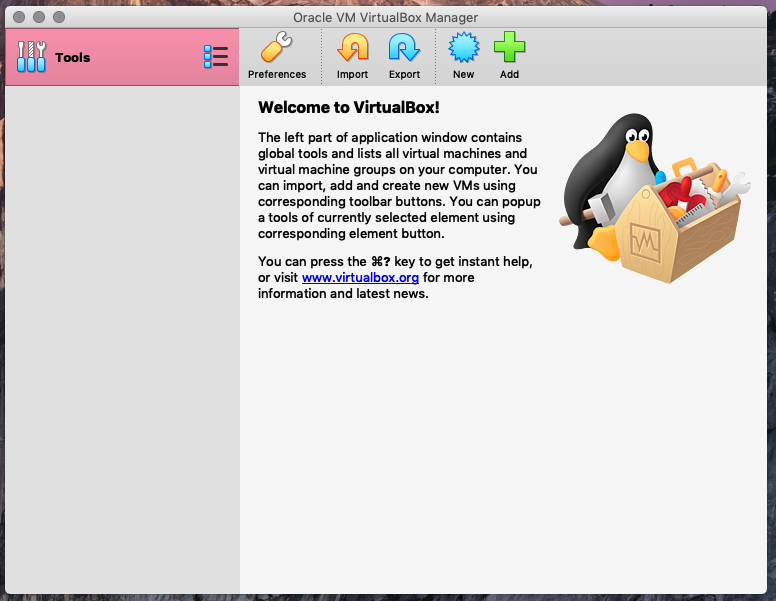
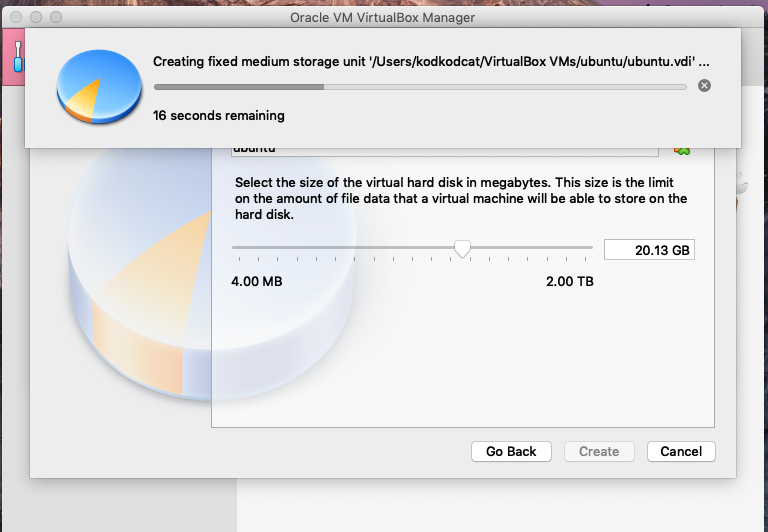
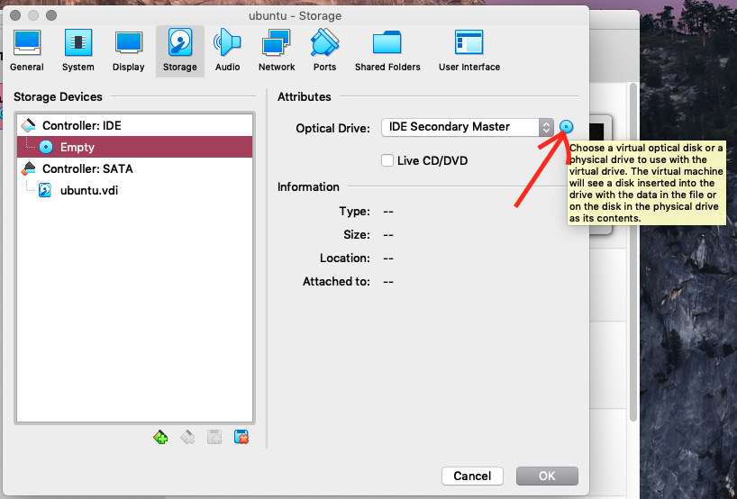
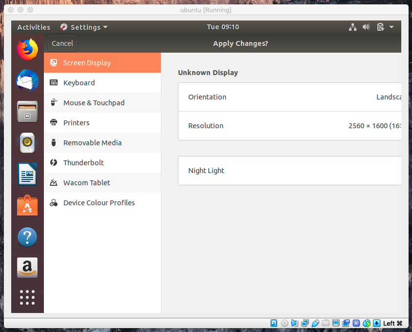
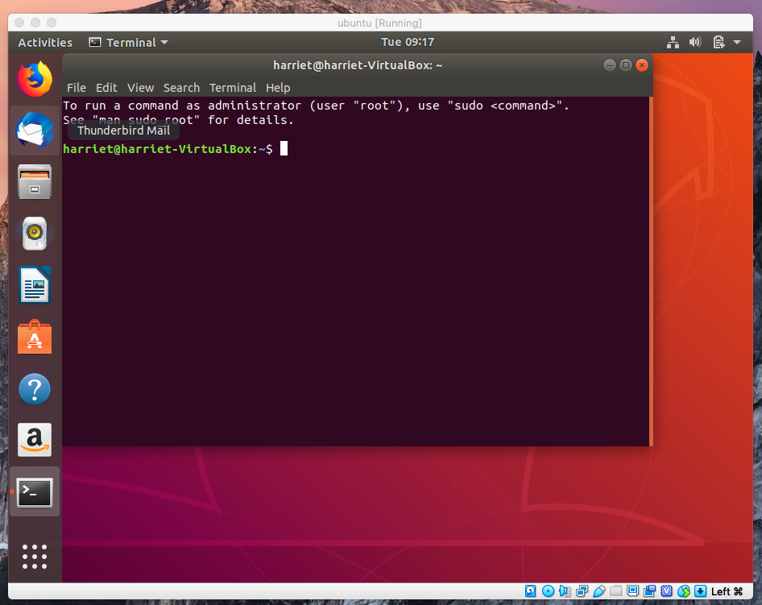

The other day, I decided I wanted to take a screenshot of the terminal application on Ubuntu to include in an instruction leaflet for new starters on a software development course.

Thus began a mighty (actually not that mighty) journey to get Ubuntu running on a Virtual Machine on my Mac.

Could I just have Googled a picture? Definitely.

Could I just have taken a screenshot of the Mac terminal, since it’s basically the same. Yes.

But I really wanted that authentic screenshot of an Ubuntu terminal, taken myself, from my own machine. So VirtualBox it was.

#### What is VirtualBox?

VirtualBox is a free “hypervisor” created by software giant Oracle. A hypervisor sounds pretty cool but I’m not sure if it actually is. It depends what you think is cool I guess.

It is basically a piece of software which allows you to run a virtual version of another operating system from within your current operating system. The virtual OS is called a Guest OS and it will be given some access to some of the resources (the hard drive and the RAM) of your computer.

#### Setting up an Ubuntu Virtual Machine

First, you need to download it from [Oracle](https://www.virtualbox.org/wiki/Downloads). You also need to download a version of the Guest Operating System that you intend to run - in my case this was Ubuntu 18.04 which can be downloaded for free [here](https://www.ubuntu.com/download/desktop).

Open up the application and select New to create a new virtual machine.

Give it a name, and then follow through the next few steps. Give it the recommended amount of memory, select the option to ‘Create a virtual hard disk now’ and keep the option ‘VDI VirtualBox Disk Image’ selected.

VirtualBox creates a file to use as the hard disk for your virtual machine. When it comes to choosing Dynamically Allocated/Fixed Size for the hard disk file that will be created, Dynamically Allocated takes up less space because it’ll grow the file as needed, as you save more to the virtual hard disk. But Fixed Size is more efficient, as the dialog box explains.

I selected Fixed Size, as I had plenty of disk space to spare.

On the next page, I found that the 10GB virtual hard disk size recommended was not enough for what I wanted to do, so I upped the size to **20GB**.

VirtualBox will then start creating the virtual disk image.

#### Using your virtual machine

Now you have to do the equivalent of inserting the Ubuntu installation disk into the CD drive/plug in the memory stick. You don’t actually have Ubuntu installation disk on a physical device, you have it in your downloads folder, but VirtualBox gives you a way of virtually attaching it.

Go to the Settings panel of your new virtual machine and click on Storage. The virtual machine comes with something called a IDE Controller which lets you create up to 4 virtual storage devices, so we’re going to mount the Ubuntu .iso image as though it were a virtual storage device. This way, we can boot up the virtual machine from the .iso image.

Click on the Empty slot under Controller IDE and for the Optical Drive on the right, locate the Ubuntu .iso image you have downloaded previously.

Now you should be able to start the virtual machine and it should boot Ubuntu.

#### Installing

Now you need to install Ubuntu which is pretty straightforward. Go through the various setup options, leaving the default options selected for **Normal installation** and **Erase disk and install Ubuntu**. Remember the disk in question is only the virtual hard disk, not your actual one, so you’re in no danger here!

Ubuntu will then begin its installation process and afterwards you’ll be asked to restart - just press Restart and it’ll do it. When it asks you to remove the installation medium, simply press Enter.

#### Making the screen bigger

Great, I had my virtual machine but unfortunately it’s the size of a postage stamp, so not much good for the screenshot which I wanted to take.

Worse, the small screen size meant I couldn’t actually see the full screen at times. For example, my first attempt to fix the problem involved trying to change the resolution though the Display Settings, but I couldn’t actually click the Apply button to see if this would even work 🤷

Thus began the process of trying to enlarge it.

Can you just drag it at the corner like a normal window? Yes, and it has no effect whatsoever. It turns out that what you need to do is install an additional set of packages which provide better integration between the Host OS (your operating system) and the Guest OS (Ubuntu).

This can be done by selecting the **Devices** menu from the top nav of VirtualBox itself, and selecting **“Insert Guest Additions CD Image”**. This only worked for me when I had 20GB of disk space, when I tried with 10GB it seemed to fail.

Even when I had 20GB of disk space, at the end of the installation process I got the message `This system is currently not set up to build kernel modules` and it looked like it hadn’t worked, but it actually had since I was now able to enlarge the screen 🎉

And then I was finally able to take my lovely screenshot!

