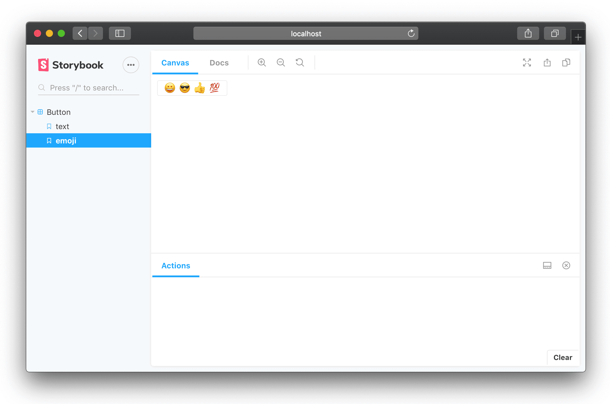

### What is Storybook?

<a href="https://storybook.js.org/" target="_blank">Storybook</a> is an open source tool for developing and exploring components. It works with React, Vue, Angular and more, and it looks something like this:



Storybook is like a gallery of all your components (or at least, the ones you've added to Storybook). Out of the box, you can view your components in a folder-like structure along in the left sidebar, and you can choose to add different variations (in React, this would mean passing different `props`) of each component to each "Story" in your Storybook.

You can also choose to show composite components. For example, if `<ListItem>` usually lives within a `<List>` component it would make sense to document them both in Storybook so people can see how `<ListItem>` is commonly used. In fact, the <a href="https://www.learnstorybook.com/intro-to-storybook/react/en/composite-component/" target="_blank">Storybook docs</a> show a great example of this.

Being able to spin up Storybook and develop components in isolation really helps development speed, and it also encourages you to think in a **component-first** approach to designing your interfaces.

Instead of building a whole page first and creating components as and when you need them, with Storybook you'll be more likely to think about the reusable components _first_.

### Simple installation

The <a href="https://storybook.js.org/docs/basics/introduction/" target="_blank">Storybook docs</a> have great guides for most setups. If you used <a href="https://reactjs.org/docs/create-a-new-react-app.html#create-react-app" target="_blank">Create React App</a> for creating your initial React project, you can even get the `@storybook/preset-create-react-app` package to install and configure Storybook for you, and it does a perfect job.

However, our setup was a little different - the original project was created with Create React App, but we've added <a href="https://github.com/arackaf/customize-cra" target="_blank">Customize CRA</a> to customize the default webpack configuration, and we also use TypeScript (💖).

So setting up Storybook was a little more complicated.

### What is customize-CRA?

Firstly, what is customize-CRA?

<a href="https://github.com/arackaf/customize-cra" target="_blank">Customize CRA</a> is a project that allows you to customize the webpack configuration object that `create-react-app` creates and keeps hidden from you (unless you eject).

When you run `create-react-app`, a brand new React project is spun up for you, but most of the configuration is tidied away out of sight. There's no `webpack.config.js` file, so you have very little control over how your files are bundled. This is fine most of the time, CRA is officially maintained and supported by Facebook (the React team) so you're guaranteed it's gonna do a pretty good job of sorting our your configuration for you. It handles most things you could imagine, including images, fonts, SASS, ES6+ language features and a dev server.

However, if you have any unusual requirements (for example, the need to bundle `.less` files which are not included in the default webpack configuration) then you have 2 options. You can either "eject" from CRA, which means it basically spits out all the configuration files that it previously managed for you, leaving you alone in the wilderness with a `webpack.config.js` file, or you can use a tool like `customize-cra`.

Customize-CRA allows you to carry on without ejecting, but it lets you define an additional configuration file that can modify the underlying webpack configuration. On the plus side, you still get the benefits of not having to _fully_ manage the webpack config yourself, but on the downside Customize-CRA is not an officially supported project, it can be hard to find documentation for what you need to do, and you still need to know enough about Webpack to figure out how to write the configuration file.

When you use Customize-CRA, you write a `config-overrides.js` file in which you use the function `override` to modify an underlying webpack configuration object. You can use built-in functions from the `customize-cra` library, or you can modify the config object yourself, for example, by pushing extra custom rules.

<a name="configexample" class="no-link">
config-overrides.js might look something like this:
</a>

```javascript
// config-overrides.js

const {
  override,
  addDecoratorsLegacy,
  disableEsLint,
  addBundleVisualizer,
  addLessLoader,
} = require("customize-cra");
const path = require("path");

module.exports = override(
  // enable legacy decorators babel plugin
  addDecoratorsLegacy(),

  // add loader for .less files
  addLessLoader({
    javascriptEnabled: true,
  }),

  // disable eslint in webpack
  disableEsLint(),

  // add webpack bundle visualizer if BUNDLE_VISUALIZE flag is enabled
  process.env.BUNDLE_VISUALIZE == 1 && addBundleVisualizer(),

  // Adding another rule to the config object
  (config) => {
    config.module.rules.push({
      test: /\.tsx?$/,
      include: path.join(__dirname, "src"),
      enforce: "pre",
      use: [{ loader: "ts-nameof-loader" }],
    });

    return config;
  }
);
```

By the way, the return value of `override` is **a function that returns a webpack configuration object** - which is important for later.

### Installing Storybook with Typescript

Storybook has its own Webpack configuration. Since it tries to be zero-config, surprise surprise, it doesn't show you this configuration but it does let you modify it yourself, very much like Customize-CRA does.

For installing Storybook in a Typescript project, the <a href="https://storybook.js.org/docs/configurations/typescript-config/" target="_blank">section on TypeScript configuration</a> of the official docs explains how you can modify Storybook's webpack configuration object to use either `ts-loader` or `babel-loader`, either of which you will be using to transpile your TypeScript. Figuring out which one you are using will require checking in your _project_ webpack configuration or webpack customization file for a rule like this:

```javascript
{
  test: /\.tsx?$/,
  include: path.join(__dirname, "node_modules"),
  enforce: "pre",
  use: [
    {
      loader: "ts-loader",
      options: {
        transpileOnly: true,
      },
    },
  ],
}
```

In the above example, you can see I'm using `ts-loader`.

So I would go ahead and follow Storybook's instructions for adding `ts-loader` to its custom webpack configuration.

At this point, it shouldn't really make a difference whether you are using Customize-CRA or not. If at this point your Storybook configuration is working fine for you, horay.

### What About Other Custom Configuration?

However, you might find that the default configuration of Storybook's webpack config, even with `ts-loader`/`babel-loader` added, isn't enough. What if you have `.less` files that aren't getting compiled, or you're doing some other fancy magic in your project's webpack file that you'd like to see applied in Storybook, too?

Well, that's no problem. You should have a `.storybook/main.js` file already from setting up `ts-loader`/`babel-loader`. If not, don't worry, you can make one now.

If you've got a `webpack.config.js` file for your project, you can import that configuration file and use it in the `main.js` file to replace the rules with your own. The example from the docs is:

```javascript
// .storybook/main.js

// Import your app's webpack.config.js
const custom = require("../webpack.config.js");

module.exports = {
  webpackFinal: (config) => {
    return {
      ...config,
      module: { ...config.module, rules: custom.module.rules },
    };
  },
};
```

If you were adding `ts-loader` or `babel-loader` here before, note that there's no need to if you're combining your project's webpack rules with Storybook's default configuration - the rule for `ts-loader` or `babel-loader` is getting added from your project's webpack config object now 😄

### Okay, but what about Customize-CRA?

As we've already established, if you are using Customize-CRA, then you don't have a `webpack.config.js` file for your project, you have a `config-overrides.js` instead which lets you modify the underlying config object. As we [saw above](#configexample), this could either be through using out-of-the-box methods provided by `customize-cra` such as `addLessLoader` or by manually mutating the underlying config object.

So how can you combine this with the default config that Storybook creates? As you can see from the above code snippet, all you're doing to create the new config is manually stitching an object together from two other objects. There's no magic going on there.

`config` is the webpack configuration object provided by Storybook

`custom` is your own project's webpack configuration object

But how do you get the `custom` object if it's not exposed directly to you?

Well, remember that what we are exporting from `config-overrides.js` is **a function that returns a webpack configuration object**? So all we need to do is pass that function Storybook's initial config, and the return value will be a valid webpack config object. From which we can extract our own custom `module.rules` to combine with Storybook's own configuration object:

```javascript
// .storybook/main.js

const custom = require("../config-overrides");

module.exports = {
  webpackFinal: (storybookConfig) => {
    const customConfig = custom(storybookConfig);
    return {
      ...storybookConfig,
      module: { ...storybookConfig.module, rules: customConfig.module.rules },
    };
  },
};
```

In the long run we might think about moving away from Customize-CRA and gaining complete control over our webpack configuration. Actually I started an interesting discussion on <a href="https://dev.to/harri_etty/maybe-i-should-have-just-used-create-react-app-56af" target="_blank">the benefits of ejecting/not ejecting</a> over on dev.to a little while ago - check it out if you want to read some interesting opinions on the matter 🤓

But for now I'm glad we were able to get Storybook running without too much of a headache.
