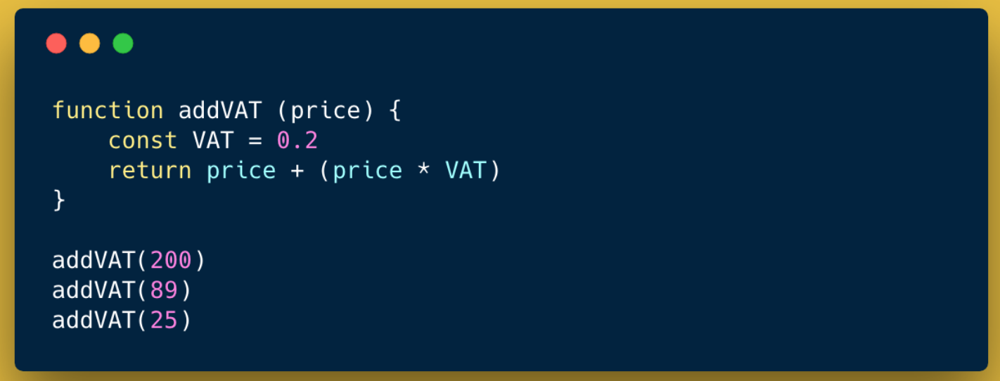

#### History

Let's start with a little bit of history of JavaScript, because the history of JavaScript is entangled with the history of the web. 

In the late 80s, Tim Berners Lee, a British computer scientist, was working in a physics research laboratory in Geneva and he recognised that scientists coming to work at his unit from all over the world were having a problem, beyond the problem of like, working out particle physics, and that problem was how to share information, scientific documents and other media, with one another across the world.

Maybe you'd use a fax machine like this but it was awkward, it wasn’t easy to update a document once you’d sent it, it was a faff, it just wasn’t ideal.

He decided there had to be a better way and he began to work on fixing this problem. The infrastructure was there - telephone lines, connected devices, routers, yet it was not easy to send, retrieve and view written information from anywhere in the world currently. The technology he invented was the *World Wide Web*, which was built on top of the infrastructure of the *internet*, which was already in place. The Web would make all kinds of media immediately available from anywhere in the world at the click of a button, it would allow simple linking from one place to another, and real-time communication which was really quite revolutionary.

By 1990, he had developed the 3 Key technologies that underly the Web, and which still underly it today. Those were:

#### HTML (Hypertext Markup Language)

This is the language that allows us to describe the structure and content of web pages allowing for a large range of different content types.

This is a sample - it might be familiar to you. Even now, you can't have a web page without HTML. It's still one of the key building blocks that we need for sharing content on the web and it's not going to go away any time soon.

#### URIs - Uniform Resource Identifiers

This is the convention for describing how to locate resources on the internet, how to find this vast amount of content that would just be sitting there on other people's computers, waiting to be viewed. When one person uses their computer to go to a webpage, their computer has to figure out who's computer, where in the world (and whereabouts ON that computer) the requested file can be found. Yes, all webpages are just files!

This is a URI and again, it probably looks familiar. We are still used to accessing resources on the web using addresses that look something like this. Addresses can be complex but the basic building blocks are:

1. A protocol (how the two computers - the requesting computer and the serving computer - communicate with one another to access this resource). In what standardized format should they write their messages to one another so that they understand one another? This is a protocol, HTTP is the protocol invented for the Web.

2. A domain name (which is human readable, but maps to a number describing exactly which computer the content is located on).

3. A path, which describes where abouts on the specified computer the particular file can be found. Paths can be more complex as there are more sophisticated ways of interpreting them, but this was the original general idea.

#### HTTP - Hypertext Transfer Protocol

As mentioned above, this is the name of the formalised protocol for how computers would talk to each other to send these pages back and forth.

These 3 technologies together underpinned and still DO underpin the Web today.

By the end of 1990 the first web page was live. And it looked like this.

The amazing thing about these 3 technologies that Berners Lee invented are that even now, almost 30 years later, these 3 technologies still underly how the web works and this initial page, built with HTML, located by a URI and served via HTTP protocol - still works, even on a modern computer on a recent browser. How many other technologies from 1990, before I was born actually, still just *work* like that today? And I think this shows just how well designed and thought out these technologies are.

Here's the HTML for that first page:

#### Enter JavaScript

As the Web grew in popularity, people began to see that its real power would be unlocked when rather than just displaying information, web pages could encompass some kind of interactivity. It was great to be able to view a document at the click of a button anywhere in the world, and a user could even fill in a form stating what they want to buy, and the computer at the other side of the world could receive that input, complete the order and debit the account. But people began to imagine a more interactive experience.. where maybe the page itself could respond to your input and clicks, tell you whether you were filling in the form correctly, and give you real time feedback.

To do this another programming language was needed. HTML was great for laying out content and form fields but it didn’t have the ability to execute the kind of logic that would be needed for jobs like this.

The Java programming language had recently been developed and it was looking like a deal might be signed to make Java the language of the web, the one that would be embedded in browsers to provide this interactivity. The developers at Netscape Browser thought they could make something better, and began working on JavaScript. It was actually developed in just 10 days due to the pressure to beat Java to the deal. Some people credit this time pressure as the root of some of JavaScript’s unusual features, some of which I’ll point out later, but I think that it’s actually a really well designed language for what it’s got to do and its quirks are actually pretty loveable!

#### Javascript Today

Today, JavaScript is widely used across the software development industry. It remains the only programming language that can be run in the browser, alongside HTML and CSS, and is the only way to provide front-end interactivity, so most developers use it to some extent in if they build products for the web.

I used to think JavaScript was mostly just used for things like this, and I used JavaScript for years without even knowing what I was doing by copying and pasting code like this and getting cool things to happen on my Myspace page.

But over the years, as browsers have become more powerful, we’ve been able to leverage JavaScript more and more. JavaScript has always been a fully fledged programming language, but now the kinds of things we habitually do with it have become more and more complex and we’re building much more exciting websites. Websites nowadays are more like applications that run in your browser. Consider the project management website Trello, for example. The level of user interactivity here and the ease and speed at which you can drag, drop, edit things, is pretty impressive. Or think about Google Docs or Google Sheets which allow us a desktop-like experience in the browser. These applications are all going to be powered by JavaScript.

Since 2009 however, we’ve also been able to use JavaScript to do back-end programming, which opens up a whole new world of what we can do with it. It means we can code up the systems that retrieve and manipulate the data underlying any front-end application, for example. This was a hugely exciting step for JavaScript because it’s now the *only* language that can be used in both the front and back end. This makes it ideal as a first language to learn as you can do so much with it, and explore both side of web development, by learning just 1 language and learning it really well.

Javascript can now also be used to code programmes for embedded devices and the internet of things, such as this remote control Lego robot. It can also be used to build mobile applications such as AirBnB, Facebook and Uber Eats. And also Desktop applications like the popular text editor, Atom or the workplace messaging app, Slack.

#### Lets look at Javascript

As we take a look at some of the features of JavaScript, it’s important to bear in mind that these key concepts are common across all programming languages. Don't worry too much about the syntax and think more about the concepts of what's possible with programming languages.

##### Data Types

JavaScript handles various different data types. We have *strings* (collections of characters), *numbers*, *booleans*, and more complex data types of *Objects* and *Arrays*.

Arrays are lists of related data, allowing us to keep a list of cute animals together for example, whereas an object is a way or representing a real world entity. Objects have key-value pairs. You can almost think of it as a table. When you’re representing something in your program its up to you to choose what type of data type is most appropriate. If you’ve got a lot of cats to represent, you’d put them in an array. If you had just one cat, which is obviously the less exciting option here, you might represent more detailed information about that cat as an object.

##### Storing and retrieving data

JavaScript allows storage and retrieval of data, either from the file system, memory or from a database. The simplest way to store data is with variables, allowing us to retrieve those values later in our program.

See how the above data types have names? Those are *variable names* (e.g. `cuteAnimals` is the name of my array of cute animals) and if I want to refer to that array (e.g. to add or remove cute animals from it), I can use its name to do so.

Be warned, there are also nothing-y type values that represent no data, unset values or a gap in a dataset. These two data types are undefined and null.

In most programming languages there is only 1 nothing-y type. Why does JavaScript need 2? Well, there’s a bit of history behind it but it does allow us to differentiate between slightly different situations and therefore find out what’s gone wrong in our program more easily, so I’m grateful for this quirk.

##### Comparisons and boolean logic.

We can compare values, and comparisons always give us a boolean value. Above are some example of comparisons and the boolean values they return. You will see that many of the signs look familiar from maths.

JavaScript Quirk! JavaScript has 2 ways of comparing values, strict and non-strict. Strict equality (three equals signs) cares about what data type 2 values are, whereas non-strict (two equals signs) will try and coerce 1 type into another if it can in order to make a positive comparison. It just really wants to say yes. This is one of the things that drives some people crazy about JavaScript and is quite different to other programming languages. The rules about how JS will convert data types to try and make a positive comparison are like 5 pages long and nobody wants to rely on using such complicated rules so we never use the double equals sign in reality. I really can't find a good reason for why someone sat there and made all those rules that nobody ever uses even though, trust me, I've really, really tried.

##### Branching logic.

This means taking different directions, usually based on a comparison or evaluation that has been made. Either do one thing or another. If we couldn’t branch our logic we’d have extremely limited applications, they would always do the same thing!

##### Functions

Functions allow us to create reusable sequences that can be run whenever we want. Functions are like recipes. We start by writing a recipe for adding VAT to a purchase, for example, where the placeholder variable ‘price’ is standing in for the actual price. We can then perform that recipe, or function, whenever we want by passing it an actual price to use.

##### Loops

One of the great things about computers is that they can do the same thing a million times without getting bored, and they can do it very quickly too. Like all languages, JavaScript offers us a way of doing something a set number of times... or until a certain condition is met

These are some of the main features of JavaScript and of any programming languages. There are loads of inbuilt methods to help us do things more easily or effectively but most of them rely on some level on varying combinations of the above features.

So finally, should you take the plunge and learn JavaScript?

If I haven't convinced you yet, here are a few final reasons:

⭐ JavaScript is a forgiving language, it doesn’t have as many rules as some other languages so it’s just that little bit easier to get started with without making so many mistakes

⭐ It also runs on your browser with 0 setup and on your computer with minimal setup which makes it a great option for getting up and running with. If you create HTML, CSS and JS files you can create an interactive web app with absolutely no difficult configuration needed and no extra tools to download.

⭐ It’s really popular at the moment. It was listed as the no 1 most popular language on the 2017 Stack Overflow survey and lots of companies list JS as one of their desired languages. You can’t get away from it as a web developer...

⭐ It runs on all sorts of devices and places, which also influences its popularity. And this also makes it ideal as a first language as you’re not committing yourself to a particular platform

⭐ It has a friendly and active community online and offline. In most big cities there are JS meet ups and even more specific meet ups for JS libraries such as React. It is easy to find people talking about JS problems on Stack Overflow and creating up to date articles and tutorials about how to do certain things, which is a huge bonus.

I hope you consider giving JavaScript a go - there are tonnes of resources out there that you can try if you want to continue learning.
