Have you ever wondered what’s in the .git directory?

Yup, the directory that's created when you run the `git init` command.

Oh, you’ve never noticed that directory before? Well, that’s fair enough. It is a _hidden_ directory after all - that’s what the dot at the beginning of its name signifies. Hidden directories don’t appear when you look for them on the filesystem, although you can see them if you’re using the terminal and you run:

`$ ls -a`

The .git directory is very unobtrusive. It just does its work and requires no intervention from you.

Just to prove it exists and to give you something to explore, let’s create a .git directory. Follow the below instructions to create a new project, a new file, and then initialise Git inside the directory.

```
$ mkdir project
$ cd project
$ touch hello.txt
$ echo ‘hello world’ > hello.txt
$ git init
```

Now if you have a look at all files, you should see your .git directory there:

`$ ls -a`


The .git directory is where Git stores all the information it needs to keep track of the various different versions, branches and states of the project that you’ve just asked it to track. All this information is kept in a number of different files, which we’ll take a look at.

### What isn't in the .git directory?

Let's begin with a few things that _aren't_ in the .git directory...

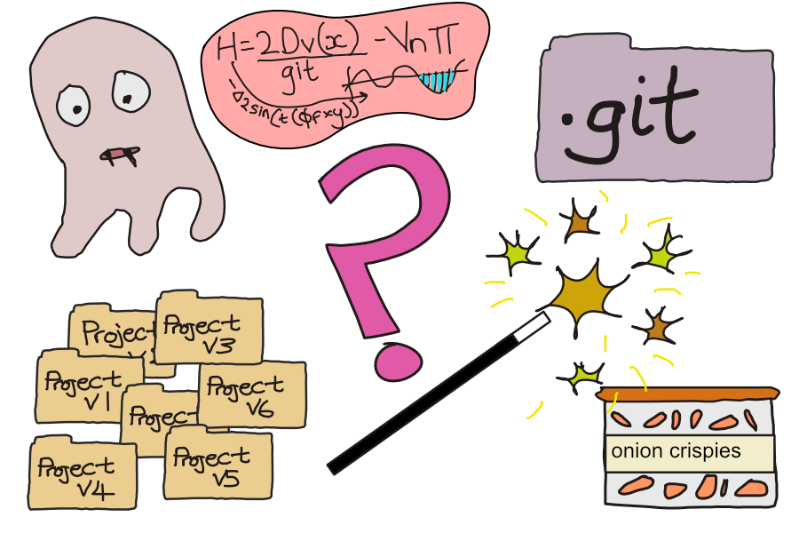

- **Your entire project** times 48 or however many commits/versions you’ve got of it. This would be extremely inefficient and you could just as well do the job yourself by saving your entire project in 48 different folders called _myFinalProject4_ and _myActualFinalCompleteDraft2_ etc. etc. as I’m sure we’re all used to from school!

- **Magic**. Amazingly, Git doesn’t work by magic. It just works with files, and more files, which is a bit more boring.

- **Complicated stuff**. Git definitely CAN be complicated to use, which makes you think that underneath the plumbing must be 500x more complicated, but it isn’t! It actually makes sense!

- **Onion crispies** which are amazing but sadly not in the .git directory

- **Scary stuff**. Again, Git definitely CAN be scary to use but there are definitely no ghosts, spiders or bats in the .git directory (bats are actually cute - there’s not really any cute stuff either, sorry)

Really this list was just an excuse for me to draw silly pictuers on the first slide of this presentation.... so let's move on to the important stuff now!

### So what IS in the .git directory?

If you `cd` into the directory now and have a look around, you’ll see there’s not much of anything. There are some info files with very little in them and some folders that might one day contains some more stuff.

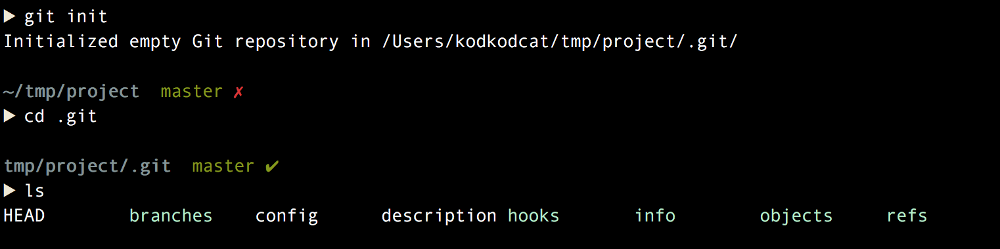

Let's start off with a file that actually does have something in it at this point.

### The HEAD file

`.git/HEAD` is a file that tells Git where you currently “are” - i.e. what branch, or at what commit you're at. If you open up your project in your text editor, all your files will be "at" the commit referenced in HEAD. When you make a new commit, that commit is the child of whatever HEAD is.

If you take a look at the contents of HEAD,  you can see that the HEAD file seems to contain a reference to another file.


But if you actually try and follow that reference and look at `.git/refs/heads/master` the file doesn’t exist. Let’s make a commit and see what changes.

If you’re in the `.git` folder looking around, remember to move back to the project root to make the commit.

Now if we take a look at that reference to `refs/heads/master` we actually see the file, and it contains some content!

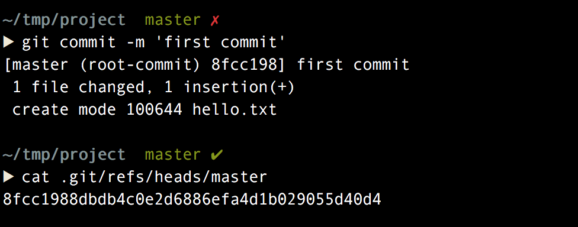

What is this long string? Well, it's actually the hash of the commit that you just made. All commits have hashes which identify them, besides having a descriptive message. If you run `git log` you will see this hash next to your first commit, and it will be the same hash as you see in the `refs/heads/master` file.

Before we go any further, here's a diagram of the files and directories we've explored so far:


### A very quick introduction to hashes

In this context, a hash means a digest of characters which is produced by running content through an algorithm. However long this content is, the algorithm will spit out a hash of a determined length. The algorithm means that the same content fed through the algorithm twice will ALWAYS produce the same sequence of characters, and if the algorithm is secure then it should be impossible to take the digest of characters and decipher the original message.

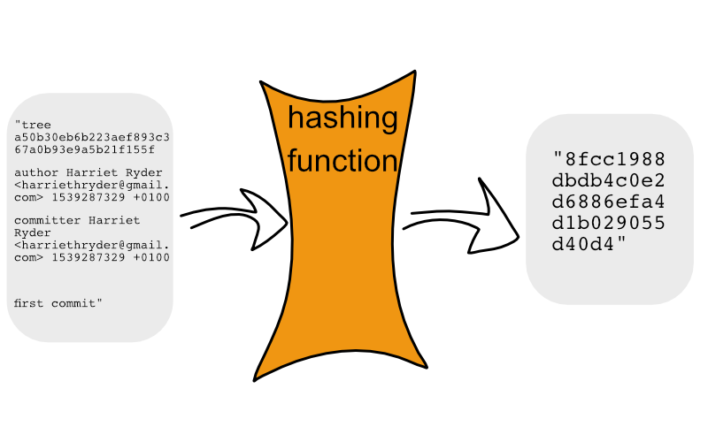

The algorithm Git uses isn’t secure any more because people have figured out how it transforms characters from one string into another. However, that doesn’t matter in this context because Git is not using a hash for cryptographic reasons. It uses a hash to represent data because it helps *verify* the contents of that data, making it very hard for someone to change the underlying data without the hash changing, and also because hashes provide a handy, unique, and shorthand way to refer to the pieces of data that Git’s storing (more on that in a moment).

### Looking at a commit

I just said that the hash of a commit is a way to refer to the commit in question. So you might gather that somewhere, Git stores the rest of the information about the commit. This is true - Git stores information about this commit in one of the directories in the `./git/objects` directory.

Let's go and look at the commit. Yes, we can also run `git log` which we are used to using for looking at commits but just for the sake of it, let's go and look at the _actual_ file that contains the commit data. `git log` will be reading this file and parsing it for us, but the actual commit data contains some more info that we don't always see when we run `git log`.

You can probably guess what file you would need to inspect because it is named the same as the hash of the commit - this is called using a **content addressable filestytem** to store data.

Note that the first 2 characters of the hash are used as a sub-directory name, and the remaining characters of the hash are used for the filename. This is just a technique to break the files into different directories, because operating systems can have trouble with directories containing very large numbers of files.

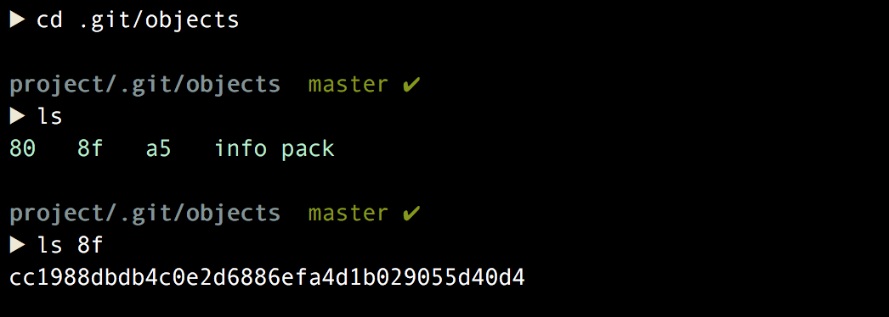

If we `cat` the contents of the commit file, we might be surprised that unlike the HEAD file, we cannot read its contents.

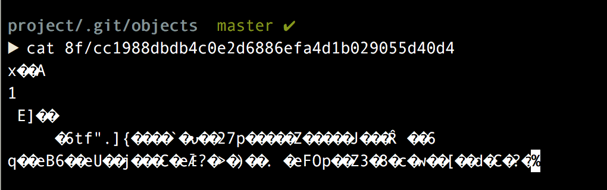

This is because the file is a compressed format. Git provides a handy tool for converting the contents of an object file to something readable, which is `git cat-file`.

We use the `-p` flag to tell Git to figure out the type of object for itself (more on this in a second) and note that we don't need to give the path to the file - instead we provide the entire hash and Git knows where to look in the `.git/objects` directory

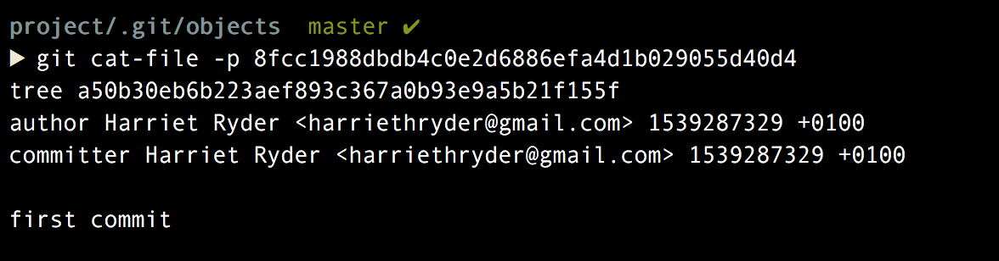

So we've got a HEAD file that tells us where to find out what the current commit is, and we've got a file containing the data for that commit. If we make a diagram we get something like this:

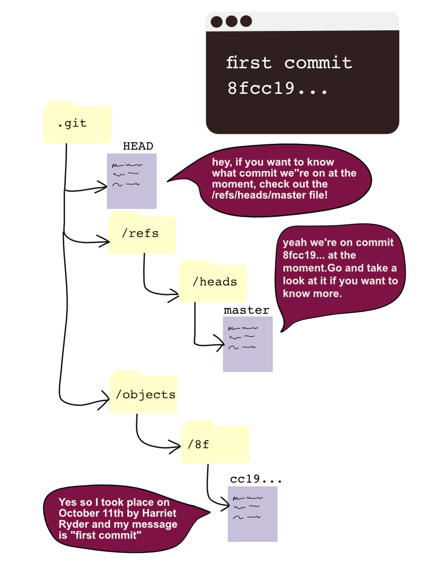


### What about the other objects?

You might have noticed that we seem to have more than just our commit in the `.git/objects` directory! We have a few other sub-directories and these, too, have data files inside them.

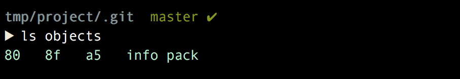

This is because when we made our first commit, we did more than just create a commit message. We also need to store information about **what** what commit acutally comprised of. What files were involved, and what did the files look like at this point in time? When you inspect the commit data with `git log` or `git cat-file`, note that we don't see any information about what the change actually _was_.

If we look at the commit again with `cat-file` we can see that is lists _another_ hash, which is says is the "tree".


The tree is a file that describes what files were changes in a specific commit. Again, a tree contains no data about what those changes were, just what files were involved. For each file that the tree lists, a "blob" is listed. The blob is referenced, you guessed it, with _another_ hash!

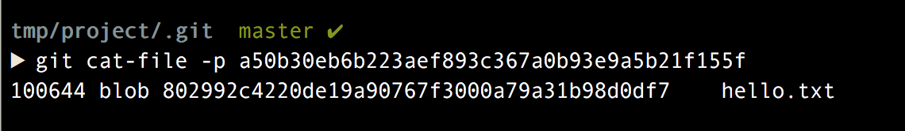

If we look at the hash for a "blob", we finally see some information about the change that took place in our first commit! There's the text that we added to the hello.txt file!

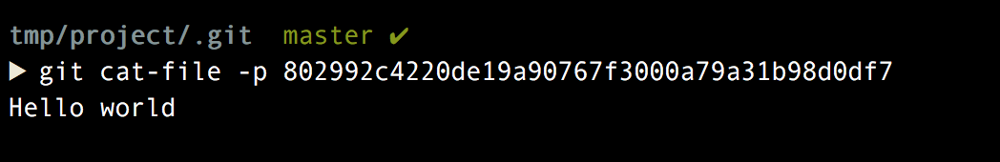

We can add a few more sections to our diagram now we know what's going on in some of the other directories:

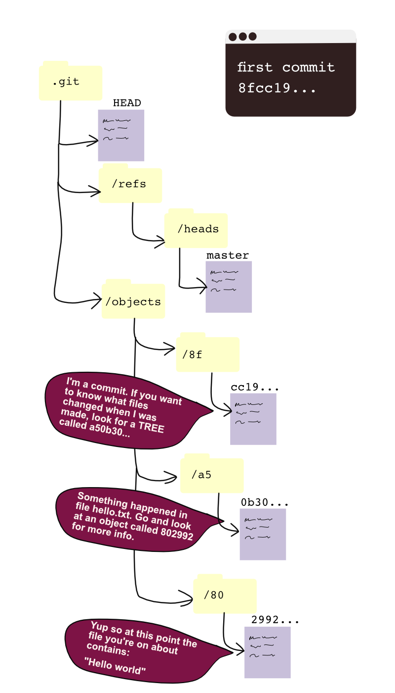

### Main points:

- each piece of information, from a commit to a blog, is identified by a hash
- the hashes are used so that pieces of information can reference one another
- only the blobs contain details of the changes made to your project
- each piece of data is called an Object
- objects have different types: so far we’ve met commits, trees and blobs
- these objects are really just files
- they are all stored in the Git directory

### Further exploration

Let’s make a change to our file by adding a second line, and then commit it.

```
$ echo Another line >> hello.txt
$ git status
$ git add hello.txt
$ git commit -m "Second commit"
```

We now have two commits.

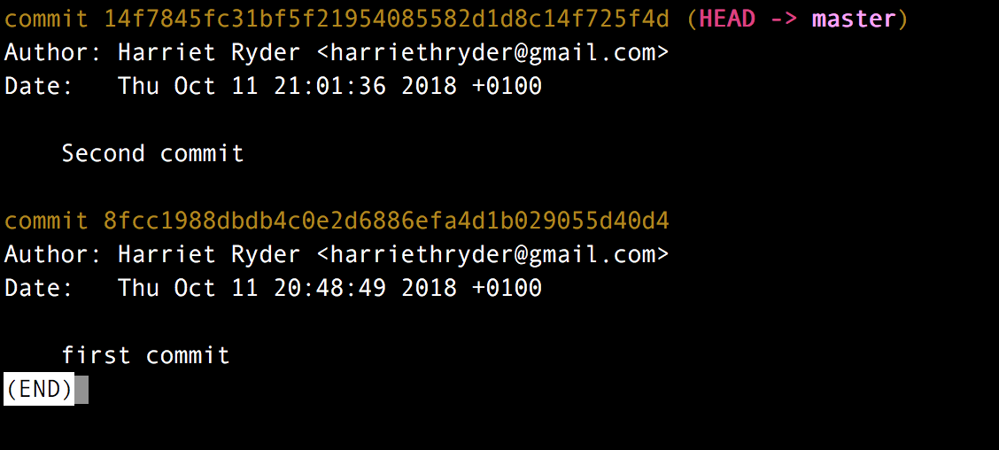

And if we `cat-file` our second commit we can see that it too has a tree, but it also has a parent. As you might have guessed, the hash of the "parent" is the hash of our original commit.

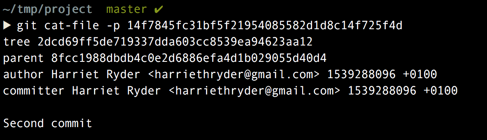

The tree, however, is a different tree. If we look at the tree, we also have a different blob.

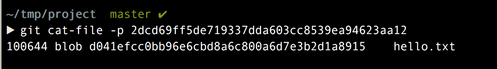

And if we look at the blob we can see it contains the contents of `hello.txt`

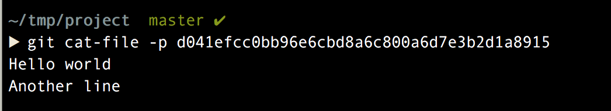

But hang on! It looks like this blob contains the whole file contents! Isn’t this a bit weird? Didn’t we say earlier that Git doesn’t record your entire project at every commit, only the changes? So wouldn't you expect only the new line we added to appear in this blob file?

Well, when it comes to individual files which contain changes, Git actually _does_ record the whole file and not just the diff (the changed lines). I'm guessing it would just be too hard for Git to piece together loads of individual diffs into complete files when you check out a commit, and that it's easier just to store an entire file when it changes. If Git notices your objects getting a bit heavy, it will compress them into the `packs` folder.

### Questions for you to answer

1. try making a third commit, but in this commit you should add a new file and not make any changes to `hello.txt`. Now what does the commit --> tree --> blob structure look like? Can Git re-use any of the blobs from earlier commits, if file contents haven't changed? (Drawing it out is quite a fun exercise, as I discovered above!)

2. Another thing to try is adding a new directory inside your project, and a new file inside there. When you commit this change, how does Git represent the directory structure? Remember that in order for Git to build out what your project looks like at the point of a commit, it needs to know not just what files you've got but what your directory structure looks like!

3. What if you make a new project and create the same file `hello.txt` again, add the same contents, and make a new commit. Would the hash be the same? We mentioned that the hashing algorithm always produces the same output when given the same input. Or has something changes between your two (apparently identical) projects which found result in a different input being fed to the algorithm?

### Finally, hooks

There is one more directory I wanted to talk about, which is the hooks directory, but in the interest of keeping this talk/post from sprawling endlessly I’m going to keep this section really brief. Basically, the hooks directory contains a scripts which will be invoked at various times of the git lifecycle, such as before you commit, after you commit, before you push or before you rebase.

There are lots of sample files in the `.git/hooks` directory already, containing brief descriptions. If you have a look in the `.git/hooks` directory you’ll have an idea of what hooks are available.

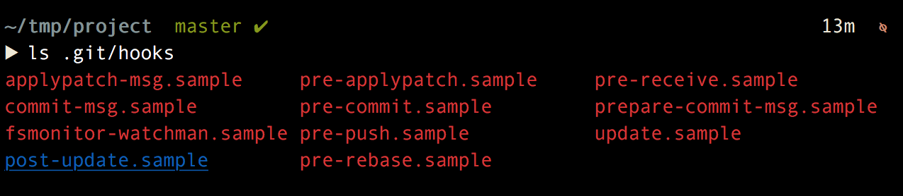

Just to demonstrate something really simple, let’s rename one of the files so that it’s not a sample any more (which is what the sample files instruct you to do, if you `cat` them out)

`mv hooks/pre-commit.sample hooks/pre-commit`

Using the `mv` command is better than creating our own new file afresh because it copies over the permissions as well, and it’s important that we have permission to execute this file since it’s a script.

I'll replace everything in the file with some silly script, just for demonstration purposes:

`echo "Hello, Harriet! This is the pre-commit hook being run."`

Then make a change and commit it, and we should see the silly message printed out on the console before the regular output from the commit.

Hooks are great because they give you the power to build additional steps around your git lifecycle, such as ensuring your tests and linting pass before you commit, or even to deploy automatically after a push. There are lots of tools to make working with hooks easier so you don’t necessarily have to write shell scripts yourself.

I hope this has been a helpful exploration of what's in the `.git` directory. If you want to read more, I recommend looking at the [Git Internals](https://git-scm.com/book/en/v1/Git-Internals) section of the Git documentation. ✌️
